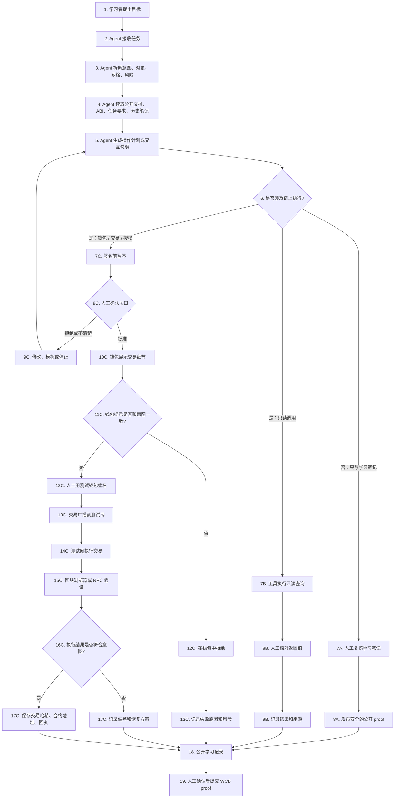
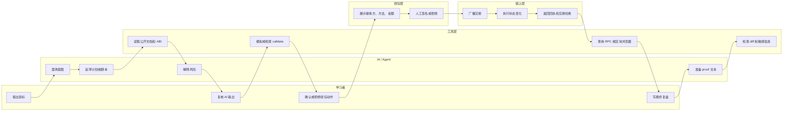

# Task 008 - AI x Web3 Minimal Crossover Flowchart

## Metadata

- Date: 2026-05-23
- Program: AI x Web3 School
- Week: Week 1
- Track: AI x Web3 integrated task
- WCB task: Week 1｜AI × Web3 综合任务｜画出 AI × Web3 最小交叉流程图
- WCB task id: `cmp3jyrc507sin301kjhy1mwf`
- Points: 30
- Repository: https://github.com/pillowtalk-Qy/ai-web3-school-cohort-0
- Task file: `tasks/task-008-ai-web3-minimal-crossover-flowchart.md`
- Status: completed, deployed to GitHub, WCB latest submission status `SUBMITTED` at 2026-05-23T09:12:15.229Z

## 任务目标

画出一个最小 AI x Web3 工作流，理解 AI 系统和链上操作之间的边界。

我选择的最小交叉场景是：

```text
学习者提出目标 -> AI / Agent 生成链上交互计划 -> 人工复核 -> 钱包确认 -> 测试网执行 -> 区块浏览器验证 -> 写入公开学习记录
```

这个流程不追求复杂项目，而是把 Week 1 的核心概念连成一条可检查的任务链：LLM / Agent、工具调用、钱包、签名、交易、合约、区块浏览器、人工确认和 proof-of-work。

The goal is to draw a minimal AI x Web3 workflow and make the boundaries explicit: what the AI can suggest, what tools can verify, what the human must confirm, what the wallet signs, what the blockchain executes, and how the result is checked.

## Minimal Flowchart / 最小交叉流程图



## Lane View / 责任泳道



## Step-by-Step Explanation / 步骤说明

| 步骤 | 执行者 | 发生什么 | 人工确认点 | 可验证材料 |
|---:|---|---|---|---|
| 1 | 学习者 | 提出任务目标，例如“帮我理解一次测试网合约交互应该怎么做”。 | 目标必须由学习者提出。 | prompt 摘要或任务记录 |
| 2 | AI / Agent | 把目标拆成结构化计划，标出对象、网络、工具、可能的链上动作和风险。 | 学习者复核计划是否符合真实意图。 | 操作计划、checklist |
| 3 | AI / Agent + 工具 | 读取公开文档、ABI、WCB 任务要求、本地学习笔记和公开区块浏览器信息。 | 只读资料收集通常不需要确认，但来源必须可追溯。 | 来源链接、文件路径、ABI 来源 |
| 4 | AI / Agent | 判断动作类型：纯学习笔记、只读链上查询、钱包签名、转账、授权、合约写入或平台提交。 | 如果分类不确定，必须人工确认。 | 风险分类记录 |
| 5A | 工具层 | 如果是只读调用，用 RPC 或区块浏览器查询公开状态。 | 不需要钱包确认，但需要人工复核返回值。 | RPC 返回值、explorer 链接 |
| 5B | 钱包层 | 如果涉及交易，钱包展示网络、接收方、方法、金额、gas、授权范围和合约地址。 | 签名前必须人工确认。 | 钱包提示、交易预览 |
| 6 | 学习者 | 批准、拒绝或要求 Agent 修改方案。 | 这是最重要的安全关口。 | 复核记录、修改记录 |
| 7 | 区块链网络 | 如果人工批准并签名，交易被广播到测试网并执行。 | 签名已经由学习者在钱包中完成。 | 交易哈希、回执 |
| 8 | 工具层 + 学习者 | 用区块浏览器或 RPC 验证状态、gas、区块、日志、合约地址、返回值或 decoded result。 | 学习者核对执行结果是否符合原始意图。 | 区块浏览器链接、解码结果 |
| 9 | 学习者 + AI / Agent | 写入公开学习记录，说明流程、边界、风险、验证材料和人工修正。 | 发布前必须人工复核隐私和准确性。 | GitHub Markdown、commit |
| 10 | 学习者 | 在最终确认后提交 WCB proof。 | WCB 提交会改变平台状态，必须人工确认。 | WCB submission id 和状态回查 |

## Boundary Rules / 边界规则

### AI / Agent Can Do / AI 可以做

- Help clarify the user intent and turn it into a checklist.
- Explain wallet, signature, transaction, gas, contract, ABI, and explorer concepts.
- Read public documentation, public contract ABI, public explorer pages, and local learning notes.
- Draft scripts, transaction explanations, risk summaries, and proof text.
- Run read-only checks such as `eth_call`, `eth_getCode`, explorer lookup, and local `git diff`.
- Flag risky actions and ask the human to confirm before execution.

AI / Agent 可以澄清任务、解释概念、读取公开资料、生成计划、整理 proof、执行只读查询和标记风险。

### AI / Agent Must Not Do Automatically / AI 不能自动做

- Hold or request a private key or seed phrase.
- Import a real wallet or main wallet.
- Sign a transaction.
- Approve token spending.
- Transfer assets.
- Bridge funds.
- Deploy or upgrade contracts without explicit human confirmation.
- Submit public proof, push code, or change platform state without confirmation.

AI / Agent 不能自动接触私钥或助记词，不能自动签名、授权、转账、跨链、部署或升级合约，也不能在没有确认时提交 proof 或发布内容。

## Where Signing, Payment, and Authorization Happen / 签名、付款、授权在哪里发生

| 动作类型 | 需要钱包吗 | 需要人工确认吗 | 原因 |
|---|---:|---:|---|
| 读取公开文档 | 不需要 | 通常不需要，除非资料涉及隐私 | 不改变链上状态 |
| 解码 ABI 或 calldata | 不需要 | 建议复核 | ABI 或来源错误会导致解释错误 |
| `eth_call` 只读查询 | 不需要 | 需要复核结果 | 不改变链上状态，但返回值需要解释 |
| 钱包登录签名 | 需要 | 必须确认 | 签名可能绑定身份、权限或登录状态 |
| token approval | 需要 | 必须确认，高风险 | 可能授予第三方花费权限 |
| 转账 | 需要 | 必须确认，高风险 | 会移动资产，即使是测试网也要养成习惯 |
| 合约写入 | 需要 | 必须确认，高风险 | 会改变链上状态 |
| 合约部署 | 需要 | 必须确认 | 会创建公开合约，并可能设置 owner 或管理员 |
| WCB proof submission | 不需要钱包 | 必须确认 | 会改变平台任务状态 |

## Verification Plan / 验证方式

最小交叉流程不应该只停在“AI 说已经完成”。每一步都要有可验证材料：

- AI 输出：保存 prompt 摘要、计划、脚本或解释。
- 人工复核：记录我检查了哪些字段，例如 network、recipient、method、value、gas、contract address、ABI、risk note。
- 钱包确认：只记录是否人工确认，不公开私钥、助记词或私密截图。
- 链上执行：记录测试网交易哈希、合约地址、区块高度、状态、gas 和 explorer link。
- 只读调用：记录 RPC method、target contract、function selector、raw result 和 decoded result。
- 公开 proof：写入 GitHub Markdown，并在提交前做隐私检查。
- 平台提交：WCB submission id 和 read-only status check。

The verification principle is: AI can explain or prepare, but the final proof must be checkable through public records such as GitHub files, explorer links, transaction receipts, RPC results, or WCB submission status.

## Requirement Mapping / 任务要求对应

| WCB 要求 | 本流程图中的对应位置 |
|---|---|
| 谁发起任务 | `1. 学习者提出目标`；责任泳道中的 `学习者`。 |
| 谁执行 | AI / Agent 负责计划和解释；工具层负责只读查询和验证；钱包层负责展示待签名动作；链上层负责执行；学习者负责最终判断。 |
| 哪一步需要钱包签名 / 付款 / 授权 | `7C` 到 `12C` 分支；签名、转账、授权、合约写入、合约部署都进入钱包确认路径。 |
| 哪一步必须人工确认 | 目标确认、AI 输出复核、签名前暂停、钱包提示核对、公开发布、WCB proof submission。 |
| 如何验证结果 | `15C` 到 `17C`；使用区块浏览器、RPC、交易哈希、合约地址、回执、decoded result 和 GitHub proof。 |
| 可能的风险点 | `Risk Points / 风险点` 表格列出 AI 编造、网络错误、隐藏转账、无限授权、私钥泄露、过度自动化、proof 不充分和隐私泄露。 |

## Risk Points / 风险点

| 风险 | 出现位置 | 为什么重要 | 缓解方式 |
|---|---|---|---|
| AI 编造合约、ABI 或接口 | Agent 计划阶段 | 目标错误可能导致失败、误签或错误学习记录。 | 用区块浏览器、官方文档和合约源码核对。 |
| 网络错误 | 钱包或 RPC 设置 | 把主网当成测试网会带来真实资产风险。 | 检查 chain id、钱包网络和 explorer 域名。 |
| 隐藏转账或错误接收方 | 钱包提示 | 用户可能签下和原意不一致的交易。 | 检查 recipient、value、method、calldata 和合约地址。 |
| 无限授权 | token approval | 可能授予第三方过大的花费权限。 | Week 1 尽量避免授权；必要时设置限额并记录原因。 |
| 私钥或助记词泄露 | 钱包创建、日志、截图 | 泄露后账户可被完全控制。 | 不粘贴、不截图、不提交；只使用隔离测试钱包。 |
| 过度自动化 | Agent 执行阶段 | Agent 可能绕过人的判断，直接进入高风险动作。 | 签名、转账、授权、部署、平台提交前设置硬暂停。 |
| proof 不充分 | 公开记录 | 审核者无法验证真实完成情况。 | 提供 GitHub 文件、交易哈希、合约地址、decoded result 和状态说明。 |
| 隐私泄露 | GitHub 或 WCB proof | 公开仓库可能意外暴露个人资料或敏感信息。 | 提交前做敏感信息扫描、人工复核和截图脱敏。 |

## My Understanding / 我的理解

这张图让我把 AI x Web3 的最小交叉点重新压缩成一句话：

```text
AI 可以帮助理解、计划、解释和验证；Web3 钱包负责授权；链上系统负责执行和留下可验证记录；人必须守住高风险动作的确认权。
```

我现在更清楚地看到，AI x Web3 的关键不是“让 Agent 自动操作钱包”，而是设计一条可控的执行链：

- AI 负责把复杂任务变得可理解。
- 工具负责把公开事实查清楚。
- 钱包负责让用户看见并确认具体授权。
- 区块链负责执行和记录。
- 人负责判断目标、风险和最终确认。

For me, the minimum crossover is not "AI controls money." It is "AI helps prepare and explain an action, while the human keeps signing authority, and the chain provides a verifiable receipt."

## WCB Submission Draft

```text
Task proof:
https://github.com/pillowtalk-Qy/ai-web3-school-cohort-0/blob/main/tasks/task-008-ai-web3-minimal-crossover-flowchart.md

说明：
我画了一份 AI × Web3 最小交叉流程图，选择的最小场景是：
学习者提出目标 -> AI / Agent 生成链上交互计划 -> 人工复核 -> 钱包确认 -> 测试网执行 -> 区块浏览器验证 -> 写入公开学习记录。

流程图标出了：
1. 谁发起任务：Human / 学习者。
2. 谁执行：AI / Agent 负责计划和解释，工具负责只读查询和验证，钱包负责展示待签名交易，区块链负责执行，学习者负责最终判断和确认。
3. 哪一步需要钱包签名 / 付款 / 授权：钱包登录签名、token approval、转账、合约写入、合约部署等都需要钱包确认。
4. 哪一步必须人工确认：目标确认、AI 输出复核、签名前确认、钱包提示核对、公开发布和 WCB proof submission。
5. 如何验证结果：通过 GitHub 任务文件、测试网交易哈希、合约地址、区块浏览器、RPC 返回值、decoded result 和 WCB submission status。
6. 主要风险点：AI hallucination、错误网络、隐藏转账、无限授权、私钥泄露、过度自动化、proof 不充分和隐私泄露。

本 proof 不包含私钥、助记词、API Key、token、.env 文件、真实资产钱包地址或私密截图。
```

## WCB Submission Status / WCB 提交状态

- Submission id: `cmpi4qxz1ecqymu01msycg40i`
- Status: `SUBMITTED`
- Submitted at: 2026-05-23T09:12:15.229Z
- Review status: not reviewed in the checked API response
- Submitted proof:
  - https://github.com/pillowtalk-Qy/ai-web3-school-cohort-0/blob/main/tasks/task-008-ai-web3-minimal-crossover-flowchart.md

## Privacy Check / 隐私检查

- [x] No private keys, seed phrases, API keys, cookies, tokens, or `.env` content.
- [x] No real wallet address, real-asset balance, or private transaction pattern.
- [x] No private screenshots or private chat transcripts.
- [x] The flowchart is conceptual and does not execute any transaction.
- [x] WCB proof was submitted only after explicit human confirmation.
