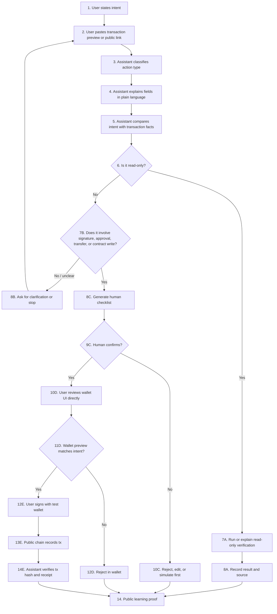

# Task 010 - Restricted Web3 Assistant Workflow

## Metadata

- Date: 2026-05-23
- Program: AI x Web3 School
- Week: Week 1
- Track: integrated advanced task
- WCB task: Week 1｜综合进阶｜设计一个受限 Web3 助手或小 workflow
- WCB task id: `cmp9wlsuo0s4lmw01u8h0og3t`
- Repository: https://github.com/pillowtalk-Qy/ai-web3-school-cohort-0
- Task file: `tasks/task-010-restricted-web3-assistant-workflow.md`
- Status: completed, deployed to GitHub, WCB latest submission status `SUBMITTED` at 2026-05-23T10:06:08.846Z

## Task Goal / 任务目标

设计一个受限 Web3 助手或小 workflow，说明 AI 可以协助哪些步骤，哪些步骤不能自动执行。

我选择的设计是：

```text
Restricted Transaction Explainer and Intent Check
受限交易解释与意图核对助手
```

它不是自动交易机器人，也不是钱包控制器。它的作用是在用户签名前，帮助用户把“我想做什么”和“钱包 / 区块链即将执行什么”放在同一张检查表里对比。

The assistant is a restricted pre-signing review workflow. It can explain a proposed Web3 action, compare the user's intent with public transaction facts, and prepare a human review checklist. It must not sign, approve, transfer, deploy, or submit anything automatically.

## Problem / 解决的问题

很多 Web3 风险不是因为用户完全不知道要做什么，而是因为用户在钱包弹窗里看不懂关键字段：

- 这是测试网还是主网？
- 目标地址是不是预期合约？
- 这是普通转账、合约读取、合约写入，还是 token approval？
- `value` 是否为 0？
- 是否存在隐藏转账、无限授权、错误网络或错误接收方？
- 这个动作是否需要人工确认？

这个受限助手解决的是“签名前解释与核对”问题，而不是“替用户执行交易”问题。

The problem is pre-signing clarity. The assistant helps the user understand what a proposed transaction or interaction appears to do before any wallet confirmation happens.

## User Input / 用户输入

用户可以输入以下内容中的一种或多种：

```text
1. 用户自然语言意图
   例如：我想在 Sepolia 上发送一笔 0.01 SepoliaETH 到我的另一个测试钱包。

2. 交易预览字段
   network: Sepolia
   chainId: 11155111
   from: 0xa882...2a88
   to: 0x4649...6fc5b
   value: 0.01 SepoliaETH
   data: 0x

3. 公开区块浏览器或合约链接
   https://sepolia.etherscan.io/tx/...
   https://sepolia.etherscan.io/address/...

4. 合约 ABI 片段或函数名
   approve(address,uint256)
   transfer(address,uint256)
   decimals()
   latestRoundData()
```

用户不应该输入：

- private key
- seed phrase
- API key
- token
- cookie
- `.env` content
- wallet backup
- real-asset wallet balance
- private screenshots

## What the AI / Agent Does / AI 做什么

AI / Agent 可以做：

1. 解析用户意图。
2. 把交易字段翻译成普通语言。
3. 判断动作类型：
   - read-only call
   - native token transfer
   - token approval
   - contract write
   - contract deployment
   - wallet login signature
   - WCB / platform submission
4. 标出风险等级。
5. 检查用户意图和交易字段是否一致。
6. 生成签名前人工 checklist。
7. 给出“继续、修改、拒绝、先模拟、先查 explorer”的建议。
8. 在执行后，根据公开 tx hash、receipt、explorer link 或 RPC result 帮助验证结果。

AI / Agent 不能做：

- 接触或保存私钥、助记词、API key、token、cookie、session 或 `.env`。
- 直接签名。
- 点击钱包确认。
- 自动发起 token approval。
- 自动转账。
- 自动部署合约。
- 自动调用合约写入函数。
- 自动桥接资产。
- 自动提交平台 proof。
- 绕过人工确认继续执行。

## Web3 Tools and Onchain Steps / Web3 工具与链上步骤

这个 workflow 可以使用的工具分三类：

### Public Read Tools / 公开只读工具

- Block explorer: Etherscan / Sepolia Etherscan
- Public RPC read calls:
  - `eth_getCode`
  - `eth_call`
  - `eth_getTransactionByHash`
  - `eth_getTransactionReceipt`
- ABI decoder
- Function selector lookup
- Local notes and task proof files

这些工具只读取公开信息，不需要钱包签名。

### Wallet Preview / 钱包预览

钱包负责展示：

- network / chain id
- from
- to
- value
- gas
- method
- calldata
- contract address
- approval amount
- token symbol

这个助手只能解释钱包预览内容，不能替用户点击确认。

### Onchain Execution / 链上执行

只有在人工确认后，用户才可以在测试钱包中签名并广播交易。交易执行后，助手可以读取公开结果并生成复盘。

## Workflow Diagram / Workflow 图



## Manual Confirmation Points / 人工确认点

| Step / 步骤 | Must be manually confirmed? | Why / 原因 |
|---|---:|---|
| User intent | Yes | The goal must come from the user, not from the assistant. |
| Network and chain id | Yes | Mainnet vs testnet mistakes can cause real loss. |
| Recipient / target contract | Yes | Wrong address can send assets or call the wrong contract. |
| `value` and token amount | Yes | These fields determine asset movement. |
| Token approval | Yes, high risk | Approval may grant spending permission. |
| Contract write | Yes, high risk | It changes onchain state. |
| Contract deployment | Yes | It creates public code and may set owner/admin roles. |
| Wallet login signature | Yes | It may bind identity or session access. |
| WCB / platform submission | Yes | It changes platform task state. |
| Git commit / push | Yes | It publishes public learning records. |

## Example 1 - Safe Read-Only Contract Check / 示例 1：只读合约检查

### Input

```text
Intent:
I want to understand the current ETH / USD price feed value on Sepolia.

Network:
Sepolia

Contract:
0x694AA1769357215DE4FAC081bf1f309aDC325306

Function:
latestRoundData()
```

### Assistant Output

```text
Action type: read-only contract call
Risk level: low
Wallet signature required: no
Gas required: no

Explanation:
This asks a public Sepolia Chainlink price feed contract for its latest round data.
Because the call is read-only, it can be checked with eth_call and does not change chain state.

Manual checklist:
- Confirm the network is Sepolia.
- Confirm the target contract is the intended public Chainlink ETH / USD price feed.
- Confirm no private key, seed phrase, API key, or wallet screenshot is used.

Verification:
- Check the contract address on Sepolia Etherscan.
- Call decimals(), description(), version(), and latestRoundData().
- Decode the raw answer using decimals = 8.
```

### Result Verification

This maps to the existing Week 1 contract-call proof:

```text
https://github.com/pillowtalk-Qy/ai-web3-school-cohort-0/blob/main/tasks/task-006-minimal-smart-contract-call.md
```

## Example 2 - Testnet Transfer Pre-Signing Check / 示例 2：测试网转账签名前检查

### Input

```text
Intent:
I want to send 0.1 SepoliaETH from my burner wallet to another burner wallet.

Wallet preview:
network: Sepolia
chainId: 11155111
to: 0x4649...6fc5b
value: 0.1 SepoliaETH
data: 0x
```

### Assistant Output

```text
Action type: native token transfer
Risk level: medium, but limited because this is testnet ETH
Wallet signature required: yes
Gas required: yes

Intent match:
- Network matches the user's stated Sepolia intent.
- Value matches 0.1 SepoliaETH.
- Input data is 0x, so this appears to be a plain transfer, not a contract call.
- Recipient must still be manually checked in the wallet UI.

Manual checklist before signing:
- Confirm this is Sepolia, not Ethereum mainnet.
- Confirm the sender is a burner wallet.
- Confirm the recipient is the intended burner wallet.
- Confirm the amount is testnet ETH.
- Confirm data is 0x.
- Confirm no private keys or seed phrases are shared with the assistant.

Assistant recommendation:
Proceed only if the wallet UI matches the checklist. Otherwise reject in the wallet.
```

### Result Verification

This maps to the existing Week 1 testnet transaction proof:

```text
https://github.com/pillowtalk-Qy/ai-web3-school-cohort-0/blob/main/tasks/task-005-testnet-transaction.md
```

Public explorer proof:

```text
https://sepolia.etherscan.io/tx/0xbbfdaa8b966523d7feb966858eaaf522004aebc7dd8f08f94aba452f195a7016
```

## Example 3 - Token Approval Warning / 示例 3：Token 授权风险提醒

### Input

```text
Intent:
I only want to read my token balance.

Wallet preview:
network: Ethereum mainnet
method: approve(address,uint256)
spender: 0x...
amount: unlimited
```

### Assistant Output

```text
Action type: token approval
Risk level: high
Wallet signature required: yes

Intent mismatch:
The user says they only want to read a token balance, but the wallet preview shows approve(address,uint256).
This is not a read-only balance check. It grants a spender permission to use tokens.

Assistant recommendation:
Do not sign. Reject in the wallet.
Ask why approval is needed, check the dApp source, and prefer a limited amount if approval is truly required.

The assistant must not click confirm, sign, or submit this action.
```

## Logs and Records / 日志与记录

The assistant should produce a small structured log for each review:

```text
intent_summary:
action_type:
network:
target:
value:
data_or_method:
risk_level:
manual_confirmation_required:
assistant_recommendation:
verification_source:
final_user_decision:
```

Public logs must be sanitized. They should not include private keys, seed phrases, private wallet screenshots, full private transaction patterns, personal account metadata, or private platform details.

## Failure Points and Recovery / 失败点与恢复

| Failure point / 失败点 | What can go wrong / 可能问题 | Recovery / 恢复方式 |
|---|---|---|
| Wrong network | User expects Sepolia but wallet is on mainnet. | Stop, switch network, re-check chain id. |
| Wrong address | Target contract or recipient does not match intent. | Reject, verify address from official source or explorer. |
| Misclassified action | Assistant treats a write as read-only. | Require wallet preview and function selector check; if unclear, stop. |
| Hidden approval | User expects a read but wallet asks for approval. | Reject and investigate. |
| Unlimited approval | Approval amount is too broad. | Reject or use limited amount only after manual review. |
| AI hallucinated ABI | Function explanation is wrong. | Verify against explorer, source, ABI, or official docs. |
| Explorer / RPC mismatch | Public sources disagree or are unavailable. | Retry with another public source and record uncertainty. |
| User fatigue | User clicks through checklist without reading. | Keep checklist short, highlight only decision-critical fields. |

## Risks and Limitations / 风险与限制

1. The assistant can misunderstand calldata, ABI, proxy contracts, upgrade patterns, or token standards.
2. The assistant may hallucinate contract names, methods, addresses, or risk explanations if sources are weak.
3. Wallet previews can be incomplete or hard to read; the assistant must not treat its own explanation as final authority.
4. A testnet-safe workflow does not automatically become mainnet-safe.
5. Token approvals, permit signatures, session keys, bridges, and account-abstraction operations can hide complex permissions.
6. Public proof may leak patterns if it includes too many private wallet details.
7. Human confirmation can become mechanical if the checklist is too long or too repetitive.

## How Results Are Verified / 如何验证结果

For read-only checks:

- Use block explorer contract pages.
- Use public RPC `eth_call`.
- Record target contract, function selector, raw result, decoded result, and source.

For transactions:

- Record transaction hash.
- Check block explorer status.
- Check network and chain id.
- Check from / to / value / gas / input data.
- Check receipt status and contract address if any.

For public learning proof:

- Save a sanitized Markdown note in this repo.
- Link to public explorer pages, task proof, and relevant notes.
- Run a privacy check before commit, push, or WCB submission.

## Requirement Mapping / 任务要求对应

| WCB requirement / WCB 要求 | Where covered / 对应位置 |
|---|---|
| Explain the problem solved | `Problem / 解决的问题` |
| Provide example inputs and outputs | `Example 1`, `Example 2`, `Example 3` |
| Mark manual confirmation points | `Manual Confirmation Points / 人工确认点` |
| List at least 3 risks or limitations | `Risks and Limitations / 风险与限制` |
| Explain how result is verified | `How Results Are Verified / 如何验证结果` |
| Explain what AI can and cannot do | `What the AI / Agent Does / AI 做什么` |

## My Understanding / 我的理解

这个设计让我重新确认一件事：受限 Web3 助手的价值不在于“自动帮我点确认”，而在于把签名前的事实和意图讲清楚。

我认为 Week 1 阶段最合理的 Web3 assistant 是：

- 先做解释器，而不是执行器。
- 先做 checklist，而不是自动化钱包。
- 先支持测试网和只读验证，而不是主网资产操作。
- 先记录人工确认和失败原因，而不是追求全自动完成。

The assistant should make the user more aware, not less responsible. It should reduce confusion before signing while keeping final authority with the human.

## WCB Submission Draft

```text
Task proof:
https://github.com/pillowtalk-Qy/ai-web3-school-cohort-0/blob/main/tasks/task-010-restricted-web3-assistant-workflow.md

说明：
我设计了一个受限 Web3 助手 workflow：Restricted Transaction Explainer and Intent Check（受限交易解释与意图核对助手）。

它解决的问题是签名前解释与核对：用户把自己的自然语言意图、钱包交易预览字段、公开区块浏览器链接或合约 ABI / 函数名交给助手，助手负责解释交易字段、判断动作类型、比较用户意图和交易事实、标出风险等级，并生成签名前人工 checklist。

示例输入 / 输出包括：
1. Sepolia Chainlink ETH / USD price feed 的只读合约检查。
2. Sepolia 测试网普通转账的签名前核对。
3. 用户只想读取余额但钱包显示 approve(address,uint256) 的高风险提醒。

人工确认点包括：用户意图、network / chain id、recipient / target contract、value、token approval、contract write、contract deployment、wallet login signature、WCB submission、Git commit / push。

风险和限制包括：AI 可能误解 calldata / ABI / proxy，可能 hallucinate 地址或方法，钱包预览可能不完整，testnet-safe 不等于 mainnet-safe，approval / permit / session key / bridge / account abstraction 操作可能隐藏复杂权限，公开 proof 也可能泄露私密模式。

验证方式：
只读检查用 block explorer、public RPC eth_call、function selector、raw result 和 decoded result 验证；交易用 tx hash、receipt、network、from/to/value/gas/input data、explorer status 验证；公开 proof 用 GitHub Markdown 和隐私检查记录。

这个助手不能自动接触私钥、助记词、API key、token、cookie、session、.env，不能自动签名、授权、转账、部署合约、调用合约写入函数、桥接资产、提交平台 proof 或绕过人工确认。
```

## Verification Checklist / 验证清单

- [x] Problem solved is explained.
- [x] User inputs are defined.
- [x] AI / Agent allowed actions are listed.
- [x] AI / Agent forbidden actions are listed.
- [x] Web3 tools and onchain steps are described.
- [x] Manual confirmation points are marked.
- [x] Example inputs and outputs are included.
- [x] More than 3 risks and limitations are listed.
- [x] Result verification method is explained.
- [x] WCB submission draft is prepared.
- [x] Commit and push completed after human confirmation.
- [x] WCB proof submitted after human confirmation.

## WCB Submission Status / WCB 提交状态

- Task id: `cmp9wlsuo0s4lmw01u8h0og3t`
- Submission id: `cmpi6o91pejdgmu0106uo3ij0`
- Status: `SUBMITTED`
- Submitted at: 2026-05-23T10:06:08.846Z
- Review status: not reviewed in the checked API response
- Submitted proof:
  - https://github.com/pillowtalk-Qy/ai-web3-school-cohort-0/blob/main/tasks/task-010-restricted-web3-assistant-workflow.md

## Privacy Check / 隐私检查

- [x] No private keys, seed phrases, wallet backups, API keys, cookies, tokens, sessions, or `.env` content.
- [x] No real-asset wallet balance or private mainnet transaction pattern.
- [x] No private screenshots, private chat logs, or private contact information.
- [x] The examples use public Sepolia proof or placeholder fields.
- [x] The workflow is a design document and does not execute wallet actions.
- [x] Commit, push, and WCB submission remain pending human confirmation.
