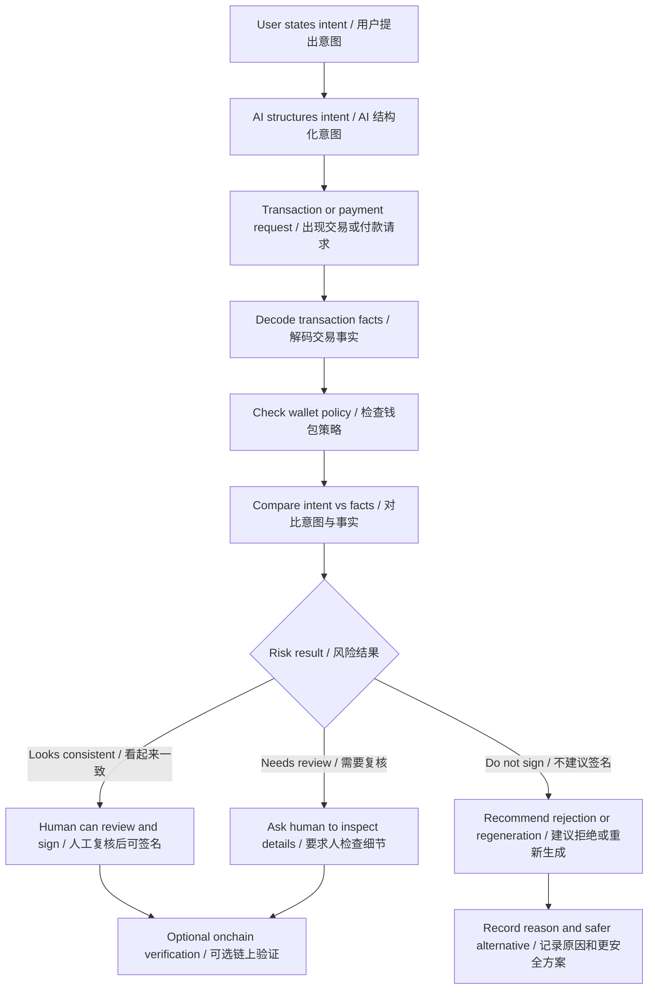

# Task 014 - AI x Web3 Problem Map and Main Direction Selection

## Metadata / 元信息

- Date / 日期: 2026-05-26
- Program / 项目: AI x Web3 School
- Week / 周次: Week 2
- Track / 方向: direction research / 方向研究
- WCB task / WCB 任务: Week 2｜方向研究｜AI × Web3 问题地图与主方向选择
- WCB task id / WCB 任务 ID: `cmpkl64ppnbg2mu01renief9v`
- Points / 分值: 20
- Repository / 仓库: https://github.com/pillowtalk-Qy/ai-web3-school-cohort-0
- Task file / 任务文件: `tasks/task-014-ai-web3-problem-map-and-main-direction.md`
- Status / 状态: completed locally; GitHub deployment and WCB submission pending human confirmation / 已在本地完成，GitHub 部署和 WCB 提交等待人工确认

## Task Goal / 任务目标

这个任务的目标不是直接写完整黑客松 proposal，而是完成 Week 2 的第一步方向研究：

1. 画出一张 AI x Web3 问题地图，至少覆盖 5 个方向。
2. 对每个方向说明 AI 的作用和 Web3 的机制。
3. 从地图里选择 2 个方向，说明它们为什么不是纯 AI 问题，也不是纯 Web3 问题。
4. 最后选择 1 个方向作为 Week 2 主线，后续问题拆解和项目 proposal 都围绕这个方向继续推进。

My goal is to move from a broad AI x Web3 interest map into one selected Week 2 main direction. This is a direction-selection proof, not the final Hackathon proposal.

## WCB Requirement Check / 平台要求核对

2026-05-26 通过 WCB Agent API 只读查询确认任务要求：

```text
Task id: cmpkl64ppnbg2mu01renief9v
Title: Week 2｜方向研究｜AI × Web3 问题地图与主方向选择
Points: 20
Available: true
Proof required: true
Current status before this proof: NOT_STARTED
Submission history before this proof: none
```

平台原始要求可以压缩成：

- 画一张 AI x Web3 问题地图。
- 至少覆盖 5 个方向。
- 每个方向都要说明 AI 作用和 Web3 机制。
- 选择 2 个方向，说明为什么它们不是纯 AI 或纯 Web3 问题。
- 选择 1 个方向作为 Week 2 主线。

WCB 建议覆盖的方向包括：

- Payment / Commerce / Settlement
- Identity / Reputation / Capability / Interoperability
- Wallet / Permission / Safe Execution
- Privacy / Security / Sovereignty
- Dev Tooling / Agent Workflow
- Governance / Coordination / Public Goods

In English, the task asks me to:

- Draw an AI x Web3 problem map.
- Cover at least 5 directions.
- Explain the AI role and Web3 mechanism in each direction.
- Pick 2 directions and explain why they are neither pure AI nor pure Web3 problems.
- Choose 1 direction as my Week 2 main line.

The WCB suggested directions include payment, identity, wallet safety, privacy and security, developer tooling, governance, coordination, and public goods.

## Problem Map / AI x Web3 问题地图

### Map Overview / 地图总览

我把 AI x Web3 的问题空间先分成 7 个方向。前 6 个来自 WCB Week 2 建议方向，第 7 个是我基于最近 Agent Memory 课程和 0G 外部会议笔记补充的方向。

```text
AI x Web3 Problem Map

1. Payment / Commerce / Settlement
   Agent 需要付款、收款、结算、退款或处理争议。

2. Identity / Reputation / Capability / Interoperability
   Agent 需要身份、能力声明、信誉记录和跨系统协作接口。

3. Wallet / Permission / Safe Execution
   Agent 可以提出或执行链上动作，但权限必须可限制、可复核、可撤销、可审计。

4. Privacy / Security / Sovereignty
   Agent 会接触上下文、数据、权限、凭证或策略，隐私与安全边界是系统前提。

5. Dev Tooling / Agent Workflow
   Agent 帮开发者读文档、写代码、调工具、维护 proof，但输出必须验证。

6. Governance / Coordination / Public Goods
   Agent 帮社区整理提案、会议、贡献和预算，但治理判断不能自动化越权。

7. Agent Memory / Audit Trail
   Agent 需要长期记忆、权限历史、决策记录和可复查执行轨迹。
```

**English Companion**

I split the AI x Web3 problem space into 7 directions. The first 6 come from the WCB Week 2 suggested map. The 7th direction, `Agent Memory / Audit Trail`, is added from my recent notes on agent memory, agent wallets, and the 0G ecosystem discussion.

```text
AI x Web3 Problem Map

1. Payment / Commerce / Settlement
   Agents may need to pay, receive payment, settle, refund, or handle disputes.

2. Identity / Reputation / Capability / Interoperability
   Agents need identity, capability claims, reputation records, and cross-system collaboration interfaces.

3. Wallet / Permission / Safe Execution
   Agents may prepare or execute onchain actions, but authority must be scoped, reviewable, revocable, and auditable.

4. Privacy / Security / Sovereignty
   Agents may touch context, data, credentials, permissions, and policies, so privacy and security are design prerequisites.

5. Dev Tooling / Agent Workflow
   Agents can help developers read docs, write code, call tools, and maintain proofs, but outputs must be verified.

6. Governance / Coordination / Public Goods
   Agents can organize proposals, meetings, contribution records, and budgets, but governance judgment must not be delegated blindly.

7. Agent Memory / Audit Trail
   Long-running agents need memory, permission history, decision records, and reviewable execution trails.
```

I added `Agent Memory / Audit Trail` because long-running agents cannot be evaluated only by their current prompt. For agent wallets, memory may affect permission judgment, payment history, reputation, and auditability.

### Direction 1 - Payment / Commerce / Settlement

| 维度 | 内容 |
|---|---|
| 核心问题 | Agent 未来可能需要购买 API、支付模型调用、向其他 Agent 购买服务、收款、退款、处理争议和留下付款证明。 |
| AI 作用 | 理解用户要买什么服务，比较报价，判断服务结果是否满足任务，解释为什么需要付款，以及提醒是否超预算或重复付款。 |
| Web3 机制 | 稳定币、x402-like payment flow、链上收据、facilitator、escrow、结算记录、退款或争议处理。 |
| 典型场景 | Agent 请求一个受 x402 保护的 API，识别付款要求，完成小额稳定币支付，拿到服务返回结果并记录 proof。 |
| 主要风险 | Agent 可能付错对象、重复付款、超预算、使用不可信 facilitator，或者把“能付款”误当成“应该付款”。 |

**English Companion**

| Dimension | Content |
|---|---|
| Core problem | Agents may need to buy APIs, pay for model calls, purchase services from other agents, receive payment, issue refunds, handle disputes, and leave payment proofs. |
| AI role | Understand what service the user needs, compare offers, judge whether the service result satisfies the task, explain why payment is needed, and warn about over-budget or duplicate payment. |
| Web3 mechanism | Stablecoins, x402-like payment flow, onchain receipts, facilitator, escrow, settlement records, refund, and dispute handling. |
| Typical scenario | An agent requests an x402-protected API, recognizes the payment requirement, completes a small stablecoin payment, receives the service result, and records proof. |
| Main risk | The agent may pay the wrong party, pay twice, exceed the budget, use an untrusted facilitator, or treat "can pay" as "should pay." |

This direction is about agents as economic actors. AI decides and explains what service is needed; Web3 provides payment rails, settlement records, and verifiable receipts.

### Direction 2 - Identity / Reputation / Capability / Interoperability

| 维度 | 内容 |
|---|---|
| 核心问题 | 如果 Agent 要跨平台被发现、调用和协作，用户需要知道它是谁、能做什么、历史表现如何、失败时谁负责。 |
| AI 作用 | 描述 Agent 能力，协商任务，解释历史表现，和其他 Agent 或工具交换上下文。 |
| Web3 机制 | Agent ID、registry、reputation record、validation registry、attestation、capability profile、可验证交付记录。 |
| 典型场景 | 一个 Agent profile 记录维护者、能力、输入输出、收费方式、历史任务、验证来源和失败处理方式。 |
| 主要风险 | Sybil、刷评价、伪造能力、身份转卖、信誉 farming、高信誉 Agent 后期作恶。 |

**English Companion**

| Dimension | Content |
|---|---|
| Core problem | If agents need to be discovered, called, and coordinated across platforms, users need to know who they are, what they can do, how they performed in the past, and who is responsible when they fail. |
| AI role | Describe agent capabilities, negotiate tasks, explain past performance, and exchange context with other agents or tools. |
| Web3 mechanism | Agent ID, registry, reputation record, validation registry, attestation, capability profile, and verifiable delivery records. |
| Typical scenario | An agent profile records maintainer, capabilities, input and output format, pricing, task history, validation source, and failure handling. |
| Main risk | Sybil attacks, fake reviews, false capability claims, identity resale, reputation farming, or high-reputation agents abusing trust later. |

This direction focuses on discoverability and trust. AI needs to describe and execute capabilities; Web3 can provide registries, attestations, reputation, and validation records.

### Direction 3 - Wallet / Permission / Safe Execution

| 维度 | 内容 |
|---|---|
| 核心问题 | Agent 可以帮助准备链上动作，但钱包权限一旦无限开放，就会变成真实资产和授权风险。 |
| AI 作用 | 把用户自然语言意图结构化，解释交易事实，对比用户意图和交易内容，标记权限或策略风险。 |
| Web3 机制 | 钱包签名、智能账户、session key、spending limit、allowlist、policy engine、Safe guard、ERC-4337、ERC-7702、交易模拟、clear signing。 |
| 典型场景 | 用户说“只授权 10 USDC”，但交易事实显示无限授权；系统标记 intent mismatch，并建议不要签名。 |
| 主要风险 | 盲签、无限授权、错误 spender、错误网络、隐藏转账、prompt injection、Agent 绕过人工确认。 |

**English Companion**

| Dimension | Content |
|---|---|
| Core problem | Agents can help prepare onchain actions, but unlimited wallet permission creates real asset and approval risk. |
| AI role | Structure natural-language intent, explain transaction facts, compare user intent with transaction content, and flag permission or policy risks. |
| Web3 mechanism | Wallet signing, smart accounts, session keys, spending limits, allowlists, policy engines, Safe guards, ERC-4337, ERC-7702, transaction simulation, and clear signing. |
| Typical scenario | The user says "approve only 10 USDC", but transaction facts show unlimited approval. The system flags an intent mismatch and recommends not signing. |
| Main risk | Blind signing, unlimited approval, wrong spender, wrong network, hidden transfer, prompt injection, or an agent bypassing human confirmation. |

This is the strongest fit for my current learning path. AI helps translate and compare intent; Web3 provides transaction facts, wallet authority, policy enforcement, and verifiable execution.

### Direction 4 - Privacy / Security / Sovereignty

| 维度 | 内容 |
|---|---|
| 核心问题 | Agent 会看到用户上下文、项目策略、API key、钱包权限、交易计划、身份数据或私密文档。安全不是附加项，而是系统前提。 |
| AI 作用 | 识别敏感数据，整理 threat model，检测 prompt injection，判断哪些内容不能进入模型或外部工具。 |
| Web3 机制 | 自托管、加密、TEE、ZK、local-first storage、DID、权限撤销、可验证策略、审计日志。 |
| 典型场景 | 一个 Agent workflow 明确哪些数据可以进入云模型，哪些必须留在本地，哪些动作必须显式确认。 |
| 主要风险 | 敏感信息泄露、excessive agency、工具注入、供应商依赖、数据不可删除、责任边界不清。 |

**English Companion**

| Dimension | Content |
|---|---|
| Core problem | Agents may see user context, project strategy, API keys, wallet permissions, transaction plans, identity data, or private documents. Security is not an add-on; it is a system prerequisite. |
| AI role | Identify sensitive data, organize threat models, detect prompt injection, and decide what must not enter a model or external tool. |
| Web3 mechanism | Self-custody, encryption, TEE, ZK, local-first storage, DID, permission revocation, verifiable policy, and audit logs. |
| Typical scenario | An agent workflow clearly marks which data can enter a cloud model, which data must stay local, and which actions require explicit confirmation. |
| Main risk | Sensitive data leakage, excessive agency, tool injection, vendor lock-in, non-deletable data, and unclear accountability. |

This direction treats privacy and security as design prerequisites. AI classifies and explains risk; Web3-related mechanisms support ownership, revocation, verification, and sovereignty.

### Direction 5 - Dev Tooling / Agent Workflow

| 维度 | 内容 |
|---|---|
| 核心问题 | AI 可以显著加速 Web3 开发，但合约代码、ABI、RPC、交易脚本和 proof 都不能只凭模型输出相信。 |
| AI 作用 | 读文档、生成代码、解释错误、创建测试、整理 proof、维护学习仓库、调用只读工具。 |
| Web3 机制 | Solidity、Foundry、Hardhat、viem、wagmi、ABI、RPC、区块浏览器、测试网、GitHub proof、CI。 |
| 典型场景 | Agent 起草合约交互脚本，人复核网络、ABI、目标地址、calldata 和测试网输出后再执行。 |
| 主要风险 | 编造 API、错误网络、未测试合约、隐藏写操作、proof 不充分、自动化越过钱包签名边界。 |

**English Companion**

| Dimension | Content |
|---|---|
| Core problem | AI can accelerate Web3 development, but contract code, ABIs, RPC calls, transaction scripts, and proofs cannot be trusted only because a model generated them. |
| AI role | Read docs, generate code, explain errors, create tests, organize proof, maintain a learning repository, and call read-only tools. |
| Web3 mechanism | Solidity, Foundry, Hardhat, viem, wagmi, ABI, RPC, block explorers, testnets, GitHub proof, and CI. |
| Typical scenario | An agent drafts a contract interaction script; a human reviews the network, ABI, target address, calldata, and testnet output before execution. |
| Main risk | Fabricated APIs, wrong network, untested contracts, hidden write actions, weak proof, or automation crossing the wallet signing boundary. |

This direction is practical and close to builder workflows. AI helps move faster, while Web3 tooling and public records keep the work verifiable.

### Direction 6 - Governance / Coordination / Public Goods

| 维度 | 内容 |
|---|---|
| 核心问题 | DAO 和社区需要更好地整理提案、会议、行动项、贡献记录和预算执行，但治理权力不能交给黑箱 Agent。 |
| AI 作用 | 总结提案、提取行动项、整理争议点、生成预算 checklist、准备公开更新。 |
| Web3 机制 | DAO proposal、Snapshot、onchain governance、多签执行、公共物品资助、attestation、贡献记录、预算透明。 |
| 典型场景 | 治理助手把会议纪要转成 action items，并标出哪些事项需要社区投票或多签确认。 |
| 主要风险 | AI 扭曲社区意图，过度压缩分歧，自动化预算决策，制造虚假的 accountability。 |

**English Companion**

| Dimension | Content |
|---|---|
| Core problem | DAOs and communities need better organization of proposals, meetings, action items, contribution records, and budget execution, but governance authority should not be handed to a black-box agent. |
| AI role | Summarize proposals, extract action items, organize disagreement points, generate budget checklists, and prepare public updates. |
| Web3 mechanism | DAO proposals, Snapshot, onchain governance, multisig execution, public-goods funding, attestations, contribution records, and budget transparency. |
| Typical scenario | A governance assistant turns meeting notes into action items and marks which items require community vote or multisig confirmation. |
| Main risk | AI distorting community intent, compressing disagreement too aggressively, automating budget decisions, or creating false accountability. |

AI can improve governance information flow, but final decisions around values, budgets, and public accountability must remain with human governance processes.

### Direction 7 - Agent Memory / Audit Trail

| 维度 | 内容 |
|---|---|
| 核心问题 | 长期运行的 Agent 需要记住偏好、项目状态、历史决策、失败经验、权限边界和执行记录。 |
| AI 作用 | 压缩历史，触发相关记忆，召回高信号内容，在当前任务下重新解释，并更新或遗忘过期信息。 |
| Web3 机制 | 链上审计轨迹、attestation、permission history、Agent identity、reputation、签名记录、可撤销数据引用、可验证日志。 |
| 典型场景 | Agent wallet 执行动作前，系统检查历史用户策略：“不要做无限授权”，并展示此前拒签过的类似风险。 |
| 主要风险 | memory poisoning、旧偏好污染、隐私泄露、购买来的 memory 不可信、敏感记忆无法删除。 |

**English Companion**

| Dimension | Content |
|---|---|
| Core problem | Long-running agents need to remember preferences, project state, past decisions, failures, permission boundaries, and execution records. |
| AI role | Compress history, trigger relevant memory, recall high-signal context, reinterpret it for the current task, and update or forget outdated information. |
| Web3 mechanism | Onchain audit trails, attestations, permission history, agent identity, reputation, signing records, revocable data references, and verifiable logs. |
| Typical scenario | Before an agent wallet action, the system checks the historical user policy: "do not make unlimited approvals", then shows similar risks previously rejected. |
| Main risk | Memory poisoning, outdated preferences contaminating decisions, privacy leakage, untrusted purchased memory, or sensitive memory that cannot be deleted. |

Memory is not just personalization. For agent wallets, memory can influence permission checks, payment history, risk review, and auditability.

## Direction Comparison / 方向对比

| 方向 | 真实痛点 | 现有积累 | 黑客松适配度 | 安全边界清晰度 | 当前决策 |
|---|---:|---:|---:|---:|---|
| Payment / Commerce / Settlement | 高 | 中 | 高 | 中 | 强后续方向 |
| Identity / Reputation / Capability / Interoperability | 中高 | 中 | 中 | 中 | backlog |
| Wallet / Permission / Safe Execution | 很高 | 高 | 很高 | 高 | 主方向 |
| Privacy / Security / Sovereignty | 高 | 中 | 中高 | 中 | 重要分析镜头 |
| Dev Tooling / Agent Workflow | 中 | 高 | 中 | 高 | 支撑层 |
| Governance / Coordination / Public Goods | 中 | 中 | 中 | 高 | backlog |
| Agent Memory / Audit Trail | 高 | 中高 | 中高 | 中 | 主方向支撑层 |

我的选择标准：

1. 问题必须足够具体，可以进入 Week 3 / Hackathon demo。
2. 方向必须真的同时需要 AI 和 Web3，而不是把热门名词拼在一起。
3. 第一版 MVP 必须避开真实私钥、真实资产、主网签名和自动交易。
4. 我需要已经有足够资料和笔记支撑 proof-of-work。
5. 方向要和我长期关注的 Agent wallet safety、权限控制和可验证执行相关。

**English Companion**

| Direction | Real pain | Existing work | Hackathon fit | Safety boundary clarity | Current decision |
|---|---:|---:|---:|---:|---|
| Payment / Commerce / Settlement | High | Medium | High | Medium | Strong follow-up direction |
| Identity / Reputation / Capability / Interoperability | Medium-high | Medium | Medium | Medium | Backlog |
| Wallet / Permission / Safe Execution | Very high | High | Very high | High | Main direction |
| Privacy / Security / Sovereignty | High | Medium | Medium-high | Medium | Important analysis lens |
| Dev Tooling / Agent Workflow | Medium | High | Medium | High | Supporting layer |
| Governance / Coordination / Public Goods | Medium | Medium | Medium | High | Backlog |
| Agent Memory / Audit Trail | High | Medium-high | Medium-high | Medium | Supporting layer for the main direction |

My selection criteria are specificity, real AI-Web3 dependency, safe MVP scope, existing evidence, and alignment with my longer-term focus on agent wallet safety.

## Two Directions Analyzed in Detail / 两个方向详细辨析

### Direction A - Wallet / Permission / Safe Execution

#### 为什么它不是纯 AI 问题

如果它只是纯 AI 问题，解决方案可能只是“让模型把交易解释得更清楚”。但这不够。

钱包安全必须建立在确定性的 Web3 事实上：

- 这笔操作在哪条链？
- 调用的是哪个合约或接收方？
- 执行的是哪个方法？
- 它是 transfer、approve、swap、deposit、borrow，还是其他 contract write？
- 金额是有限额度还是无限额度？
- spender 是已知对象还是未知对象？
- 是否有 smart account、Safe guard、policy engine 或 session key 限制？
- 能否通过交易哈希、区块浏览器、RPC、模拟或 clear-signing descriptor 验证？

AI 可以解释和对比，但安全判断不能只来自模型语言输出。它必须落在交易事实、钱包权限、账户架构和可验证执行记录上。

#### 为什么它不是纯 Web3 问题

如果它只是纯 Web3 问题，那用户只要自己读 calldata、ABI、钱包提示和交易模拟就可以解决。但现实中，大量用户并不能稳定读懂这些内容。

AI 的作用在于：

- 把用户自然语言意图转成结构化 intent。
- 把交易事实翻译成用户能理解的语言。
- 对比“我想做什么”和“这笔交易实际会做什么”。
- 总结权限和策略风险。
- 当用户意图模糊时追问。
- 把复杂技术字段变成签名前 review checklist。

这个问题正好发生在人类语言和机器可执行交易之间。

**English Companion**

This is not a pure AI problem. If it were only an AI problem, the answer would be "make the model explain the transaction better." That is not enough. Wallet safety must be grounded in deterministic Web3 facts: chain, target contract, method, value, spender, approval amount, transaction simulation, clear-signing descriptor, account policy, and verifiable execution record.

It is also not a pure Web3 problem. Web3 infrastructure can expose calldata, ABI, wallet prompts, simulations, and policy rules, but many users cannot reliably interpret them. AI is needed to structure natural-language intent, translate transaction facts, compare intent with actual execution, ask follow-up questions when intent is vague, and turn technical fields into a pre-signing review checklist.

This problem sits exactly between human language and machine-executable transactions.

### Direction B - Payment / Commerce / Settlement

#### 为什么它不是纯 AI 问题

Agent commerce 不能只靠更聪明的 Agent 规划解决。如果 Agent 决定购买 API、模型调用或其他 Agent 服务，系统仍然要回答：

- 用什么支付？
- 价格是多少？
- 付款对象是谁？
- 用哪个 token 和 network？
- 如何证明已经结算？
- 失败后如何退款或争议处理？
- 预算上限是什么？
- 谁验证 payment payload？

这些都是支付基础设施和 Web3 机制问题。稳定币、x402-like flow、facilitator、链上收据和结算记录都是核心组件。

#### 为什么它不是纯 Web3 问题

只有 payment rail 也不够。Web3 可以完成支付，但它不知道用户为什么要买这个服务，也不知道服务结果是否满足需求。

AI 的作用在于：

- 理解用户要完成什么任务。
- 判断服务是否值得购买。
- 比较不同服务提供方。
- 检查价格是否合理。
- 判断交付结果是否满足请求。
- 避免重复付款或无意义付款。

没有 AI，它只是支付协议；没有 Web3，它缺少可编程结算、开放收据和跨平台支付协调。

**English Companion**

This is not a pure AI problem. If an agent decides to buy an API, model call, or another agent's service, the system still needs payment rails, pricing, recipient verification, token and network selection, settlement proof, refund or dispute handling, budget limits, and payment payload verification.

It is also not a pure Web3 problem. Web3 can move value and produce receipts, but it does not know why the user needs a service, whether the provider is appropriate, whether the price is reasonable, or whether the result satisfies the original task.

Agent commerce needs both sides. AI handles task intent, service selection, price judgment, duplicate-payment prevention, and outcome review. Web3 handles payment, settlement, receipts, facilitator verification, and dispute evidence.

## Selected Main Direction / 主方向选择

我的 Week 2 主线方向是：

```text
Wallet / Permission / Safe Execution
```

更具体地说：

```text
AI Wallet Clear Intent Guard:
pre-signing intent, permission, and payment-route review for agent wallets
```

中文表达：

```text
AI 钱包签名前意图、权限与支付路径守卫
```

这个方向不是完整 AI wallet，而是一个签名前安全审查层。它关注的是：在人签名之前，或者 Agent wallet 在 policy 范围内执行之前，系统如何帮助用户看清楚意图、交易事实、权限边界和支付路径。

**English Companion**

My Week 2 main direction is `Wallet / Permission / Safe Execution`.

The sharper product direction is:

```text
AI Wallet Clear Intent Guard:
pre-signing intent, permission, and payment-route review for agent wallets
```

This is not a full AI wallet. It is a pre-signing review layer. Before a human signs, or before an agent wallet acts within a policy boundary, the system should help the user inspect intent, transaction facts, permission scope, and payment route.

## Why I Choose This Direction / 为什么选择这个方向

### 1. 它连接了我 Week 1 和 Week 2 的连续积累

这个方向不是今天突然选出来的。它连接了我前面已经完成的材料：

- Task 008：AI x Web3 最小交叉流程图。
- Task 010：受限 Web3 助手 workflow。
- Task 013：Cobo Agentic Wallet 和 Coinbase AgentKit / x402 项目分析。
- Sophia 嘉宾课：Agent identity、reputation、machine payment、x402、AI wallet safety。
- Long-term Memory 课程：memory source、permission history、audit trail。
- 0G 外部会议笔记：Agent wallet、memory asset、AI prediction market、AI economy。

### 2. 它有非常具体的安全问题

危险断点很清楚：

```text
用户意图：只授权 10 USDC
交易事实：approve(spender, unlimited)
```

或者：

```text
用户意图：只为这次 API 请求付款一次
支付路径：未知 facilitator、重复付款、错误 recipient、没有 fallback
```

这种 mismatch 很容易 demo，也很容易让别人理解为什么它重要。

### 3. 它确实同时需要 AI 和 Web3

AI 负责：

- 理解自然语言意图。
- 解释交易事实。
- 对比 intent 和 facts。
- 总结风险。
- 生成用户可读 review。

Web3 负责：

- 提供交易事实。
- 钱包签名。
- 账户权限。
- policy / guard。
- payment route。
- 链上验证。

任何一边单独做都不完整。

### 4. 它的 MVP 边界安全

第一版不需要：

- 做完整钱包。
- 持有私钥。
- 接真实资产。
- 自动签名。
- 广播交易。
- 自动提交任何钱包动作。

它可以从 sample transaction 和 mock policy data 开始，先做签名前 review prototype。

### 5. 它适合黑客松赛道

它自然贴近：

- Wallet tools。
- Security governance。
- Agentic commerce。
- AI x Web3 developer tooling。

**English Companion**

I choose `Wallet / Permission / Safe Execution` for five reasons:

1. It connects my Week 1 and Week 2 materials, including the minimal AI-Web3 flowchart, restricted Web3 assistant workflow, AI wallet project analysis, Sophia's class, agent memory notes, and the 0G ecosystem discussion.
2. It has a concrete safety problem: the user's intent may say "approve only 10 USDC" while transaction facts show `approve(spender, unlimited)`.
3. It truly needs both AI and Web3: AI understands and explains intent; Web3 provides transaction facts, wallet permissions, policy enforcement, payment route, and verifiable execution.
4. The MVP boundary is safe: no full wallet, no private keys, no real assets, no automatic signing, no transaction broadcasting.
5. It fits Hackathon tracks around wallet tools, security governance, agentic commerce, and AI x Web3 developer tooling.

## Main Direction Problem Breakdown / 主方向问题拆解

### Participants / 参与方

- User / 用户：提出意图，保留最终判断权。
- AI Agent / AI 代理：结构化意图，解释事实，对比风险。
- Wallet / 钱包：展示交易或签名请求。
- Policy layer / 策略层：定义 spending limit、allowlist、function rule、人工确认阈值。
- Web3 tools / 工具层：解码交易，模拟执行，查询区块浏览器或 RPC。
- Chain / 链上系统：只有用户确认后才执行并留下记录。

**English Companion**

- User: states intent and keeps final judgment authority.
- AI Agent: structures intent, explains facts, and compares risk.
- Wallet: displays the transaction or signature request.
- Policy layer: defines spending limit, allowlist, function rule, and human-confirmation threshold.
- Web3 tools: decode transactions, simulate execution, and query block explorers or RPC.
- Chain: executes only after confirmation and leaves a record.

### Minimal Flow / 最小流程



### Review Cards / 审查卡片

第一版 MVP 可以做成五张 review card：

1. User intent card / 用户意图卡
   - 用户目标
   - token / amount / recipient / purpose
   - 是否需要人工确认

2. Transaction facts card / 交易事实卡
   - chain
   - target contract
   - method
   - spender / recipient
   - amount
   - approval / transfer / contract write 分类

3. Policy check card / 权限策略卡
   - spending limit
   - allowlist
   - deny unlimited approval
   - 超过阈值必须人工确认
   - revoke reminder

4. Payment route card / 支付路径卡
   - resource
   - price
   - token
   - network
   - recipient
   - facilitator
   - fallback status

5. Memory / permission history card / 记忆与权限历史卡
   - 历史用户偏好
   - 之前拒绝过的风险模式
   - source trust level
   - 记忆来源是 user-confirmed、tool-verified、model-inferred 还是 external-unverified

**English Companion**

The first MVP can be organized as five review cards:

1. User intent card
   - user goal
   - token / amount / recipient / purpose
   - whether human confirmation is required

2. Transaction facts card
   - chain
   - target contract
   - method
   - spender / recipient
   - amount
   - approval / transfer / contract write classification

3. Policy check card
   - spending limit
   - allowlist
   - deny unlimited approval
   - human confirmation above threshold
   - revoke reminder

4. Payment route card
   - resource
   - price
   - token
   - network
   - recipient
   - facilitator
   - fallback status

5. Memory / permission history card
   - historical user preference
   - previously rejected risk patterns
   - source trust level
   - whether memory source is user-confirmed, tool-verified, model-inferred, or external-unverified

## Backlog Directions / 暂不选择的方向

### 1. Identity / Reputation / Capability / Interoperability

这个方向很重要，因为 wallet permission 未来可能会参考 Agent identity 和 reputation。

暂时不选为主方向的原因：

- 对第一版 MVP 来说过于抽象。
- 依赖的标准和 registry 还比较早期。
- 短 demo 中不如 wallet intent mismatch 容易展示用户价值。

后续连接方式：

- 把 ERC-8004-like reputation 作为 policy input。
- 在 wallet execution 前展示 agent capability 和 validation source。

**English Companion**

This direction matters because future wallet permission checks may use agent identity and reputation as policy inputs.

I do not choose it as the main direction now because it is too abstract for the first MVP, depends on early registry and reputation standards, and is harder to demonstrate quickly than a wallet intent mismatch.

Later, it can connect back to the main direction by using ERC-8004-like reputation as a policy input and showing agent capability plus validation source before wallet execution.

### 2. Payment / Commerce / Settlement

这个方向非常相关，因为 x402 和 agent payment 很可能成为核心场景。

暂时不选为主方向的原因：

- payment flow 涉及 facilitator、settlement、service delivery、dispute、refund，变量太多。
- 完整 x402 demo 可能会稀释更清楚的 signing safety 问题。

后续连接方式：

- 加一张 x402 payment route review card。
- 在付款前解释 facilitator、token、network、recipient 和 fallback。

**English Companion**

This direction is strongly related because x402 and agent payment may become a core scenario.

I do not choose it as the main direction now because a full payment flow involves facilitator selection, settlement, service delivery, dispute, refund, and fallback. It may dilute the clearer signing-safety problem.

Later, it can connect back through an x402 payment route review card that explains facilitator, token, network, recipient, and fallback before payment.

### 3. Agent Memory / Audit Trail

这个方向是我最近非常感兴趣的方向。

暂时不选为主方向的原因：

- memory system 实现范围容易过大。
- memory asset 会引入隐私、所有权和质量验证问题，第一版 demo 很难解决。

后续连接方式：

- 先把 memory 做成很小的 permission history card。
- 展示历史用户偏好，例如“不要做无限授权”。

**English Companion**

This direction is one of my strongest current interests.

I do not choose it as the main direction now because memory systems can become too broad. Memory assets also introduce privacy, ownership, quality, poisoning, and deletion problems that are hard to solve in a first demo.

Later, it can connect back as a small permission history card. For example, the system can show a historical user preference such as "do not make unlimited approvals."

## Week 2 Main Line / Week 2 后续主线

Week 2 接下来我会围绕 `Wallet / Permission / Safe Execution` 深挖。

后续任务和 proposal 会继续拆：

- Agent wallet 执行流程。
- 权限策略。
- 人工确认边界。
- 交易事实和用户意图对比。
- x402 payment route transparency。
- memory source 和 permission history 作为支撑层。

核心原则是：

```text
AI 可以准备和解释。
确定性工具负责验证交易事实。
Policy check 定义允许的权限。
人保留最终签名权。
链上系统只在确认后执行并留下记录。
```

**English Companion**

My Week 2 main line is wallet permission and safe execution.

The later problem breakdown and proposal should deepen:

- agent wallet execution flow
- permission policy
- human confirmation boundary
- transaction facts vs user intent comparison
- x402 payment route transparency
- memory source and permission history as supporting context

The core principle is: AI can prepare and explain; deterministic tools verify transaction facts; policy checks define allowed authority; humans keep final signing authority; onchain systems execute only after confirmation and leave records.

## Reference Materials / 参考资料

| 资料 | 作用 |
|---|---|
| `tasks/task-008-ai-web3-minimal-crossover-flowchart.md` | 提供 AI -> 人工复核 -> 钱包确认 -> 链上执行 -> proof 的基础安全流程。 |
| `tasks/task-010-restricted-web3-assistant-workflow.md` | 定义受限 Web3 assistant：可以解释和检查，但不能签名或执行。 |
| `tasks/task-013-ai-wallet-project-analysis.md` | 拆解 Cobo Agentic Wallet 与 Coinbase AgentKit / Agentic Wallet / x402。 |
| `notes/classes/2026-05-23-open-agile-economy-ai-agent-economy.md` | 连接 Agent identity、reputation、machine payment、x402 和 AI wallet safety。 |
| `notes/classes/2026-05-25-long-term-memory-for-ai-agents.md` | 提供 memory source、compression、recall、permission history 和 audit trail 的理解。 |
| `notes/meetings/2026-05-25-ai-agent-wallet-sovereign-assets-0g-ecosystem.md` | 提供 Agent wallet、memory asset、AI prediction market 和 AI economy 的外部观察。 |
| Cobo Agentic Wallet docs | 参考 task-scoped、policy-enforced、reviewable、revocable 的 wallet authority。 |
| Coinbase AgentKit / Agentic Wallet / x402 docs | 参考 agent wallet tooling 和 payment-route transparency。 |
| ERC-4337 / Safe guard concepts | 参考智能账户、policy enforcement 和受限执行。 |

**English Companion**

| Material | Role in this proof |
|---|---|
| `tasks/task-008-ai-web3-minimal-crossover-flowchart.md` | Provides the basic safe flow: AI, human review, wallet confirmation, onchain execution, and proof. |
| `tasks/task-010-restricted-web3-assistant-workflow.md` | Defines a restricted Web3 assistant that can explain and check but cannot sign or execute. |
| `tasks/task-013-ai-wallet-project-analysis.md` | Analyzes Cobo Agentic Wallet and Coinbase AgentKit / Agentic Wallet / x402. |
| `notes/classes/2026-05-23-open-agile-economy-ai-agent-economy.md` | Connects agent identity, reputation, machine payment, x402, and AI wallet safety. |
| `notes/classes/2026-05-25-long-term-memory-for-ai-agents.md` | Supports memory source, compression, recall, permission history, and audit trail. |
| `notes/meetings/2026-05-25-ai-agent-wallet-sovereign-assets-0g-ecosystem.md` | Provides external observations about agent wallets, memory assets, AI prediction markets, and AI economy. |
| Cobo Agentic Wallet docs | Reference for task-scoped, policy-enforced, reviewable, and revocable wallet authority. |
| Coinbase AgentKit / Agentic Wallet / x402 docs | Reference for agent wallet tooling and payment-route transparency. |
| ERC-4337 / Safe guard concepts | Reference for smart accounts, policy enforcement, and restricted execution. |

## WCB Submission Draft

```text
Task proof:
https://github.com/pillowtalk-Qy/ai-web3-school-cohort-0/blob/main/tasks/task-014-ai-web3-problem-map-and-main-direction.md

说明：
我完成了 Week 2「方向研究｜AI × Web3 问题地图与主方向选择」任务。

这份 proof 包含：
1. 一张 AI × Web3 问题地图，覆盖 7 个方向：
   - Payment / Commerce / Settlement
   - Identity / Reputation / Capability / Interoperability
   - Wallet / Permission / Safe Execution
   - Privacy / Security / Sovereignty
   - Dev Tooling / Agent Workflow
   - Governance / Coordination / Public Goods
   - Agent Memory / Audit Trail
2. 每个方向都说明了 AI 作用、Web3 机制、典型场景和主要风险。
3. 选择了两个方向做详细辨析：
   - Wallet / Permission / Safe Execution
   - Payment / Commerce / Settlement
4. 分别说明了为什么它们不是纯 AI 问题，也不是纯 Web3 问题。
5. 最终选择 Week 2 主线方向：
   AI Wallet Clear Intent Guard:
   pre-signing intent, permission, and payment-route review for agent wallets

我后续的 Week 2 拆解和 proposal 会围绕「Wallet / Permission / Safe Execution」继续推进。第一版 MVP 不做完整钱包、不接触私钥、不自动签名、不处理真实资产，而是先做签名前 review layer：对比用户意图、交易事实、权限策略、payment route 和 memory / permission history。

本 proof 不包含私钥、助记词、API key、token、.env 文件、真实资产钱包信息或私密截图。
```

**English Companion**

```text
Task proof:
https://github.com/pillowtalk-Qy/ai-web3-school-cohort-0/blob/main/tasks/task-014-ai-web3-problem-map-and-main-direction.md

Description:
I completed the Week 2 task "Direction Research | AI x Web3 Problem Map and Main Direction Selection."

This proof includes:
1. An AI x Web3 problem map covering 7 directions:
   - Payment / Commerce / Settlement
   - Identity / Reputation / Capability / Interoperability
   - Wallet / Permission / Safe Execution
   - Privacy / Security / Sovereignty
   - Dev Tooling / Agent Workflow
   - Governance / Coordination / Public Goods
   - Agent Memory / Audit Trail
2. Each direction explains the AI role, Web3 mechanism, typical scenario, and main risk.
3. Two directions are analyzed in detail:
   - Wallet / Permission / Safe Execution
   - Payment / Commerce / Settlement
4. The proof explains why these two directions are neither pure AI nor pure Web3 problems.
5. The final Week 2 main direction is:
   AI Wallet Clear Intent Guard:
   pre-signing intent, permission, and payment-route review for agent wallets

My later Week 2 breakdown and proposal will continue around "Wallet / Permission / Safe Execution." The first MVP will not build a full wallet, touch private keys, auto-sign, process real assets, or broadcast transactions. It will start as a pre-signing review layer that compares user intent, transaction facts, permission policy, payment route, and memory / permission history.

This proof does not include private keys, seed phrases, API keys, tokens, `.env` files, real-asset wallet information, or private screenshots.
```

## Verification Status / 验证状态

- [x] WCB task details checked through read-only API / 已通过只读 API 查询 WCB 任务详情
- [x] Problem map covers at least 5 directions / 问题地图覆盖至少 5 个方向
- [x] AI role and Web3 mechanism explained for each direction / 每个方向均说明 AI 作用与 Web3 机制
- [x] 2 directions analyzed in detail / 已选择 2 个方向详细辨析
- [x] Explained why selected directions are not pure AI or pure Web3 problems / 已说明为什么不是纯 AI 或纯 Web3 问题
- [x] 1 Week 2 main direction selected / 已选择 1 个 Week 2 主线方向
- [x] WCB submission draft prepared / 已准备 WCB 提交草稿
- [ ] Deployed to GitHub / 尚未部署到 GitHub
- [ ] Submitted through WCB platform / 尚未提交到 WCB

## Privacy Check / 隐私检查

- [x] No private keys, seed phrases, API keys, cookies, tokens, sessions, or `.env` content.
- [x] No real wallet address, real-asset balance, or private transaction pattern.
- [x] No private screenshots or private chat transcripts.
- [x] The task is a direction-selection proof and does not execute wallet actions.
- [x] Commit, push, and WCB proof submission still require explicit human confirmation.

中文隐私检查：

- [x] 不包含私钥、助记词、API key、cookies、tokens、sessions 或 `.env` 内容。
- [x] 不包含真实资产钱包地址、真实资产余额或私密交易模式。
- [x] 不包含私密截图或私密聊天记录。
- [x] 本任务只是方向选择 proof，不执行任何钱包动作。
- [x] commit、push 和 WCB proof submission 仍然需要明确人工确认。
