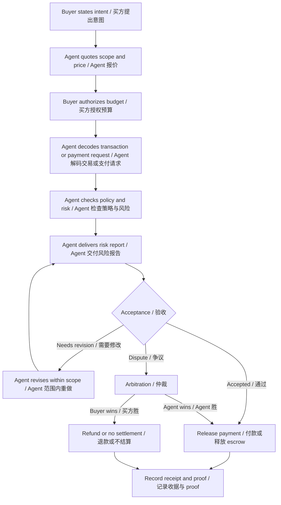

# Task 015 - Minimal Payment and Commerce Flow

## Metadata / 元信息

- Date / 日期: 2026-05-26
- Program / 项目: AI x Web3 School
- Week / 周次: Week 2
- Track / 方向: Payment / Commerce
- WCB task / WCB 任务: Week 2｜Payment / Commerce｜最小支付与商业流程拆解
- WCB task id / WCB 任务 ID: `cmpkl64w9nbg5mu01jev746ru`
- Points / 分值: 20
- Repository / 仓库: https://github.com/pillowtalk-Qy/ai-web3-school-cohort-0
- Task file / 任务文件: `tasks/task-015-minimal-payment-commerce-flow.md`
- Status / 状态: completed locally; GitHub deployment and WCB submission pending human confirmation / 已在本地完成，GitHub 部署和 WCB 提交等待人工确认

## Task Goal / 任务目标

这个任务要求我选择一个“agent 帮人完成任务并收款”的场景，拆出最小 payment / commerce flow。

平台要求至少覆盖：

- 谁下单。
- 谁执行。
- 谁验收。
- 谁付款。
- 谁仲裁。
- 报价。
- 预算授权。
- 执行。
- 交付。
- 验收。
- 付款 / 退款 / 争议。
- 记录证明。

English companion:

The task asks me to design a minimal commerce flow where an agent completes a task for a human or organization and receives payment. The proof must show ordering, execution, acceptance, payment, arbitration, quote, budget authorization, delivery, refund or dispute handling, and proof records.

## WCB Requirement Check / 平台要求核对

2026-05-26 通过 WCB Agent API 只读查询确认任务要求：

```text
Task id: cmpkl64w9nbg5mu01jev746ru
Title: Week 2｜Payment / Commerce｜最小支付与商业流程拆解
Points: 20
Available: true
Proof required: true
Current status before this proof: NOT_STARTED
Submission history before this proof: none
```

平台原始要求可以压缩成：

- 选择一个 agent 帮人完成任务并收款的场景。
- 拆出完整流程：谁下单、谁执行、谁验收、谁付款、谁仲裁。
- 设计最小 payment / commerce flow。
- 至少包含报价、预算授权、执行、交付、验收、付款 / 退款 / 争议、记录证明。
- 可选加分：比较 x402、MPP、ERC-8004、ERC-8183 中任意两个。

I will compare `x402` and `ERC-8004` because they map cleanly to two different parts of the commerce flow: payment transport and agent trust.

## Scenario / 场景选择

我选择的场景是：

```text
AI Wallet Transaction Review Agent
```

中文表达：

```text
AI 钱包交易审查 Agent
```

这个 Agent 帮用户在签名前审查一笔候选链上操作或 x402 支付请求。它不会代替用户签名，也不会触碰私钥。它只完成一个可收费的 review task：

```text
输入：用户意图 + 候选交易 / 支付请求 + 钱包策略
输出：结构化风险报告 + 建议动作 + 可复查 proof
收费：按次小额稳定币支付，或验收后释放 escrow
```

English companion:

The chosen scenario is an AI Wallet Transaction Review Agent. It reviews a candidate onchain action or x402 payment request before signing. It does not sign, broadcast, or hold private keys. It sells a bounded review service: user intent in, transaction/payment facts in, risk report out.

## Why This Is a Payment / Commerce Problem / 为什么这是支付与商业问题

这不是单纯的 AI 回答问题，也不是单纯的链上转账。它是一笔完整商业交易：

- 用户购买一个审查服务。
- Agent 提供分析、工具调用和报告。
- 用户或委托方验收报告。
- 付款需要预算、条件、收据和争议处理。
- 如果报告没有覆盖约定内容，需要退款或重新执行。
- 后续如果要复用 agent，需要身份、声誉和历史交付记录。

English companion:

This is a commerce problem because there is a service buyer, a service provider, a quoted scope, a budget, delivery criteria, acceptance, payment, refund or dispute handling, and proof. AI creates the review output; Web3 provides payment rails, receipts, identity, reputation, and verifiable records.

## Participants / 参与方

| 角色 | 谁 | 职责 |
|---|---|---|
| Buyer / 下单方 | 用户、DAO 财务成员、开发者或钱包用户 | 发起审查请求，提供意图和候选交易，不交出私钥。 |
| Review Agent / 执行方 | AI 钱包交易审查 Agent | 解读意图，解码交易，检查策略，生成风险报告。 |
| Agent operator / 维护方 | Agent 服务提供者或维护者 | 维护模型、工具、规则、价格、服务条款和 fallback。 |
| Wallet / Budget owner / 付款方 | 用户钱包、智能账户或组织 treasury | 授权预算，执行付款或释放 escrow。 |
| Acceptance reviewer / 验收方 | 用户本人或 DAO 指定 reviewer | 检查报告是否覆盖约定项目，决定接受、要求重做或争议。 |
| Arbitrator / 仲裁方 | 平台、DAO 多签、第三方仲裁服务或预设规则 | 处理未交付、错误交付、重复收费和退款争议。 |
| Proof layer / 记录层 | GitHub、IPFS、链上收据、任务日志、payment receipt | 保存报价、授权、交付、验收和付款证明。 |

English companion:

| Role | Actor | Responsibility |
|---|---|---|
| Buyer | User, DAO treasury member, developer, or wallet user | Orders the review and provides intent plus candidate transaction, without sharing private keys. |
| Review Agent | AI Wallet Transaction Review Agent | Interprets intent, decodes transaction facts, checks policy, and produces a risk report. |
| Agent operator | Service provider or maintainer | Maintains model, tools, rules, pricing, terms, and fallback path. |
| Wallet / Budget owner | User wallet, smart account, or organization treasury | Authorizes budget and pays or releases escrow. |
| Acceptance reviewer | User or assigned DAO reviewer | Accepts, rejects, or requests revision. |
| Arbitrator | Platform, DAO multisig, third-party arbitrator, or predefined rule | Handles non-delivery, wrong delivery, duplicate charge, or refund dispute. |
| Proof layer | GitHub, IPFS, onchain receipt, task log, payment receipt | Records quote, authorization, delivery, acceptance, and payment proof. |

## Minimal Flow Overview / 最小流程总览



## Commerce Flow Details / 商业流程拆解

### 1. Quote / 报价

报价必须把“任务范围”和“价格”绑定在一起，而不是只说“帮你看一下”。

| 字段 | 最小内容 |
|---|---|
| Service / 服务 | 审查 1 笔候选交易或 1 个 x402 payment request。 |
| Inputs / 输入 | 用户意图、候选 transaction / payment payload、钱包策略、链和 token 信息。 |
| Output / 输出 | 风险报告、intent vs facts 对比、建议动作、proof hash。 |
| Price / 价格 | 例如 1 USDC / review，或课程 proof 中使用 mock price。 |
| Time limit / 时间 | 例如 5 分钟内交付，超时可退款。 |
| Revision / 修改 | 1 次范围内重做，例如补充遗漏字段。 |
| Exclusions / 不包含 | 不签名、不广播、不持有私钥、不承诺交易一定安全。 |

English companion:

| Field | Minimal content |
|---|---|
| Service | Review one candidate transaction or one x402 payment request. |
| Inputs | User intent, candidate transaction / payment payload, wallet policy, chain, and token facts. |
| Output | Risk report, intent-vs-facts comparison, suggested action, and proof hash. |
| Price | Example: 1 USDC per review, or mock price for this proof. |
| Time limit | Example: deliver within 5 minutes or allow refund. |
| Revision | One in-scope revision if required fields were missed. |
| Exclusions | No signing, no broadcasting, no private-key custody, and no guarantee that the transaction is safe. |

### 2. Budget Authorization / 预算授权

预算授权不能等同于无限付款授权。最小授权策略：

```text
Max per review: 1 USDC
Daily cap: 5 USDC
Allowed recipient: Review Agent service address
Allowed action: pay for transaction review only
Expiration: 24 hours
Human confirmation: required above cap, new recipient, or new service type
```

这可以由智能账户 policy、CAW / Pack-like authority、或简单 escrow 合约表达。

English companion:

Budget authorization should be scoped. The agent should not be able to charge arbitrary amounts, charge arbitrary recipients, or reuse old authorization forever. A minimal budget policy includes per-review cap, daily cap, allowed recipient, allowed service type, expiration, and human-confirmation threshold.

### 3. Execution / 执行

Agent 执行的是审查任务，不是钱包签名任务。

执行步骤：

1. 读取用户自然语言意图。
2. 读取候选交易或 x402 payment request。
3. 解码交易事实：chain、target、method、spender / recipient、amount、token、calldata。
4. 检查钱包策略：budget、allowlist、denylist、approval limit、human confirmation rule。
5. 检查 payment route：resource、price、network、token、recipient、facilitator、fallback。
6. 生成风险等级和解释。
7. 输出报告和 proof hash。

English companion:

The agent executes a review, not a wallet action. It parses intent, decodes deterministic facts, checks policy, reviews payment route, labels risk, and produces a report. It does not sign or broadcast.

### 4. Delivery / 交付

最小交付物是一份结构化报告：

```text
Review report id: review-2026-05-26-001
Intent summary: user wants to approve only 10 USDC for one API payment
Transaction facts: approve(spender, unlimited)
Policy result: violates max approval policy
Payment route: x402 API request, 1 USDC, Base, USDC, facilitator X
Risk level: HIGH
Recommendation: do not sign; regenerate transaction with exact allowance
Evidence: decoded calldata hash + report hash + timestamp
```

交付物可以存储在 GitHub、IPFS、数据库或平台任务日志中。公开 proof 不应包含真实私钥、真实资产地址、私密交易或敏感策略。

### 5. Acceptance / 验收

验收不应看“Agent 写得像不像”，而应看是否覆盖约定字段。

验收 checklist：

- 是否总结了用户意图。
- 是否列出 chain / target / method / amount / token / recipient。
- 是否对比 intent 与 transaction facts。
- 是否检查预算、白名单、限额和人工确认阈值。
- 是否检查 payment route。
- 是否给出风险等级和建议动作。
- 是否标出无法确认的信息。
- 是否没有要求用户泄露私钥、助记词或 API key。

English companion:

Acceptance should be checklist-based. The reviewer accepts the report only if it covers the promised fields, identifies unknowns, and respects privacy boundaries.

### 6. Payment / 付款

付款有两种最小模式：

| 模式 | 流程 | 适用场景 |
|---|---|---|
| Pay after acceptance / 验收后付款 | Agent 交付报告，用户验收，通过后付款。 | 人工审查、低频高信任任务。 |
| Escrow then release / 先托管后释放 | 用户先把预算锁进 escrow，Agent 交付并验收后释放。 | 降低 Agent 收不到款的风险。 |

如果用 x402，支付可以走 HTTP-native flow：服务端返回 `402 Payment Required`，客户端根据 payment requirements 创建 payment payload，再由服务端本地验证或通过 facilitator 验证 / 结算。

English companion:

The safest minimal design is either pay-after-acceptance or escrow-then-release. x402 can be used when the service is exposed as an API endpoint, but the wallet policy still needs to decide whether the agent is allowed to pay.

### 7. Refund / 退款

退款触发条件：

- Agent 未在约定时间内交付。
- 报告缺少约定必填字段。
- Agent 交付了与请求无关的内容。
- Agent 要求用户提供私钥、助记词、API key 或不必要的敏感信息。
- Agent 重复收费但没有新增交付。

退款可以由 escrow 自动规则、平台仲裁或人工多签决定。

### 8. Dispute / 争议

争议场景：

- 用户认为报告没用，但 Agent 认为已经按范围交付。
- Agent 报告标为 LOW risk，后续人工发现明显 mismatch。
- x402 payment route 付款成功，但服务端没有返回资源。
- facilitator / server / client 对 settlement 状态理解不一致。

最小仲裁证据：

- 原始报价。
- 预算授权。
- 输入 hash。
- 交付报告。
- 验收 checklist。
- payment payload / receipt。
- 时间戳和日志。

English companion:

Disputes need evidence. Without quote, budget authorization, input hash, report, acceptance checklist, payment receipt, and timestamps, arbitration becomes a subjective argument.

### 9. Record Proof / 记录证明

最小 proof 记录：

| Proof | 作用 |
|---|---|
| Quote id | 证明服务范围和价格。 |
| Budget authorization id | 证明付款权限边界。 |
| Input hash | 证明 Agent 审查的是哪一笔请求，但不公开敏感内容。 |
| Report hash | 证明交付内容未被篡改。 |
| Acceptance result | 证明是否验收通过。 |
| Payment receipt / tx hash | 证明是否付款或退款。 |
| Dispute record | 证明争议处理过程。 |

English companion:

The proof layer makes commerce reviewable. It should preserve enough evidence to verify scope, delivery, acceptance, and settlement without exposing sensitive wallet data.

## Minimal Data Model / 最小数据模型

```json
{
  "orderId": "order-001",
  "buyer": "user-or-dao",
  "agentId": "review-agent-001",
  "quote": {
    "service": "one transaction or payment-route review",
    "price": "1 USDC",
    "deadlineMinutes": 5,
    "revisionCount": 1
  },
  "budgetAuthorization": {
    "maxPerReview": "1 USDC",
    "dailyCap": "5 USDC",
    "allowedRecipient": "review-agent-service",
    "expiresAt": "2026-05-27T00:00:00Z"
  },
  "delivery": {
    "reportHash": "hash-of-report",
    "riskLevel": "HIGH",
    "recommendation": "do not sign"
  },
  "acceptance": {
    "status": "accepted | revision_requested | disputed",
    "reviewer": "buyer-or-dao-reviewer"
  },
  "settlement": {
    "status": "paid | refunded | disputed",
    "receipt": "payment-receipt-or-tx-hash"
  }
}
```

This is a conceptual data model only. It does not contain real wallet addresses, private keys, real payment payloads, or private transaction data.

## Protocol Comparison / 协议对比：x402 与 ERC-8004

### Source Check / 来源核对

I checked the following primary sources on 2026-05-26:

- x402 official site: https://www.x402.org/
- x402 facilitator docs: https://docs.x402.org/core-concepts/facilitator
- ERC-8004 EIP: https://eips.ethereum.org/EIPS/eip-8004

### Comparison Table / 对比表

| 维度 | x402 | ERC-8004 |
|---|---|---|
| 核心问题 | API / 资源如何按请求收款。 | Agent 如何被发现、选择和建立信任。 |
| 位于流程哪一段 | Payment request、verification、settlement。 | Agent identity、reputation、validation。 |
| 主要角色 | Client / buyer、resource server / seller、facilitator。 | Agent owner、agent registry、reputation registry、validation registry。 |
| 解决什么 | 让服务通过 HTTP `402 Payment Required` 返回付款要求，客户端付款后重试请求。 | 让跨组织 Agent 通过链上身份、声誉和验证机制建立可组合信任。 |
| 不解决什么 | 不直接判断 Agent 是否值得信任，也不定义仲裁规则。 | 不直接处理每次 API 支付、报价、退款或 settlement。 |
| 在本流程中的作用 | 支付通道和收据来源。 | Agent 身份、能力、声誉和历史交付参考。 |

English companion:

| Dimension | x402 | ERC-8004 |
|---|---|---|
| Core problem | How APIs or resources charge per request. | How agents are discovered, selected, and trusted. |
| Flow segment | Payment request, verification, settlement. | Agent identity, reputation, validation. |
| Main roles | Client / buyer, resource server / seller, facilitator. | Agent owner, identity registry, reputation registry, validation registry. |
| What it solves | Uses HTTP `402 Payment Required` to communicate payment requirements and retry after payment. | Uses onchain identity, reputation, and validation to support trust across organizations. |
| What it does not solve | It does not decide whether an agent is trustworthy or define arbitration by itself. | It does not handle each API payment, quote, refund, or settlement by itself. |
| Role in this flow | Payment rail and receipt source. | Agent identity, capability, reputation, and validation reference. |

### My Takeaway / 我的判断

在这个最小商业流程里，x402 和 ERC-8004 是互补关系：

```text
ERC-8004 helps answer: Who is this agent, and why should I trust it?
x402 helps answer: How does this request get paid and settled?
```

但它们都不是完整商业系统。真正的 payment / commerce flow 还需要：

- 报价。
- 预算授权。
- 服务范围。
- 交付标准。
- 验收 checklist。
- 退款规则。
- 争议处理。
- 隐私边界。
- 风险控制。

English companion:

ERC-8004 can support trust and discovery; x402 can support request-level payment and settlement. A complete commerce flow still needs quote, budget, scope, acceptance, refund, dispute, privacy, and risk controls.

## Risk Analysis / 风险分析

| 风险 | 可能后果 | 缓解方式 |
|---|---|---|
| 过度授权 | Agent 重复扣款或超预算。 | Per-review cap、daily cap、recipient allowlist、expiration。 |
| 交付质量差 | 买方为无用报告付费。 | Acceptance checklist、revision、refund rule。 |
| 伪造 Agent | 买方付给冒名服务。 | Agent identity、verified endpoint、reputation / validation record。 |
| 付款成功但资源未交付 | 买方付费后拿不到报告。 | Escrow、receipt、delivery proof、dispute path。 |
| Facilitator 依赖 | 验证和结算集中到单点。 | Multiple facilitators、local verification option、fallback。 |
| 隐私泄露 | 输入交易、策略或意图被公开。 | Hash instead of raw sensitive data、redacted reports、local review. |
| AI 幻觉 | 报告编造交易事实。 | Deterministic decoding、simulation、tool output hashes、human review. |

English companion:

The main risks are over-authorization, poor delivery, fake agents, paid-but-not-delivered resources, facilitator dependency, privacy leakage, and AI hallucination. The flow must combine payment limits, proof records, deterministic tools, and human acceptance.

## Why This Supports My Week 2 Main Direction / 和我的 Week 2 主线的关系

我的 Week 2 主线是：

```text
Wallet / Permission / Safe Execution
```

这个 payment / commerce flow 让我看到：钱包安全不仅是“签名前看懂交易”，还包括“Agent 为什么要付钱、为谁付钱、付多少钱、付款后拿到什么、失败时怎么退、争议由谁处理”。

所以 `AI Wallet Clear Intent Guard` 后续可以加入一张 payment / commerce review card：

```text
Payment / Commerce Review Card
- service requested
- quote
- budget authorization
- payment route
- agent identity
- delivery criteria
- refund / dispute rule
- receipt / proof
```

English companion:

This task expands my wallet-safety direction. A safe agent wallet should not only review transaction facts. It should also review the commercial reason behind payment: service, quote, budget, route, delivery criteria, refund path, dispute process, and receipt.

## WCB Submission Draft

```text
Task proof:
https://github.com/pillowtalk-Qy/ai-web3-school-cohort-0/blob/main/tasks/task-015-minimal-payment-commerce-flow.md

说明：
我完成了 Week 2「Payment / Commerce｜最小支付与商业流程拆解」任务。

我选择的场景是 AI Wallet Transaction Review Agent：一个在用户签名前审查候选交易或 x402 payment request 的 Agent。它不签名、不广播、不持有私钥，只提供结构化风险报告并按次收款。

这份 proof 包含：
1. 谁下单、谁执行、谁验收、谁付款、谁仲裁。
2. 最小 payment / commerce flow：报价、预算授权、执行、交付、验收、付款、退款、争议和记录证明。
3. 一张 Mermaid 流程图。
4. 最小数据模型。
5. x402 与 ERC-8004 对比：x402 更适合支付请求、验证与结算；ERC-8004 更适合 agent identity、reputation 和 validation。
6. 风险分析：过度授权、交付质量差、伪造 Agent、付款成功但未交付、facilitator 依赖、隐私泄露和 AI 幻觉。

本 proof 不包含私钥、助记词、API key、token、.env 文件、真实资产钱包信息、真实交易数据或私密截图。
```

**English Companion**

```text
Task proof:
https://github.com/pillowtalk-Qy/ai-web3-school-cohort-0/blob/main/tasks/task-015-minimal-payment-commerce-flow.md

Description:
I completed the Week 2 task "Payment / Commerce | Minimal Payment and Commerce Flow."

The chosen scenario is an AI Wallet Transaction Review Agent. It reviews a candidate transaction or x402 payment request before signing. It does not sign, broadcast, or hold private keys. It provides a structured risk report and charges per review.

This proof includes:
1. Who orders, executes, accepts, pays, and arbitrates.
2. A minimal payment / commerce flow: quote, budget authorization, execution, delivery, acceptance, payment, refund, dispute, and proof records.
3. A Mermaid flowchart.
4. A minimal data model.
5. A comparison between x402 and ERC-8004: x402 fits payment request, verification, and settlement; ERC-8004 fits agent identity, reputation, and validation.
6. Risk analysis covering over-authorization, poor delivery, fake agents, payment without delivery, facilitator dependency, privacy leakage, and AI hallucination.

This proof does not include private keys, seed phrases, API keys, tokens, `.env` files, real-asset wallet information, real transaction data, or private screenshots.
```

## Verification Status / 验证状态

- [x] WCB task details checked through read-only API / 已通过只读 API 查询 WCB 任务详情
- [x] Scenario selected / 已选择场景
- [x] Buyer, executor, acceptance reviewer, payer, and arbitrator identified / 已说明谁下单、谁执行、谁验收、谁付款、谁仲裁
- [x] Quote included / 已包含报价
- [x] Budget authorization included / 已包含预算授权
- [x] Execution and delivery included / 已包含执行与交付
- [x] Acceptance checklist included / 已包含验收 checklist
- [x] Payment, refund, and dispute paths included / 已包含付款、退款与争议路径
- [x] Proof records included / 已包含记录证明
- [x] x402 and ERC-8004 compared / 已比较 x402 与 ERC-8004
- [x] WCB submission draft prepared / 已准备 WCB 提交草稿
- [ ] Deployed to GitHub / 尚未部署到 GitHub
- [ ] Submitted through WCB platform / 尚未提交到 WCB

## Privacy Check / 隐私检查

- [x] No private keys, seed phrases, API keys, cookies, tokens, sessions, or `.env` content.
- [x] No real wallet address, real-asset balance, or private transaction pattern.
- [x] No real payment payload, real transaction calldata, or private x402 request.
- [x] No private screenshots or private chat transcripts.
- [x] The task is a commerce-flow design proof and does not execute wallet actions.
- [x] Commit, push, and WCB proof submission still require explicit human confirmation.

中文隐私检查：

- [x] 不包含私钥、助记词、API key、cookies、tokens、sessions 或 `.env` 内容。
- [x] 不包含真实资产钱包地址、真实资产余额或私密交易模式。
- [x] 不包含真实 payment payload、真实交易 calldata 或私密 x402 请求。
- [x] 不包含私密截图或私密聊天记录。
- [x] 本任务只是商业流程设计 proof，不执行任何钱包动作。
- [x] commit、push 和 WCB proof submission 仍然需要明确人工确认。
