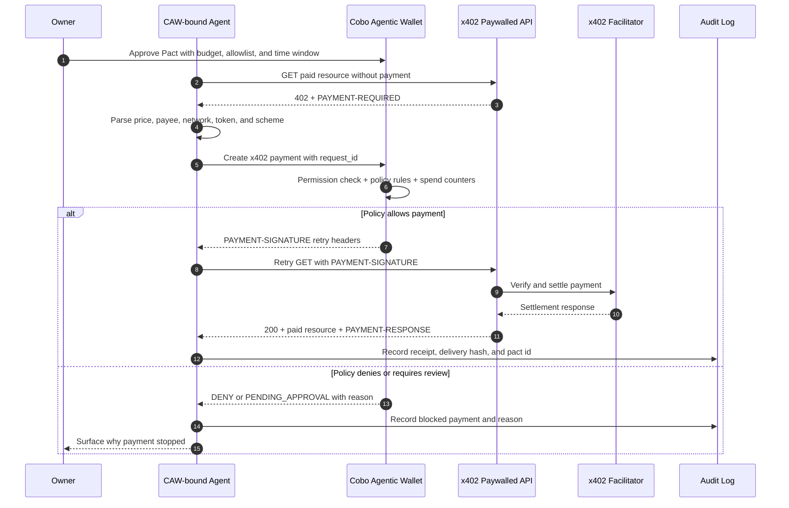
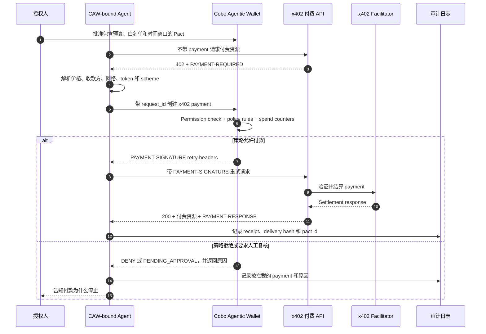
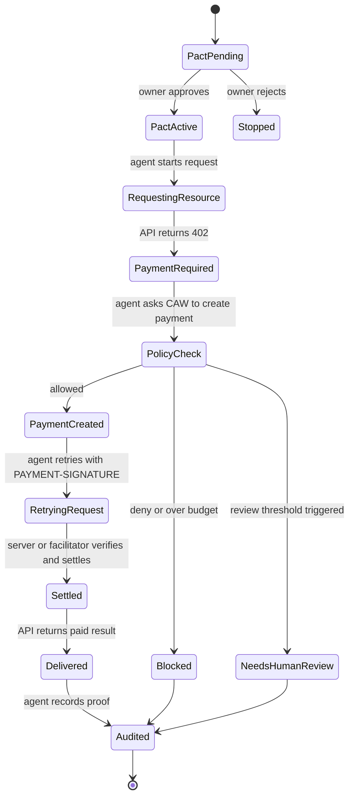

# Task 016 - x402 Paywall and CAW Agent Autonomous Payment Loop

# 任务 016 - x402 Paywall 与 CAW Agent 自主支付闭环

## Metadata

- Date: 2026-05-29
- Program: AI x Web3 School
- Week: Week 2
- Track: advanced practice, payment, wallet permission, safe execution
- WCB task: Week 2｜进阶实践｜x402 Paywall + CAW Agent 自主支付闭环
- WCB task id: `cmpkl6548nbg8mu01ufwogcau`
- Points: 40
- Repository: https://github.com/pillowtalk-Qy/ai-web3-school-cohort-0
- Task file: `tasks/task-016-x402-paywall-caw-agent-payment-loop.md`
- Status: completed, deployed to GitHub, WCB latest submission status `SUBMITTED` at 2026-05-28T17:00:20.582Z

## 元信息

- 日期：2026-05-29
- 项目：AI x Web3 School
- 周次：Week 2
- 方向：进阶实践、支付、钱包权限、安全执行
- WCB 任务：Week 2｜进阶实践｜x402 Paywall + CAW Agent 自主支付闭环
- WCB 任务 ID：`cmpkl6548nbg8mu01ufwogcau`
- 分值：40
- 仓库：https://github.com/pillowtalk-Qy/ai-web3-school-cohort-0
- 任务文件：`tasks/task-016-x402-paywall-caw-agent-payment-loop.md`
- 状态：已完成、已部署到 GitHub，WCB 最新提交状态为 `SUBMITTED`，提交时间为 2026-05-28T17:00:20.582Z

## Task Goal

This task asks for a minimal `x402 paywall + Cobo Agentic Wallet / CAW agent` autonomous payment loop.

The goal is not blind automatic payment. The goal is to show an automated transaction flow with explicit authorization, budget limits, operation scope, time limits, settlement proof, and audit records.

The loop should demonstrate:

- A service provider exposes an x402-protected API or AI inference service.
- A consumer agent initiates the request.
- The agent detects `402 Payment Required` and reads the payment requirements.
- The agent completes payment through CAW / Pact within budget, scope, and time-window constraints.
- The server verifies and settles the payment.
- After successful payment, the agent receives the API result.
- The full flow leaves auditable records.

## 任务目标

这个任务要求我尝试搭建或设计一个最小化的 `x402 paywall + Cobo Agentic Wallet / CAW agent` 自主支付闭环。

目标不是让 Agent 盲目自动付款，而是展示一个有明确授权、预算限制、操作范围、时间窗口、结算证明和审计记录的自动交易流程。

这个闭环需要展示：

- 服务提供方提供受 x402 保护的 API 或 AI 推理服务。
- 消费方由 Agent 发起请求。
- Agent 识别 `402 Payment Required` 并读取付款要求。
- Agent 通过 CAW / Pact 在预算、操作范围和时间窗口内完成支付。
- 服务端完成付款验证和结算。
- 付款成功后 Agent 获取接口返回结果。
- 全流程保留可审计记录。

## WCB Requirement Check

WCB read-only API check on 2026-05-29 confirmed the task requirements:

```text
Task id: cmpkl6548nbg8mu01ufwogcau
Title: Week 2｜进阶实践｜x402 Paywall + CAW Agent 自主支付闭环
Points: 40
Available: true
Proof required: true
Current status before this proof: NOT_STARTED
Submission history before this proof: none
```

The WCB requirement can be summarized as:

- Design or build a minimal x402 paywall plus CAW agent autonomous payment loop.
- The service provider exposes an x402-protected API or AI inference service.
- The consumer side is an agent that initiates the request, detects payment requirements, and completes payment.
- CAW / Pact constrains budget, operation scope, and time window.
- The flow completes payment settlement and keeps auditable records.
- After successful payment, the agent receives the API result.
- If a real demo is not yet available, an architecture diagram, pseudocode, interaction flow, key API notes, and risk boundary are acceptable.

## WCB 要求核对

2026-05-29 通过 WCB Agent API 只读查询确认任务要求：

```text
Task id: cmpkl6548nbg8mu01ufwogcau
Title: Week 2｜进阶实践｜x402 Paywall + CAW Agent 自主支付闭环
Points: 40
Available: true
Proof required: true
Current status before this proof: NOT_STARTED
Submission history before this proof: none
```

平台要求可以压缩成：

- 设计或搭建最小化的 x402 paywall + CAW agent 自主支付闭环。
- 服务提供方提供 x402 保护的 API 或 AI 推理服务。
- 消费方由 Agent 发起请求、识别付款要求并完成支付。
- 通过 CAW / Pact 限制预算、操作范围和时间窗口。
- 完成 payment settlement 并保留可审计记录。
- 付款成功后 Agent 获取接口返回结果。
- 如果暂时无法完成真实 demo，可以提交架构图、伪代码、交互流程、关键接口说明和风险边界。

## Scope Choice

I choose a design-proof format:

```text
Mock endpoint + mock Pact + pseudocode + interaction flow + audit log + risk boundary.
```

This proof does not:

- Connect to a real CAW wallet.
- Use real private keys, seed phrases, API keys, tokens, or `.env` files.
- Execute a real x402 payment.
- Expose real wallet addresses, real balances, or private transaction data.
- Design an agent that can bypass Pact and spend freely.

## 范围选择

本次 proof 选择设计型产出：

```text
mock endpoint + mock Pact + 伪代码 + 交互流程 + 审计日志 + 风险边界。
```

本 proof 不做：

- 不连接真实 CAW 钱包。
- 不使用真实私钥、助记词、API key、token 或 `.env` 文件。
- 不执行真实 x402 payment。
- 不暴露真实钱包地址、真实资产余额或私密交易数据。
- 不把 Agent 设计成可以绕过 Pact 自由花钱。

## Source Check

Public sources checked on 2026-05-29:

- x402 docs index: https://docs.x402.org/llms.txt
- x402 HTTP 402 docs: https://docs.x402.org/core-concepts/http-402.md
- x402 facilitator docs: https://docs.x402.org/core-concepts/facilitator.md
- x402 buyer quickstart: https://docs.x402.org/getting-started/quickstart-for-buyers.md
- Cobo Agentic Wallet docs index: https://cobo.com/products/agentic-wallet/manual/llms.txt
- Cobo Pact overview: https://cobo.com/products/agentic-wallet/manual/start-here/what-is-a-pact.md
- Cobo Pact mechanism: https://cobo.com/products/agentic-wallet/manual/security/pact-mechanism.md
- Cobo policy engine: https://cobo.com/products/agentic-wallet/manual/security/policy-engine.md
- Cobo spend limits: https://cobo.com/products/agentic-wallet/manual/security/spend-limits.md
- Cobo payment reference: https://cobo.com/products/agentic-wallet/manual/reference/payment.md

Key facts used in this proof:

- x402 uses HTTP `402 Payment Required` to communicate that payment is required.
- x402 V2 uses `PAYMENT-REQUIRED`, `PAYMENT-SIGNATURE`, and `PAYMENT-RESPONSE` headers.
- An x402 facilitator can help servers verify payment payloads and settle payments, although local verification is also possible.
- A CAW Pact is a structured delegation agreement between owner and agent. It includes intent, execution plan, policies, and completion conditions.
- The CAW policy engine checks permission, policy rules, and spend counters before execution.
- CAW spend limits can express per-transaction caps, rolling window budgets, and review thresholds.
- The CAW payment endpoint can create payment from an `x402_payment_required` challenge and supports `request_id` idempotency.

## 官方资料核对

2026-05-29 核对的公开资料：

- x402 docs index: https://docs.x402.org/llms.txt
- x402 HTTP 402 docs: https://docs.x402.org/core-concepts/http-402.md
- x402 facilitator docs: https://docs.x402.org/core-concepts/facilitator.md
- x402 buyer quickstart: https://docs.x402.org/getting-started/quickstart-for-buyers.md
- Cobo Agentic Wallet docs index: https://cobo.com/products/agentic-wallet/manual/llms.txt
- Cobo Pact overview: https://cobo.com/products/agentic-wallet/manual/start-here/what-is-a-pact.md
- Cobo Pact mechanism: https://cobo.com/products/agentic-wallet/manual/security/pact-mechanism.md
- Cobo policy engine: https://cobo.com/products/agentic-wallet/manual/security/policy-engine.md
- Cobo spend limits: https://cobo.com/products/agentic-wallet/manual/security/spend-limits.md
- Cobo payment reference: https://cobo.com/products/agentic-wallet/manual/reference/payment.md

本 proof 使用的关键事实：

- x402 使用 HTTP `402 Payment Required` 表达需要付款。
- x402 V2 使用 `PAYMENT-REQUIRED`、`PAYMENT-SIGNATURE` 和 `PAYMENT-RESPONSE` 三类 header。
- x402 facilitator 可以帮助服务端验证 payment payload 并完成结算，但服务端也可以选择本地验证。
- CAW Pact 是 owner 与 Agent 之间的结构化授权协议，包含 intent、execution plan、policies 和 completion conditions。
- CAW policy engine 会在执行前检查 permission、policy rules 和 spend counters。
- CAW spend limits 可以表达单笔上限、滚动窗口预算和人工 review threshold。
- CAW payment endpoint 可以基于 `x402_payment_required` challenge 创建支付，并支持 `request_id` 幂等。

## Minimal Scenario

The minimal scenario:

```text
An agent buys one paid AI inference result from an x402-protected API.
```

Example service:

```text
GET /api/research-brief?topic=agent-wallet-safety
```

Service provider:

```text
AI Research Brief API
```

Consumer:

```text
CAW-bound Research Agent
```

Price:

```text
0.20 USDC per successful request
```

Budget authorization:

```text
Max per request: 0.25 USDC
Rolling 24h cap: 1.00 USDC
Allowed payee: AI Research Brief API merchant address
Allowed network/token: Base USDC
Allowed action: pay x402 protected research API only
Time window: 24 hours
Human confirmation: required above cap, new payee, new network, or new service type
```

## 最小场景

我设计的最小场景是：

```text
Agent 购买一次受 x402 paywall 保护的 AI 推理结果。
```

示例服务：

```text
GET /api/research-brief?topic=agent-wallet-safety
```

服务提供方：

```text
AI Research Brief API
```

消费方：

```text
CAW-bound Research Agent
```

价格：

```text
0.20 USDC per successful request
```

预算授权：

```text
单次请求上限：0.25 USDC
24 小时滚动预算：1.00 USDC
允许收款方：AI Research Brief API merchant address
允许网络和 token：Base USDC
允许操作：只为 x402 protected research API 付款
时间窗口：24 小时
人工确认：超过上限、新收款方、新网络或新服务类型时必须人工确认
```

## Participants

| Role | Actor | Responsibility |
|---|---|---|
| Owner | Human learner or wallet owner | Reviews and approves the Pact before the agent can pay. |
| Consumer agent | CAW-bound Research Agent | Requests the paid API, reads x402 payment requirements, asks CAW to create payment, retries with payment header, and records the result. |
| Wallet authority layer | Cobo Agentic Wallet | Enforces Pact policies, spend limits, allowlists, and completion conditions before signing payment. |
| Seller | AI Research Brief API | Serves a paid endpoint and returns `402 Payment Required` when payment is missing. |
| Facilitator | x402 facilitator or local verification | Verifies payment payload, settles payment, and returns settlement result. |
| Audit layer | Local log, CAW audit log, server log, settlement receipt | Records request id, pact id, payment requirement hash, payment result, delivery hash, and policy decision. |

## 参与方

| 角色 | 参与者 | 职责 |
|---|---|---|
| 授权人 | 学习者或钱包 owner | 在 Agent 可以付款之前审查并批准 Pact。 |
| 消费方 Agent | CAW-bound Research Agent | 请求付费 API，读取 x402 付款要求，请求 CAW 创建 payment，带 payment header 重试请求，并记录结果。 |
| 钱包权限层 | Cobo Agentic Wallet | 在签署付款前执行 Pact policies、spend limits、allowlists 和 completion conditions。 |
| 服务提供方 | AI Research Brief API | 提供付费接口，在缺少 payment 时返回 `402 Payment Required`。 |
| 支付验证与结算层 | x402 facilitator 或本地验证 | 验证 payment payload，完成结算，并返回 settlement result。 |
| 审计层 | 本地日志、CAW 审计日志、服务端日志、结算收据 | 记录 request id、pact id、payment requirement hash、payment result、delivery hash 和 policy decision。 |

## Architecture



## 架构说明



## State Machine



## 状态机说明

```text
Pact pending -> owner 审批 -> Pact active
Pact active -> Agent 请求 API -> API 返回 402
Agent 读取付款要求 -> 请求 CAW 创建 payment
CAW 做策略校验 -> allow / deny / pending approval
allow 后 Agent 带 PAYMENT-SIGNATURE 重试
服务端完成验证与结算 -> 返回结果
Agent 记录审计日志
```

## Minimal Pact Draft

This is a conceptual Pact draft, not a real CAW payload:

```json
{
  "intent": "Allow the Research Agent to buy paid AI research briefs from one approved x402 API for 24 hours.",
  "execution_plan": "The agent may call one approved API endpoint, read the x402 PAYMENT-REQUIRED challenge, ask CAW to create one x402 payment, retry the request with the returned PAYMENT-SIGNATURE header, and store the settlement receipt and delivery hash.",
  "policies": [
    {
      "type": "operation_scope",
      "allow": ["payment:x402"],
      "deny": ["transfer:any", "contract_call:any", "message_sign:any"]
    },
    {
      "type": "payee_allowlist",
      "allowed_payees": ["mock-ai-research-brief-api-payee"]
    },
    {
      "type": "network_token_allowlist",
      "allowed": [
        {
          "network": "base",
          "token": "USDC"
        }
      ]
    },
    {
      "type": "spend_limit",
      "max_per_request_usd": "0.25",
      "rolling_24h_usd": "1.00",
      "review_threshold_usd": "0.25"
    },
    {
      "type": "service_scope",
      "allowed_resource_pattern": "/api/research-brief"
    }
  ],
  "completion_conditions": [
    {
      "type": "time_elapsed",
      "expires_at": "2026-05-30T00:00:00Z"
    },
    {
      "type": "amount_spent_usd",
      "limit": "1.00"
    },
    {
      "type": "tx_count",
      "limit": 5
    }
  ]
}
```

The Pact turns payment ability into a constrained mandate. It should not authorize generic transfers, arbitrary contract calls, unlimited approvals, or reusable wallet power.

## 最小 Pact 草案

这是概念性 Pact draft，不是可直接提交到 CAW 的真实 payload：

```json
{
  "intent": "Allow the Research Agent to buy paid AI research briefs from one approved x402 API for 24 hours.",
  "execution_plan": "The agent may call one approved API endpoint, read the x402 PAYMENT-REQUIRED challenge, ask CAW to create one x402 payment, retry the request with the returned PAYMENT-SIGNATURE header, and store the settlement receipt and delivery hash.",
  "policies": [
    {
      "type": "operation_scope",
      "allow": ["payment:x402"],
      "deny": ["transfer:any", "contract_call:any", "message_sign:any"]
    },
    {
      "type": "payee_allowlist",
      "allowed_payees": ["mock-ai-research-brief-api-payee"]
    },
    {
      "type": "network_token_allowlist",
      "allowed": [
        {
          "network": "base",
          "token": "USDC"
        }
      ]
    },
    {
      "type": "spend_limit",
      "max_per_request_usd": "0.25",
      "rolling_24h_usd": "1.00",
      "review_threshold_usd": "0.25"
    },
    {
      "type": "service_scope",
      "allowed_resource_pattern": "/api/research-brief"
    }
  ],
  "completion_conditions": [
    {
      "type": "time_elapsed",
      "expires_at": "2026-05-30T00:00:00Z"
    },
    {
      "type": "amount_spent_usd",
      "limit": "1.00"
    },
    {
      "type": "tx_count",
      "limit": 5
    }
  ]
}
```

这个 Pact 的核心不是“让 Agent 会付款”，而是“让 Agent 只能为指定服务、指定收款方、指定 token/network、指定预算和指定时间窗口付款”。它不应该授权普通转账、任意合约调用、无限授权或可复用的开放钱包权限。

## x402 Paywall Server Sketch

```typescript
type PaymentRequirement = {
  scheme: "exact";
  network: "base";
  token: "USDC";
  amount: "0.20";
  payee: "mock-ai-research-brief-api-payee";
  resource: "/api/research-brief";
  expiresAt: string;
};

async function researchBriefHandler(request: Request): Promise<Response> {
  const paymentSignature = request.headers.get("PAYMENT-SIGNATURE");

  if (!paymentSignature) {
    const requirement: PaymentRequirement = {
      scheme: "exact",
      network: "base",
      token: "USDC",
      amount: "0.20",
      payee: "mock-ai-research-brief-api-payee",
      resource: "/api/research-brief",
      expiresAt: new Date(Date.now() + 5 * 60 * 1000).toISOString()
    };

    return new Response("Payment Required", {
      status: 402,
      headers: {
        "PAYMENT-REQUIRED": base64Json(requirement)
      }
    });
  }

  const settlement = await verifyAndSettleWithFacilitator(paymentSignature);

  if (!settlement.valid || !settlement.settled) {
    return new Response("Payment Required", {
      status: 402,
      headers: {
        "PAYMENT-RESPONSE": base64Json(settlement)
      }
    });
  }

  const result = await generateResearchBrief(request);

  return Response.json(result, {
    status: 200,
    headers: {
      "PAYMENT-RESPONSE": base64Json(settlement),
      "X-Delivery-Hash": sha256Json(result)
    }
  });
}
```

Server-side points:

- Without `PAYMENT-SIGNATURE`, return `402` and `PAYMENT-REQUIRED`.
- With payment payload, verify locally or through a facilitator.
- After successful settlement, return `200`, the business result, and `PAYMENT-RESPONSE`.
- Keep a delivery hash for audit and dispute handling.

## x402 服务端伪代码

服务端逻辑：

```text
如果请求没有 PAYMENT-SIGNATURE：
  返回 402 Payment Required
  在 PAYMENT-REQUIRED header 中放入付款要求

如果请求包含 PAYMENT-SIGNATURE：
  本地验证或调用 facilitator 验证
  完成 settlement
  如果 settlement 失败，返回 402 和错误信息
  如果 settlement 成功，返回 200、业务结果和 PAYMENT-RESPONSE
  同时返回 delivery hash，方便审计
```

关键点：

- 没有 `PAYMENT-SIGNATURE` 时返回 `402` 和 `PAYMENT-REQUIRED`。
- 有 payment payload 时，服务端本地验证或调用 facilitator 验证与结算。
- 结算成功后返回 `200`、业务结果和 `PAYMENT-RESPONSE`。
- 交付物用 hash 留存，方便后续审计或争议处理。

## Agent Client Sketch

```typescript
async function buyResearchBrief(topic: string) {
  const requestId = `research-brief:${topic}:2026-05-29`;
  const url = `https://mock.example/api/research-brief?topic=${encodeURIComponent(topic)}`;

  const first = await fetch(url);

  if (first.status !== 402) {
    return {
      status: "free_or_unexpected",
      result: await first.json()
    };
  }

  const paymentRequired = first.headers.get("PAYMENT-REQUIRED");
  if (!paymentRequired) {
    throw new Error("Missing PAYMENT-REQUIRED header");
  }

  const parsed = parsePaymentRequired(paymentRequired);
  const policyReview = reviewPaymentAgainstLocalIntent({
    requestId,
    expectedResource: "/api/research-brief",
    maxPriceUsd: "0.25",
    allowedPayee: "mock-ai-research-brief-api-payee",
    allowedNetwork: "base",
    allowedToken: "USDC",
    paymentRequired: parsed
  });

  if (policyReview.decision !== "continue") {
    return recordBlockedPayment(requestId, policyReview);
  }

  const cawPayment = await caw.createPayment({
    walletId: "mock-wallet-id",
    protocol: "x402",
    requestId,
    x402PaymentRequired: paymentRequired
  });

  if (cawPayment.status !== "completed") {
    return recordBlockedPayment(requestId, cawPayment);
  }

  const second = await fetch(url, {
    headers: cawPayment.retryHeaders
  });

  const result = await second.json();

  return recordSuccess({
    requestId,
    pactId: "mock-pact-id",
    paymentRequiredHash: sha256(paymentRequired),
    paymentResponse: second.headers.get("PAYMENT-RESPONSE"),
    deliveryHash: second.headers.get("X-Delivery-Hash"),
    result
  });
}
```

Agent-side checks:

1. Local intent check: price, resource, payee, network, and token must match the task.
2. CAW policy check: Pact, permission, spend limit, allowlist, counter, and time window must allow the payment.

The agent should not pay every 402 response. It should treat 402 as a payment request that still requires policy review.

## Agent 客户端伪代码

Agent 逻辑：

```text
1. 请求受 x402 保护的 API。
2. 如果服务端返回 402，读取 PAYMENT-REQUIRED。
3. 解析资源、价格、收款方、network、token 和 scheme。
4. 先做本地意图检查。
5. 如果本地意图检查不通过，记录 block reason 并停止。
6. 如果本地意图检查通过，请求 CAW 根据 Pact 创建 x402 payment。
7. 如果 CAW policy deny 或 pending approval，记录原因并停止或等待人工复核。
8. 如果 CAW 返回 retry headers，带 PAYMENT-SIGNATURE 重试原请求。
9. 收到 200 和 PAYMENT-RESPONSE 后，记录 settlement、delivery hash 和 policy decision。
```

Agent 在付款前做两层检查：

1. 本地意图检查：价格、资源、收款方、network、token 是否符合本次任务。
2. CAW policy check：Pact、permission、spend limit、allowlist、counter 和时间窗口是否允许。

Agent 不应该见到所有 `402` 都付款。`402` 只是付款要求，仍然必须经过策略审查。

## CAW Payment Call Sketch

Conceptual request:

```json
{
  "wallet_uuid": "mock-wallet-id",
  "protocol": "x402",
  "request_id": "research-brief:agent-wallet-safety:2026-05-29",
  "x402_payment_required": "base64-encoded-payment-required-from-server"
}
```

Conceptual success response:

```json
{
  "success": true,
  "result": {
    "id": "mock-payment-record-id",
    "idempotent": false,
    "request_id": "research-brief:agent-wallet-safety:2026-05-29",
    "protocol": "x402",
    "status": "completed",
    "retry_headers": {
      "PAYMENT-SIGNATURE": "base64-encoded-payment-payload"
    },
    "tx_hash": null
  }
}
```

Conceptual denial response:

```json
{
  "success": false,
  "error": {
    "code": "POLICY_DENIED",
    "reason": "Payment amount exceeds pact max_per_request_usd",
    "details": {
      "requested": "0.50",
      "limit": "0.25",
      "window": "per_request"
    }
  }
}
```

## CAW 支付接口草图

概念性请求：

```json
{
  "wallet_uuid": "mock-wallet-id",
  "protocol": "x402",
  "request_id": "research-brief:agent-wallet-safety:2026-05-29",
  "x402_payment_required": "base64-encoded-payment-required-from-server"
}
```

概念性成功响应：

```json
{
  "success": true,
  "result": {
    "id": "mock-payment-record-id",
    "idempotent": false,
    "request_id": "research-brief:agent-wallet-safety:2026-05-29",
    "protocol": "x402",
    "status": "completed",
    "retry_headers": {
      "PAYMENT-SIGNATURE": "base64-encoded-payment-payload"
    },
    "tx_hash": null
  }
}
```

概念性拒绝响应：

```json
{
  "success": false,
  "error": {
    "code": "POLICY_DENIED",
    "reason": "Payment amount exceeds pact max_per_request_usd",
    "details": {
      "requested": "0.50",
      "limit": "0.25",
      "window": "per_request"
    }
  }
}
```

在真实 CAW 集成中，payment endpoint 会代表指定钱包基于 x402 challenge 签署并提交 payment。本 proof 使用 mock data，重点是权限边界：CAW 应该返回 retry headers，或者用结构化原因拦截 payment。

## Interaction Flow

| Step | Event | Expected record |
|---|---|---|
| 1 | Owner approves Pact | Pact id, intent, policy hash, completion conditions |
| 2 | Agent requests paid API | Request id, resource, timestamp |
| 3 | API returns 402 | `PAYMENT-REQUIRED` hash, price, network, token, payee |
| 4 | Agent reviews requirement | Local decision: continue, block, or ask human |
| 5 | Agent asks CAW to pay | Wallet id, pact id, request id, payment requirement hash |
| 6 | CAW enforces policy | Allow, deny, or pending approval with reason |
| 7 | Agent retries with payment | `PAYMENT-SIGNATURE` hash, retry timestamp |
| 8 | Server verifies and settles | Settlement response, facilitator or local verifier |
| 9 | API returns result | `PAYMENT-RESPONSE`, delivery hash |
| 10 | Agent writes audit log | Final status, receipt hash, result hash, privacy check |

## 交互流程

| 步骤 | 事件 | 应记录内容 |
|---|---|---|
| 1 | Owner 审批 Pact | Pact id、intent、policy hash、completion conditions |
| 2 | Agent 请求付费 API | Request id、resource、timestamp |
| 3 | API 返回 402 | `PAYMENT-REQUIRED` hash、price、network、token、payee |
| 4 | Agent 审查付款要求 | 本地决策：continue、block 或 ask human |
| 5 | Agent 请求 CAW 支付 | Wallet id、pact id、request id、payment requirement hash |
| 6 | CAW 执行策略校验 | Allow、deny 或 pending approval，以及 reason |
| 7 | Agent 带 payment 重试 | `PAYMENT-SIGNATURE` hash、retry timestamp |
| 8 | 服务端验证并结算 | Settlement response、facilitator 或 local verifier |
| 9 | API 返回结果 | `PAYMENT-RESPONSE`、delivery hash |
| 10 | Agent 写入审计日志 | Final status、receipt hash、result hash、privacy check |

## Audit Log Example

```json
{
  "auditId": "audit-016-001",
  "task": "x402 Paywall + CAW Agent autonomous payment loop",
  "requestId": "research-brief:agent-wallet-safety:2026-05-29",
  "pactId": "mock-pact-id",
  "agentId": "mock-research-agent",
  "resource": "/api/research-brief",
  "paymentRequirement": {
    "hash": "hash-of-payment-required-header",
    "scheme": "exact",
    "network": "base",
    "token": "USDC",
    "amount": "0.20",
    "payee": "mock-ai-research-brief-api-payee"
  },
  "policyDecision": {
    "localIntentCheck": "continue",
    "cawPolicyCheck": "allow",
    "spendWindowAfterPayment": "0.20 / 1.00 USDC in 24h"
  },
  "settlement": {
    "status": "settled",
    "paymentResponseHash": "hash-of-payment-response-header"
  },
  "delivery": {
    "status": "received",
    "deliveryHash": "hash-of-ai-research-brief"
  },
  "privacy": {
    "containsPrivateKey": false,
    "containsSeedPhrase": false,
    "containsApiKey": false,
    "containsRealWalletAddress": false,
    "containsRealPaymentPayload": false
  }
}
```

This audit log keeps hashes, mock ids, policy decisions, and delivery status. It does not publish real secrets, real wallets, real payment payloads, or private business input.

## 审计日志示例

```json
{
  "auditId": "audit-016-001",
  "task": "x402 Paywall + CAW Agent autonomous payment loop",
  "requestId": "research-brief:agent-wallet-safety:2026-05-29",
  "pactId": "mock-pact-id",
  "agentId": "mock-research-agent",
  "resource": "/api/research-brief",
  "paymentRequirement": {
    "hash": "hash-of-payment-required-header",
    "scheme": "exact",
    "network": "base",
    "token": "USDC",
    "amount": "0.20",
    "payee": "mock-ai-research-brief-api-payee"
  },
  "policyDecision": {
    "localIntentCheck": "continue",
    "cawPolicyCheck": "allow",
    "spendWindowAfterPayment": "0.20 / 1.00 USDC in 24h"
  },
  "settlement": {
    "status": "settled",
    "paymentResponseHash": "hash-of-payment-response-header"
  },
  "delivery": {
    "status": "received",
    "deliveryHash": "hash-of-ai-research-brief"
  },
  "privacy": {
    "containsPrivateKey": false,
    "containsSeedPhrase": false,
    "containsApiKey": false,
    "containsRealWalletAddress": false,
    "containsRealPaymentPayload": false
  }
}
```

这个审计日志保存的是 hash、mock id、策略结论和交付状态，不公开真实 secret、真实钱包、真实 payment payload 或私密业务输入。

## Failure Cases

| Failure | Expected behavior | Reason |
|---|---|---|
| Price exceeds cap | CAW denies or requires human review. | The agent cannot raise the budget by itself. |
| Unknown payee | Local check blocks before CAW payment. | Prevents payment to an impersonating service. |
| Wrong network or token | Local check blocks; CAW policy should also deny. | Prevents payment-route substitution. |
| Reused request id | CAW idempotency returns the original result if already processed. | Prevents duplicate payment. |
| Facilitator unavailable | Server returns payment failure; agent logs and stops. | Unknown settlement must not be treated as success. |
| Settlement succeeds but API fails | Agent records receipt and opens refund or dispute path. | Payment and delivery both need audit evidence. |
| Prompt injection asks agent to ignore budget | CAW policy still blocks. | Wallet boundaries cannot depend on model obedience. |
| Pact expires | CAW key is invalid or payment is denied. | Prevents zombie permissions. |

## 失败分支

| 失败情况 | 预期行为 | 原因 |
|---|---|---|
| 价格超过上限 | CAW 拒绝或要求人工复核。 | Agent 不能自行提高预算。 |
| 未知收款方 | 本地检查在 CAW payment 之前拦截。 | 防止付给冒名服务。 |
| 错误网络或 token | 本地检查拦截，CAW policy 也应该拒绝。 | 防止支付路径被替换。 |
| 重复 request id | 如果已经处理过，CAW 幂等逻辑返回原始结果。 | 防止重复付款。 |
| Facilitator 不可用 | 服务端返回付款失败，Agent 记录并停止。 | 不能把未知 settlement 当作成功。 |
| 付款成功但服务失败 | Agent 记录 receipt，并打开退款或争议路径。 | 付款与交付都要有审计证据。 |
| Prompt injection 要求 Agent 忽略预算 | CAW policy 仍然拦截。 | 钱包边界不能依赖模型听话。 |
| Pact 过期 | CAW key 失效或 payment 被拒绝。 | 避免僵尸权限。 |

## Risk Boundary

This design intentionally defines autonomous payment as constrained automatic payment.

Required boundaries:

- The agent must not hold the full private key.
- The agent must not modify Pact policies.
- The agent must not automatically pay new payees, new service types, or new networks.
- The agent must not mark service delivery as successful when settlement fails.
- The agent must not treat `402` as a command to pay. It is only a payment requirement and still needs policy review.
- The agent must not treat payment receipt as proof of service quality. Delivery hash and acceptance logic are also required.
- A real implementation must support revoke, freeze, human review, and dispute paths.

My takeaway:

```text
x402 solves machine-readable payment negotiation.
CAW solves permission-bounded wallet execution.
The useful product layer is the review and audit loop between them.
```

## 风险边界

这个设计刻意把“自主支付”限制为“受约束的自动支付”。

必须保持的边界：

- Agent 不能持有完整私钥。
- Agent 不能修改 Pact policies。
- Agent 不能为新 payee、新服务类型或新 network 自动付款。
- Agent 不能在 settlement 失败时把服务调用标记为成功。
- Agent 不能把 `402` 看成强制付款命令；它只是付款要求，仍需策略检查。
- Agent 不能把 payment receipt 当成服务质量证明；还需要 delivery hash 和验收逻辑。
- 真实实现中必须支持 revoke、freeze、human review 和 dispute path。

我的判断：

```text
x402 解决机器可读的付款协商。
CAW 解决有权限边界的钱包执行。
真正有产品价值的是二者之间的审查与审计闭环。
```

## Real Demo Follow-up

To turn this design proof into a real demo, the next version would need:

- A local or testnet x402 paywalled endpoint.
- A test wallet or CAW sandbox wallet.
- A Pact that only allows small test payments.
- Secret management that never enters Git.
- `request_id` idempotency tests.
- Denial tests for price over cap, unknown payee, expired Pact, and facilitator failure.
- Audit log export.
- Redaction before any public proof.

The first real demo should test denial paths, not only the happy path.

## 真实 Demo 后续

如果要从 design proof 推进到真实 demo，需要补齐：

- 一个本地或测试网 x402 paywalled endpoint。
- 一个测试钱包或 CAW sandbox wallet。
- 一个只允许小额测试支付的 Pact。
- 一个不会进入 Git 的 secret 管理方式。
- `request_id` 幂等测试。
- 价格超限、未知 payee、Pact 过期和 facilitator 失败测试。
- 审计日志导出。
- 公开 proof 前的隐私脱敏。

第一版真实 demo 不应该只测试 happy path，也应该测试 denial paths。

## WCB Submission Draft

```text
Task proof:
https://github.com/pillowtalk-Qy/ai-web3-school-cohort-0/blob/main/tasks/task-016-x402-paywall-caw-agent-payment-loop.md

Description:
I completed a bilingual design proof for the Week 2 advanced practice task "x402 Paywall + CAW Agent Autonomous Payment Loop."

The proof uses a mock endpoint, mock Pact, pseudocode, interaction flow, and audit log to design a minimal closed loop:

1. A service provider exposes an x402-protected AI Research Brief API.
2. A CAW-bound agent requests the resource and receives 402 Payment Required plus PAYMENT-REQUIRED.
3. The agent first checks the payment requirement against local intent: resource, price, payee, network, and token.
4. The agent asks CAW to create an x402 payment under an approved Pact.
5. CAW enforces permission check, policy rules, and spend counters to constrain budget, action scope, and time window.
6. If allowed, CAW returns PAYMENT-SIGNATURE retry headers.
7. The agent retries the request, and the server verifies and settles payment through a facilitator or local verification.
8. The server returns the paid result and PAYMENT-RESPONSE.
9. The agent records pact id, payment requirement hash, settlement response, delivery hash, and policy decision.

The proof also includes Mermaid diagrams, a minimal Pact draft, server pseudocode, agent pseudocode, a CAW payment call sketch, an audit log example, failure paths, and risk boundaries.

This proof does not include private keys, seed phrases, API keys, tokens, `.env` files, real wallet addresses, real balances, real payment payloads, real transaction data, or private screenshots. No real wallet payment was executed.
```

## WCB 提交草稿

```text
Task proof:
https://github.com/pillowtalk-Qy/ai-web3-school-cohort-0/blob/main/tasks/task-016-x402-paywall-caw-agent-payment-loop.md

说明：
我完成了 Week 2「进阶实践｜x402 Paywall + CAW Agent 自主支付闭环」任务的双语设计型 proof。

这份 proof 使用 mock endpoint、mock Pact、伪代码、交互流程和审计日志，设计了一个最小闭环：

1. 服务提供方提供受 x402 保护的 AI Research Brief API。
2. CAW-bound Agent 发起请求，收到 402 Payment Required 和 PAYMENT-REQUIRED。
3. Agent 先检查付款要求是否符合本地意图：资源、价格、payee、network、token。
4. Agent 再请求 CAW 基于 Pact 创建 x402 payment。
5. CAW 通过 permission check、policy rule evaluation 和 spend counter 限制预算、操作范围和时间窗口。
6. 策略允许时，CAW 返回 PAYMENT-SIGNATURE retry headers。
7. Agent 重试请求，服务端通过 facilitator 或本地验证完成 settlement。
8. 服务端返回付费结果和 PAYMENT-RESPONSE。
9. Agent 记录 pact id、payment requirement hash、settlement response、delivery hash 和 policy decision。

本 proof 还包含 Mermaid 架构图、状态机、最小 Pact 草案、服务端伪代码、Agent 伪代码、CAW payment call 草图、审计日志示例、失败分支和风险边界。

本 proof 不包含私钥、助记词、API key、token、.env 文件、真实钱包地址、真实资产余额、真实 payment payload、真实交易数据或私密截图；也没有执行真实钱包支付。
```

## Verification Status

- [x] WCB task details checked through read-only API.
- [x] WCB submission history checked through read-only API.
- [x] Official x402 docs checked.
- [x] Official Cobo Agentic Wallet docs checked.
- [x] x402 paywall API scenario defined.
- [x] CAW Pact boundary defined.
- [x] Budget, operation scope, and time window included.
- [x] Payment settlement and audit records included.
- [x] Post-payment resource access included.
- [x] Failure paths and risk boundaries included.
- [x] Bilingual proof format completed.
- [x] WCB submission draft prepared.
- [x] Deployed to GitHub.
- [x] Submitted through WCB platform.

WCB latest submission status verified through read-only API on 2026-05-29:

- Submission id: `cmppqo63pd6hwpo015uqjurlg`
- Status: `SUBMITTED`
- Submitted at: 2026-05-28T17:00:20.582Z
- Review status: not reviewed in the checked API response

## 验证状态

- [x] 已通过只读 API 查询 WCB 任务详情。
- [x] 已通过只读 API 查询 WCB 提交历史。
- [x] 已核对 x402 官方文档。
- [x] 已核对 Cobo Agentic Wallet 官方文档。
- [x] 已定义 x402 paywall API 场景。
- [x] 已定义 CAW Pact 边界。
- [x] 已包含预算、操作范围和时间窗口。
- [x] 已包含 payment settlement 和审计记录。
- [x] 已包含付款成功后的资源访问。
- [x] 已包含失败分支和风险边界。
- [x] 已完成双语 proof 格式。
- [x] 已准备 WCB 提交草稿。
- [x] 已部署到 GitHub。
- [x] 已通过 WCB 平台提交。

2026-05-29 通过只读 API 核验的 WCB 最新提交状态：

- Submission id: `cmppqo63pd6hwpo015uqjurlg`
- Status: `SUBMITTED`
- Submitted at: 2026-05-28T17:00:20.582Z
- Review status: 在已检查 API 响应中尚未看到 review 结果

## Privacy Check

- [x] No private keys, seed phrases, API keys, cookies, tokens, sessions, or `.env` content.
- [x] No real wallet address, real-asset balance, or private transaction pattern.
- [x] No real payment payload, real transaction calldata, or private x402 request.
- [x] No private screenshots or private chat transcripts.
- [x] This task is a design proof and does not execute real wallet actions.
- [x] Commit, push, and WCB proof submission were completed only after explicit human confirmation.

## 隐私检查

- [x] 不包含私钥、助记词、API key、cookies、tokens、sessions 或 `.env` 内容。
- [x] 不包含真实资产钱包地址、真实资产余额或私密交易模式。
- [x] 不包含真实 payment payload、真实交易 calldata 或私密 x402 请求。
- [x] 不包含私密截图或私密聊天记录。
- [x] 本任务是设计型 proof，不执行真实钱包动作。
- [x] commit、push 和 WCB proof submission 均在明确人工确认后完成。
