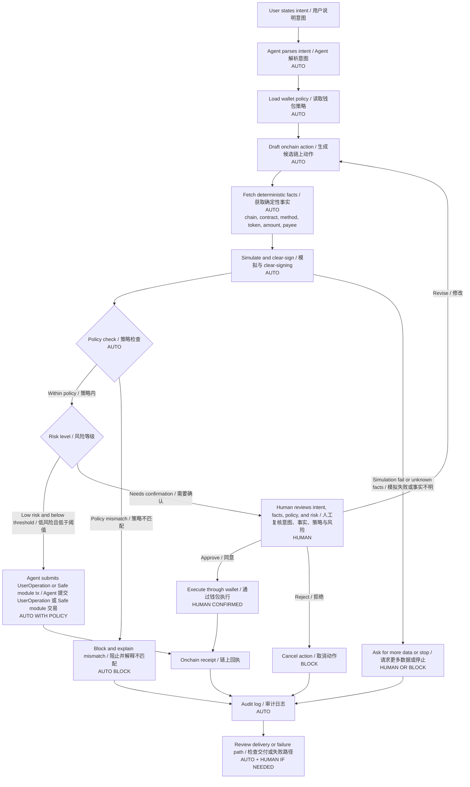

# 任务 018 - Agent 链上动作权限策略 / Task 018 - Agent Onchain Action Permission Policy

## 元信息 / Metadata

- 日期：2026-05-29
- 项目：AI x Web3 School
- 周次：Week 2
- 方向：Wallet / Permission
- WCB 任务：Week 2｜Wallet / Permission｜Agent 链上动作权限策略
- WCB 任务 ID：`cmpkl65h2nbggmu01i4egjtq6`
- 分值：20
- 仓库：https://github.com/pillowtalk-Qy/ai-web3-school-cohort-0
- 任务文件：`tasks/task-018-agent-onchain-action-permission-policy.md`
- 状态：已完成，已部署到 GitHub，WCB 最新提交状态为 `SUBMITTED`，提交时间为 2026-05-29T06:15:08.615Z

**English Companion**

- Date: 2026-05-29
- Program: AI x Web3 School
- Week: Week 2
- Track: Wallet / Permission
- WCB task: Week 2｜Wallet / Permission｜Agent 链上动作权限策略
- WCB task id: `cmpkl65h2nbggmu01i4egjtq6`
- Points: 20
- Repository: https://github.com/pillowtalk-Qy/ai-web3-school-cohort-0
- Task file: `tasks/task-018-agent-onchain-action-permission-policy.md`
- Status: completed, deployed to GitHub, WCB latest submission status `SUBMITTED` at 2026-05-29T06:15:08.615Z

## 任务目标 / Task Goal

这个任务要求我完成三件事：

1. 画出一个 `agent 发起链上动作` 的执行流程图。
2. 标出哪些步骤可以自动化，哪些步骤必须由人确认。
3. 为一个 agent wallet 场景设计权限策略，至少包含：
   - 预算。
   - 可调用合约。
   - 可执行动作。
   - 人工确认阈值。
   - 撤销方式。
   - 日志记录。
   - 失败处理。

还需要解释 ERC-4337、Safe、guard / policy 机制为什么重要，以及它们解决的是哪类风险。

**English Companion**

This task asks me to design an execution flow for an agent-initiated onchain action, mark which steps can be automated and which steps require human confirmation, and create a permission strategy for an agent wallet scenario. The strategy must cover budget, callable contracts, executable actions, human-confirmation thresholds, revocation, logging, and failure handling. It also asks why ERC-4337, Safe, and guard / policy mechanisms matter.

## WCB 要求核对 / WCB Requirement Check

2026-05-29 通过 WCB Agent API 只读查询确认任务要求：

```text
Task id: cmpkl65h2nbggmu01i4egjtq6
Title: Week 2｜Wallet / Permission｜Agent 链上动作权限策略
Points: 20
Available: true
Proof required: true
Current status before this proof: NOT_STARTED
Submission history before this proof: none
```

平台要求可以压缩成：

- 画出 agent 发起链上动作流程图。
- 标明自动化步骤与必须人工确认的步骤。
- 设计 agent wallet 权限策略。
- 覆盖预算、合约 allowlist、可执行动作、人工确认阈值、撤销、日志和失败处理。
- 解释 ERC-4337、Safe、guard / policy 的作用。

**English Companion**

The WCB read-only API check on 2026-05-29 confirmed that this task is available, requires proof, and had no submission history before this local proof.

## 官方资料核对 / Source Check

2026-05-29 核对的公开资料：

- ERC-4337 docs: https://docs.erc4337.io/core-standards/erc-4337
- Safe Smart Account overview: https://docs.safe.global/advanced/smart-account-overview
- Safe Guards: https://docs.safe.global/advanced/smart-account-guards
- Safe Modules: https://docs.safe.global/advanced/smart-account-modules

本 proof 使用这些资料中的几个事实：

- ERC-4337 通过 `UserOperation`、`EntryPoint`、bundler 和 paymaster 等组件，让 smart account 可以拥有更灵活的验证与执行流程。
- Safe Smart Account 的核心是多签安全默认值，同时支持 modules、guards 和更细粒度的访问管理。
- Safe modules 可以支持自动化、限额、allowlist、周期性动作和恢复等能力，但 modules 是安全关键组件。
- Safe guards 可以在交易执行前后检查交易参数或状态，但错误或恶意 guard 也可能阻止交易执行，因此需要审计和恢复机制。

**English Companion**

I checked primary documentation for ERC-4337 and Safe. The main facts used here are that ERC-4337 gives smart accounts a validation-execution flow through `UserOperation` and `EntryPoint`, while Safe provides multisig defaults plus modules and guards for more flexible but security-critical access control.

## 场景选择 / Scenario

我选择和 Week 2 主线一致的场景：

```text
Clear Intent Payment Review Agent
```

这个 Agent 不是完整钱包，也不持有私钥。它被允许在一个受限 agent wallet 场景中准备并发起小额链上动作，例如：

- 为一份 AI research brief 支付少量 USDC。
- 调用一个已 allowlist 的 x402 / service escrow 合约。
- 写入一个不含敏感原文的 audit hash。
- 在策略允许时撤销自己的 allowance 或 session permission。

所有动作都围绕同一个目标：

```text
让 Agent 可以在明确授权、预算限制、合约 allowlist 和审计日志下完成低风险链上动作；
一旦超出策略，就必须要求人工确认或直接阻止。
```

**English Companion**

The chosen scenario is the `Clear Intent Payment Review Agent`. It is not a full wallet and does not hold private keys. It can prepare and initiate small bounded onchain actions under an explicit wallet policy, such as paying for one AI research brief, calling an allowlisted service escrow contract, recording an audit hash, or revoking its own limited allowance.

## 执行流程图 / Execution Flow



### 自动化步骤

可以自动化的步骤：

- 解析用户意图。
- 读取当前 wallet policy。
- 生成候选交易草稿。
- 查询合约、ABI、token、chain、payee、amount、spender、deadline 等确定性字段。
- 运行模拟或 clear-signing 解释。
- 做 policy check。
- 对低风险、低额度、已 allowlist 的动作提交 UserOperation 或 Safe module transaction。
- 记录 audit log。
- 对失败原因做结构化解释。

### 必须人工确认的步骤

必须人工确认的步骤：

- 创建、修改或扩大 wallet policy。
- 添加新的合约、payee、token、network 或 module。
- 安装、替换或移除 Safe guard / module。
- 超过预算、时间窗口或服务范围。
- 调用未知合约或 upgradeable / proxy 事实不清的合约。
- 执行 `approve max`、`setApprovalForAll`、ownership transfer、delegatecall、bridge、swap 或资产迁移。
- 模拟失败、交易事实不完整、AI 解释和确定性事实冲突。
- 任何真实资产、真实钱包或高价值动作。

**English Companion**

The automated part should handle parsing, lookup, drafting, simulation, policy checking, low-risk bounded execution, and logging. Human confirmation is required whenever policy is created or expanded, new contracts or payees are introduced, high-risk methods appear, simulation fails, facts are incomplete, or real-value execution crosses predefined thresholds.

## 权限策略总览 / Permission Strategy Overview

策略名称：

```text
clear-intent-payment-review-agent.policy.v0
```

策略目标：

```text
允许 Agent 在低额度、已授权、可审计的范围内完成一个小额服务付款或审计记录动作；
阻止 Agent 获得开放式钱包权限。
```

核心原则：

1. 最小权限：只允许任务所需动作。
2. 预算上限：单次、每日、每周都有 cap。
3. 合约 allowlist：只允许调用明确列出的合约。
4. 动作 allowlist：只允许具体函数和参数范围。
5. 人工确认阈值：越界或不确定就交给人。
6. 可撤销：session permission、allowance、module、guard 都必须能撤销。
7. 可审计：每次决策都有日志。
8. AI 解释不是事实来源：事实来自交易字段、模拟、clear-signing 和链上回执。

**English Companion**

The policy is designed to let the agent perform one bounded low-value service payment or audit-record action while preventing open-ended wallet authority. The core principles are least privilege, budget caps, contract allowlists, action allowlists, human-confirmation thresholds, revocation, auditability, and deterministic facts over AI guesses.

## 预算策略 / Budget Policy

| 项目 | 策略 |
|---|---|
| 单次上限 | `0.25 USDC` |
| 每日上限 | `1.00 USDC` |
| 每周上限 | `5.00 USDC` |
| Gas 上限 | mock 环境中只记录 gas estimate；真实环境中超过预设 gas cap 必须人工确认 |
| Token 范围 | 仅允许 `USDC` mock token |
| Native asset | 不允许转出 native asset，除非只是受限 gas payment 且经过 paymaster / policy 检查 |
| 时间窗口 | 每个 session permission 最长 30 分钟 |
| 服务范围 | 仅限 `AI research brief` 或 `payment review report` |

越界处理：

- 单次金额超过上限：`needs human review`。
- 每日或每周累计超过上限：`block`。
- token 不在 allowlist：`block`。
- 服务范围不匹配：`needs human review` 或 `block`，取决于 mismatch 程度。

**English Companion**

The mock policy allows only small USDC-like payments. Any amount, token, gas, service, or time-window mismatch moves the action into human review or block mode.

## 可调用合约 / Callable Contracts

| 合约 | 地址类型 | 允许原因 | 限制 |
|---|---|---|---|
| Mock USDC token | mock allowlisted token contract | 支付小额服务费用 | 只允许 exact transfer 或 exact allowance，不允许 unlimited approval |
| Mock x402 service escrow | mock allowlisted service contract | 完成一笔受限服务付款 | 只允许指定 service id、payee、amount、deadline |
| Mock audit registry | mock allowlisted logging contract | 写入 audit hash | 只允许写 hash，不写原始 prompt、私密交易或个人信息 |
| Policy revocation contract | mock policy manager | 撤销 session permission 或 allowance | 只允许撤销，不允许扩大权限 |

禁止调用：

- 未 allowlist 合约。
- 无法确认 ABI 或 verified source 的合约。
- 可升级代理但实现地址、admin 或 upgrade risk 不清楚的合约。
- 任何会转移所有权、升级合约、安装 module / guard、桥接资产、swap 资产或迁移资产的合约。

**English Companion**

The agent can only call a small set of mock allowlisted contracts. Unknown contracts, unverifiable contracts, proxy contracts with unclear implementation or admin state, and privileged asset-moving contracts are blocked by default.

## 可执行动作 / Executable Actions

### 自动允许的低风险动作

这些动作可以在 policy 内自动执行：

| 动作 | 条件 |
|---|---|
| Read-only contract call | 不需要签名、不改变链上状态 |
| Draft transaction | 只生成候选动作，不广播 |
| Simulate transaction | 只读取模拟结果 |
| Exact USDC transfer | payee、amount、token、network、service id 均在策略内 |
| Exact allowance approve | amount 不超过本次服务费用，deadline 短，spender 在 allowlist |
| Audit hash write | 只写 hash 和 mock id，不写敏感原文 |
| Revoke own allowance | 只能缩小或撤销权限 |
| Revoke session permission | 只能缩小或撤销权限 |

### 必须人工确认的动作

| 动作 | 原因 |
|---|---|
| 新 payee / 新合约 / 新 token / 新 network | 策略范围扩大 |
| 金额超过单次上限 | 超出预算 |
| 累计金额超过每日或每周上限 | 风险累积 |
| Unlimited approval | 权限过大 |
| `setApprovalForAll` | 可能授权整个 NFT collection |
| Safe module / guard install or change | 可改变钱包执行权限 |
| ownership transfer | 改变控制权 |
| delegatecall | 执行上下文风险高 |
| bridge / swap / asset migration | 资产路径复杂，失败与滑点风险更高 |
| Policy update | 不能让 Agent 自己扩大权限 |

### 默认阻止的动作

- 私钥导出。
- seed phrase 操作。
- 转出全部余额。
- 向未知地址转账。
- 关闭日志。
- 绕过 guard / policy。
- 利用 prompt 要求 Agent “忽略策略”。

**English Companion**

The policy separates low-risk, bounded, exact actions from high-risk authority-changing actions. The agent may execute small exact payments or revocations inside policy, but any expansion of authority requires human confirmation.

## 人工确认阈值 / Human Confirmation Thresholds

| 触发条件 | 决策 |
|---|---|
| 单次金额 `> 0.25 USDC` | Human review |
| 日累计 `> 1.00 USDC` | Block |
| 周累计 `> 5.00 USDC` | Block |
| 新 payee | Human review |
| 新合约或 ABI 不明 | Block |
| 新 token | Human review |
| 新 network | Human review |
| 模拟失败 | Block |
| clear-signing facts 缺失 | Human review |
| AI summary 与确定性字段冲突 | Block |
| service scope 不匹配 | Human review or block |
| high-risk method | Human review or block |
| policy change | Human review |
| module / guard change | Human review with multisig threshold |

确认界面应该展示：

- 用户原始意图。
- 交易确定性事实。
- policy check 结果。
- 风险标签。
- 为什么需要人工确认。
- 拒绝、修改、继续执行三个选项。

**English Companion**

Human confirmation is triggered when the action expands scope, exceeds budget, introduces unknown contracts, changes policy, or creates uncertainty. The human review surface should show intent, deterministic facts, policy results, risk label, reason for escalation, and clear choices.

## 撤销方式 / Revocation

撤销策略必须比授权策略更简单。

| 撤销对象 | 撤销方式 |
|---|---|
| Session permission | 到期自动失效；人工可立即 revoke |
| Token allowance | 调用 `approve(spender, 0)` 或专用 revoke action |
| Payee permission | 从 allowlist 移除 |
| Contract permission | 从 allowlist 移除并暂停相关 service id |
| Agent permission | 暂停 agent id，撤销 session key |
| Safe module | 通过 Safe owner threshold 禁用 module |
| Safe guard | 通过 Safe owner threshold 替换或移除 guard，并保留 recovery path |
| Emergency mode | 暂停所有自动执行，只允许 read-only 和 revocation |

撤销触发条件：

- 异常失败次数超过阈值。
- 用户手动暂停。
- payee 或合约被发现有风险。
- policy mismatch 出现多次。
- audit log 不完整。
- Agent 输出出现 prompt injection 痕迹。

**English Companion**

Revocation must be easier than permission expansion. Session permissions expire automatically and can be revoked manually. Allowances, payees, contracts, agent permissions, modules, and guards must all have explicit revocation paths.

## 日志记录 / Audit Log

每次动作都要生成一条 audit record。

```json
{
  "audit_id": "audit-018-001",
  "policy_id": "clear-intent-payment-review-agent.policy.v0",
  "agent_id": "clear-intent-payment-review-agent.local.v0",
  "intent_hash": "hash-of-user-intent",
  "payment_request_hash": "hash-of-payment-request",
  "transaction_facts_hash": "hash-of-deterministic-facts",
  "simulation_hash": "hash-of-simulation-result",
  "policy_result": "pass",
  "risk_label": "low",
  "decision": "execute_within_policy",
  "human_confirmation_id": null,
  "user_operation_hash": "mock-userop-hash",
  "transaction_hash": "mock-tx-hash",
  "receipt_hash": "mock-receipt-hash",
  "created_at": "2026-05-29T00:00:00Z"
}
```

日志原则：

- 记录 hash、id、decision 和 receipt，不记录私钥、助记词、API key、真实钱包余额或私密 payload。
- 失败也要记录失败原因。
- policy change 要单独记录并要求人工确认。
- 日志应能回答：谁发起、为什么发起、策略是否允许、谁确认、链上结果是什么。

**English Companion**

The audit log should record hashes, ids, policy decisions, risk labels, confirmation references, UserOperation hashes, transaction hashes, and receipt hashes. It should not store secrets, private wallet data, or sensitive raw payloads.

## 失败处理 / Failure Handling

| 失败点 | 处理方式 |
|---|---|
| 用户意图不清 | Agent 追问，不生成交易 |
| payment request 缺字段 | 标记 `unverifiable`，请求更多数据 |
| 合约不在 allowlist | 阻止 |
| amount 超预算 | 阻止或人工确认 |
| spender 不匹配 | 阻止 |
| network 不匹配 | 阻止 |
| 模拟失败 | 阻止并记录 simulation error |
| clear-signing 缺失 | 人工确认或阻止 |
| bundler 失败 | 不重试高风险动作；低风险动作最多有限重试 |
| paymaster 失败 | 回退到人工确认，不自动改用用户 native asset |
| 交易成功但服务未交付 | 记录 receipt，进入 dispute / refund path |
| Agent 输出可疑 | 暂停 agent permission，要求人工复核 |
| Guard 或 module 故障 | 进入 emergency mode，通过 owner threshold 恢复 |

关键原则：

```text
失败时不要扩大权限。
失败时不要自动换路径绕过 policy。
失败时优先停止、解释、记录、等待人工确认。
```

**English Companion**

Failure handling should never expand authority or bypass policy. If something fails, the system should stop, explain, log, and ask for human review when needed.

## ERC-4337 为什么重要 / Why ERC-4337 Matters

ERC-4337 对这个任务重要，因为它把“钱包能不能执行”从单一 EOA 私钥签名，推进到 smart account 的验证与执行流程。

在这个场景中，ERC-4337 可以支持：

- 用 `UserOperation` 表达用户或 Agent 的结构化操作意图。
- 在 EntryPoint / smart account validation 中检查签名、nonce、policy 和支付条件。
- 通过 bundler 提交操作，而不是让用户手动广播每笔交易。
- 通过 paymaster 做 gas abstraction，但 paymaster 也必须受策略限制。
- 让 wallet 更容易支持 session permission、guardian recovery、passkey、multisig 或 spending limit。

它解决的风险：

- EOA 只有一个私钥，难以表达“这个 Agent 只能做这些动作”。
- 传统钱包签名很难内建预算、时间窗口、allowlist 和恢复机制。
- 用户需要为每笔动作理解 gas 和底层交易细节。
- Agent 自动化如果直接使用 EOA 私钥，风险过大。

它不能解决的风险：

- 它不会自动判断一个 Agent 是否诚实。
- 它不会自动保证 service delivery。
- 它不会自动阻止坏 policy。
- 它仍然需要 wallet policy、simulation、guard、audit log 和 human confirmation。

**English Companion**

ERC-4337 matters because it enables programmable smart accounts and a validation-execution flow for structured operations. It can support policy checks, flexible signatures, gas abstraction, and better automation boundaries. However, it does not automatically make an agent trustworthy or a policy safe.

## Safe 为什么重要 / Why Safe Matters

Safe 对这个任务重要，因为它提供了一个成熟的 smart account 权限模型参考。

Safe 的价值包括：

- 多签：高风险操作可以要求多个 owner 确认。
- 阈值控制：不是任何一个 Agent 或 key 都能单独控制资金。
- Modules：可以添加特定自动化能力，例如 allowance、recovery、4337 module、passkey module。
- Guards：可以在交易执行前后做检查，限制危险动作。
- Events：owner、module、guard 和交易变化可以被记录和审计。

它解决的风险：

- 单点私钥失误。
- 单人或单 Agent 无边界操作。
- 组织资金没有多人确认。
- 需要自动化但又不能给开放式权限。

需要注意的风险：

- Module 是安全关键组件，恶意 module 可能接管 Safe。
- Guard 可以阻止交易执行，坏 guard 可能造成 DoS 或资金锁定。
- 所以 module / guard 的安装、替换、移除必须人工确认，最好需要多签阈值。

**English Companion**

Safe matters because it gives a practical smart-account model with multisig defaults, modules, guards, and event-based auditability. It can support bounded automation, but modules and guards are security-critical and require careful review and recovery paths.

## Guard / Policy 机制为什么重要

Guard / policy 是防止 Agent 越界的核心。

如果没有 guard / policy，系统只能依赖：

```text
Agent 不犯错
模型不被 prompt injection
用户每次都看懂交易
钱包 UI 总能展示完整风险
```

这显然不够。

Guard / policy 应该在钱包执行层检查：

- 目标合约是否在 allowlist。
- 函数 selector 是否允许。
- 金额是否在预算内。
- spender / payee 是否匹配。
- token / chain 是否匹配。
- deadline 是否过长。
- 是否出现 high-risk method。
- 是否有人工确认记录。
- 是否超过 session permission。

它解决的风险：

- Prompt injection 诱导 Agent 交易。
- AI 幻觉或误读交易字段。
- 用户只看自然语言摘要，没有看 calldata。
- Agent 使用旧授权重复消费。
- Agent 自动切换到未授权路径。
- 恶意合约伪装成普通服务付款。

**English Companion**

Guard / policy mechanisms matter because they move safety from natural-language trust into wallet-layer enforcement. They check contract, method, amount, payee, token, chain, deadline, confirmation, and session scope before execution.

## 最小策略 JSON 草图 / Minimal Policy JSON Sketch

```json
{
  "policy_id": "clear-intent-payment-review-agent.policy.v0",
  "agent_id": "clear-intent-payment-review-agent.local.v0",
  "valid_until": "2026-05-29T00:30:00Z",
  "budget": {
    "per_action_usdc": "0.25",
    "daily_usdc": "1.00",
    "weekly_usdc": "5.00"
  },
  "allowed_networks": ["base-sepolia-mock"],
  "allowed_tokens": ["mock-USDC"],
  "allowed_contracts": [
    {
      "name": "Mock USDC",
      "address": "mock-usdc-token",
      "methods": ["transfer", "approve"],
      "constraints": {
        "approval_type": "exact",
        "unlimited_approval": false
      }
    },
    {
      "name": "Mock x402 Service Escrow",
      "address": "mock-x402-service-escrow",
      "methods": ["payForService"],
      "constraints": {
        "service_ids": ["ai-research-brief"],
        "max_amount_usdc": "0.25"
      }
    },
    {
      "name": "Mock Audit Registry",
      "address": "mock-audit-registry",
      "methods": ["recordAuditHash"],
      "constraints": {
        "raw_payload_allowed": false
      }
    }
  ],
  "human_confirmation_required_for": [
    "policy_update",
    "new_contract",
    "new_payee",
    "new_token",
    "new_network",
    "amount_above_limit",
    "unlimited_approval",
    "safe_module_or_guard_change",
    "failed_simulation",
    "unknown_calldata",
    "delegatecall",
    "ownership_transfer"
  ],
  "revocation": {
    "session_expiry_minutes": 30,
    "manual_pause": true,
    "allowance_revoke": true,
    "emergency_mode": true
  },
  "logging": {
    "store_hashes_only": true,
    "record_policy_result": true,
    "record_user_operation_hash": true,
    "record_transaction_hash": true,
    "record_failure_reason": true
  }
}
```

## 测试用例 / Test Cases

| 测试场景 | 预期结果 |
|---|---|
| Agent 支付 `0.20 USDC` 给 allowlisted payee | Pass，自动执行或低风险确认 |
| Agent 支付 `0.50 USDC` | Human review，因为超过单次上限 |
| Agent 第 6 次支付导致日累计超过 `1.00 USDC` | Block |
| Agent 尝试 `approve max` | Block |
| Agent 调用未知合约 | Block |
| Agent 调用 allowlisted contract 但 service id 不匹配 | Human review 或 block |
| Agent 写 audit hash | Pass，但只允许 hash，不允许原始内容 |
| Agent 安装新 Safe module | Human review with multisig threshold |
| 模拟失败 | Block |
| 用户手动 revoke session | 立即停止所有自动执行 |

## 和我的主方向的关系 / Relation to My Main Direction

我的 Week 2 主线是：

```text
Wallet / Permission / Safe Execution
```

这份任务把这条主线进一步具体化：

- Task 014 选择了方向。
- Task 015 设计了 payment / commerce flow。
- Task 016 设计了 x402 + CAW payment loop。
- Task 017 写了 Agent profile 和 capability claim。
- Task 018 现在补上 wallet permission policy。

现在 AI Wallet Clear Intent Guard 的 demo 逻辑更完整：

```text
Intent
-> Payment request / onchain action
-> Deterministic facts
-> Agent profile
-> Wallet policy
-> Guard check
-> Human confirmation if needed
-> Execution or block
-> Audit proof
```

**English Companion**

This task turns the wallet / permission / safe execution direction into a concrete permission policy. It connects the previous payment flow, x402 loop, and agent profile tasks into a fuller demo path for AI Wallet Clear Intent Guard.

## WCB 提交草稿 / WCB Submission Draft

```text
Task proof:
https://github.com/pillowtalk-Qy/ai-web3-school-cohort-0/blob/main/tasks/task-018-agent-onchain-action-permission-policy.md

说明：
我完成了 Week 2「Wallet / Permission｜Agent 链上动作权限策略」任务。

这份 proof 选择的场景是 Clear Intent Payment Review Agent。它不是完整钱包，也不持有私钥，而是在受限 agent wallet 策略下准备或发起小额链上动作，例如 mock x402 service payment、exact allowance、audit hash 记录和权限撤销。

内容包括：
1. Agent 发起链上动作的 Mermaid 流程图。
2. 自动化步骤与必须人工确认步骤的区分。
3. Agent wallet 权限策略总览。
4. 预算策略。
5. 可调用合约 allowlist。
6. 可执行动作与禁止动作。
7. 人工确认阈值。
8. 撤销方式。
9. 审计日志结构。
10. 失败处理表。
11. ERC-4337、Safe、guard / policy 机制为什么重要。
12. 最小策略 JSON 草图和测试用例。

核心结论是：Agent 可以准备、解释、模拟和在极小策略范围内执行动作，但不能拥有开放式钱包权限。真正的安全边界应该在 wallet policy、guard、预算、allowlist、人工确认和审计日志中实现。

本 proof 不包含私钥、助记词、API key、token、.env 文件、真实钱包地址、真实资产余额、真实交易 payload 或私密截图。
```

**English Companion**

```text
Task proof:
https://github.com/pillowtalk-Qy/ai-web3-school-cohort-0/blob/main/tasks/task-018-agent-onchain-action-permission-policy.md

Description:
I completed the Week 2 Wallet / Permission task "Agent Onchain Action Permission Policy."

The selected scenario is the Clear Intent Payment Review Agent. It is not a full wallet and does not hold private keys. It can prepare or initiate bounded low-value onchain actions under a wallet policy, such as a mock x402 service payment, exact allowance, audit-hash recording, or permission revocation.

The proof includes:
1. A Mermaid flowchart for agent-initiated onchain execution.
2. Automation vs human-confirmation steps.
3. Agent wallet permission strategy.
4. Budget policy.
5. Callable contract allowlist.
6. Executable and blocked actions.
7. Human-confirmation thresholds.
8. Revocation paths.
9. Audit-log structure.
10. Failure handling.
11. Why ERC-4337, Safe, and guard / policy mechanisms matter.
12. Minimal policy JSON and test cases.

The key conclusion is that agents may prepare, explain, simulate, and sometimes execute narrowly scoped actions, but they should not receive open-ended wallet authority. The real safety boundary belongs in wallet policy, guards, budgets, allowlists, human confirmation, and audit logs.

This proof does not include private keys, seed phrases, API keys, tokens, `.env` files, real wallet addresses, real balances, real transaction payloads, or private screenshots.
```

## 验证状态 / Verification Status

- [x] 已通过 WCB 只读 API 查询任务详情。
- [x] 已确认任务当前为 `NOT_STARTED`，无提交历史。
- [x] 已画出 Agent 发起链上动作流程图。
- [x] 已标出自动化步骤和人工确认步骤。
- [x] 已设计预算策略。
- [x] 已设计可调用合约 allowlist。
- [x] 已设计可执行动作和禁止动作。
- [x] 已设计人工确认阈值。
- [x] 已设计撤销方式。
- [x] 已设计日志记录结构。
- [x] 已设计失败处理。
- [x] 已解释 ERC-4337、Safe、guard / policy 的重要性。
- [x] 已完成 WCB 提交草稿。
- [x] 已部署到 GitHub。
- [x] 已通过 WCB 平台提交。

2026-05-29 通过只读 API 核验的 WCB 最新提交状态：

- Submission id: `cmpqj2afbff16po018xdpuc6k`
- Status: `SUBMITTED`
- Submitted at: 2026-05-29T06:15:08.615Z
- Review status: not reviewed in the checked API response

**English Companion**

- [x] WCB task details checked through read-only API.
- [x] Current WCB status confirmed as `NOT_STARTED` with no submission history.
- [x] Agent onchain action flowchart completed.
- [x] Automated and human-confirmed steps marked.
- [x] Budget policy completed.
- [x] Callable contract allowlist completed.
- [x] Executable and blocked actions defined.
- [x] Human-confirmation thresholds defined.
- [x] Revocation paths defined.
- [x] Audit-log structure defined.
- [x] Failure handling completed.
- [x] ERC-4337, Safe, and guard / policy mechanisms explained.
- [x] WCB submission draft prepared.
- [x] Deployed to GitHub.
- [x] Submitted through WCB platform.

WCB latest submission status verified through read-only API on 2026-05-29:

- Submission id: `cmpqj2afbff16po018xdpuc6k`
- Status: `SUBMITTED`
- Submitted at: 2026-05-29T06:15:08.615Z
- Review status: not reviewed in the checked API response

## 隐私检查 / Privacy Check

- [x] 不包含私钥、助记词、API key、cookies、tokens、sessions 或 `.env` 内容。
- [x] 不包含真实钱包地址、真实资产余额或私密交易模式。
- [x] 不包含真实交易 calldata、真实 payment payload 或真实 UserOperation。
- [x] 不包含私密截图或私密聊天记录。
- [x] 本任务使用 mock 合约、mock id 和策略草图，不执行真实钱包动作。
- [x] commit、push、WCB proof submission、钱包签名和链上交易仍需要明确人工确认。

**English Companion**

- [x] No private keys, seed phrases, API keys, cookies, tokens, sessions, or `.env` content.
- [x] No real wallet address, real-asset balance, or private transaction pattern.
- [x] No real calldata, payment payload, or UserOperation.
- [x] No private screenshots or private chat transcripts.
- [x] This task uses mock contracts, mock ids, and a policy sketch. It does not execute real wallet actions.
- [x] Commit, push, WCB proof submission, wallet signing, and onchain transactions still require explicit human confirmation.
