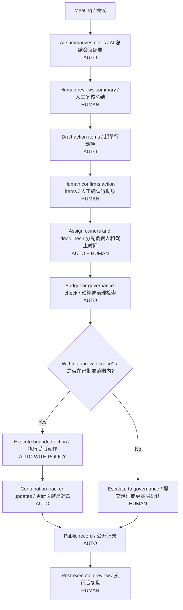
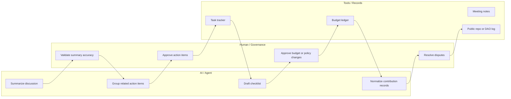

# 任务 020 - Governance / Coordination 治理协作流程草图 / Task 020 - Governance / Coordination Workflow Sketch

## 元信息 / Metadata

- 日期：2026-05-29
- 项目：AI x Web3 School
- 周次：Week 2
- 方向：Governance / Coordination
- WCB 任务：Week 2｜Governance / Coordination｜治理协作流程草图
- WCB 任务 ID：`cmpkl65x9nbgmmu019o1juedn`
- 分值：20
- 仓库：https://github.com/pillowtalk-Qy/ai-web3-school-cohort-0
- 任务文件：`tasks/task-020-governance-coordination-workflow-sketch.md`
- 状态：已完成，已部署到 GitHub，WCB 最新提交状态为 `SUBMITTED`，提交时间为 2026-05-29T08:13:19.024Z

**English Companion**

- Date: 2026-05-29
- Program: AI x Web3 School
- Week: Week 2
- Track: Governance / Coordination
- WCB task: Week 2｜Governance / Coordination｜治理协作流程草图
- WCB task id: `cmpkl65x9nbgmmu019o1juedn`
- Points: 20
- Repository: https://github.com/pillowtalk-Qy/ai-web3-school-cohort-0
- Task file: `tasks/task-020-governance-coordination-workflow-sketch.md`
- Status: completed, deployed to GitHub, WCB latest submission status `SUBMITTED` at 2026-05-29T08:13:19.024Z

## 任务目标 / Task Goal

这个任务要求我根据 Week 2 Module G，选择一个 DAO / 社区流程，拆出：

- AI 可以辅助的步骤。
- 必须由人或治理流程确认的步骤。

还需要做一个下列任一方向的草图：

- proposal summarizer。
- meeting-to-action workflow。
- contribution tracker。
- budget execution checklist。

并且要标出：

- 哪些结论只是 AI 总结。
- 哪些动作需要人工确认或治理流程通过。

**English Companion**

This task asks me to choose one DAO or community process from Week 2 Module G and separate the steps that AI can assist from the steps that must be confirmed by humans or by a governance process.

I also need to sketch one of these workflows: proposal summarizer, meeting-to-action workflow, contribution tracker, or budget execution checklist, and mark which outputs are only AI summaries and which actions require confirmation.

## WCB 要求核对 / WCB Requirement Check

2026-05-29 通过 WCB Agent API 只读查询确认任务详情：

```text
Task id: cmpkl65x9nbgmmu019o1juedn
Title: Week 2｜Governance / Coordination｜治理协作流程草图
Points: 20
Available: true
Proof required: true
Exclusive group: week2-governance-coordination-workflow
Current status before this proof: NOT_STARTED
Submission history before this proof: none
```

WCB 任务描述原文要点：

```text
根据 Week 2 Module G，选择一个 DAO / 社区流程，拆出 AI 可以辅助的步骤，以及必须由人或治理流程确认的步骤。

请做一个 proposal summarizer、meeting-to-action workflow、contribution tracker 或 budget execution checklist 的草图。

请标出哪些结论只是 AI 总结，哪些动作需要人工确认或治理流程通过。
```

Proof prompt 要求：

```text
请提交你的产出链接或截图，可以是 GitHub repo / README / Markdown 笔记 / Notion 页面 / 流程图 / 表格 / demo 链接。请确保内容能让审核者看到你的分析过程和结论。

不要提交私钥、助记词、API Key、token、.env 文件、真实资金账户信息或其他敏感信息。
```

**English Companion**

The WCB read-only API check confirmed that this task is available, requires proof, has no submission history, and is worth 20 points. The deliverable is a governance workflow sketch with AI-assisted and human-confirmed steps.

## Module G 摘要 / Module G Summary

Week 2 Module G 的核心提醒是：

```text
AI can help communities organize information, track contributions, generate action items, and support execution,
but governance power, budget actions, and final judgment must have clear boundaries.
```

我把它压缩成四个判断：

1. AI 可以帮忙总结 proposal、会议、讨论串和任务状态，但不能替代价值判断。
2. Web3 可以记录贡献、预算、投票和执行状态，但贡献质量仍要由人判断。
3. 治理流程里，预算执行、处罚、激励、提案通过和最终结论都必须有明确责任人和确认路径。
4. 如果 AI 自动生成并直接通过预算或治理动作，那不是效率提升，而是治理风险。

**English Companion**

My summary of Module G is that AI can assist communities with information organization, action item generation, contribution records, and execution support. But governance power, budget actions, and final judgment still need clear human or governance boundaries.

## 流程选择 / Workflow Choice

我选择的流程是：

```text
DAO / 社区 meeting-to-action workflow + budget execution checklist
```

这个场景最贴合 Module G，因为它把治理协作拆成一条可检查的链条：

- 会议中产生信息。
- AI 帮忙总结。
- 人决定哪些总结是有效的。
- 社区或治理流程决定哪些动作可以执行。
- 预算执行、任务分配、贡献跟踪、公开记录都留下痕迹。

我把它和这次课程里已经出现的方向连起来：

- DAO 运营。
- 贡献激励。
- 协作记录。
- 公共任务分配。
- 预算执行。

**English Companion**

I choose a DAO or community meeting-to-action workflow plus a budget execution checklist. This fits Module G because it turns meeting information into actions, distinguishes AI summaries from human decisions, and leaves records for execution and accountability.

## Workflow Boundary / 流程边界

本 proof 使用一个 mock DAO 场景：

```text
Community meeting
-> AI summarizes discussion
-> Human reviewer checks summary
-> Action items created
-> Governance / owner decides approval
-> Budget / contribution tracker updates
-> Execution happens only within approved scope
-> Public record is written
```

明确不做：

- 不自动通过预算。
- 不自动做处罚决定。
- 不自动修改治理参数。
- 不自动执行真实资金转账。
- 不自动代表社区做最终价值判断。

**English Companion**

This proof uses a mock DAO workflow. It does not auto-approve budgets, punishments, governance parameter changes, or real fund transfers. It does not replace final human value judgment.

## 流程图 / Workflow Diagram



## 责任泳道 / Responsibility Lanes



## 选择的流程草图 / Selected Workflow Sketch

我选择的是 `meeting-to-action workflow + budget execution checklist`，因为它最能展示：

- AI 总结和治理决策的边界。
- 任务分配和预算执行的差别。
- 公开记录和内部判断的差别。
- AI 辅助与人工确认如何同时存在。

### 流程步骤

| 步骤 | 执行者 | 发生什么 | 是否 AI 总结 | 是否需要人工确认 |
|---:|---|---|---|---|
| 1 | 人 | 开会、提出问题、讨论提案。 | 否 | 是，会议本身就是人类协作。 |
| 2 | AI | 总结会议要点、提取行动项、整理争议点。 | 是 | 是，必须人工检查准确性。 |
| 3 | 人 | 复核 AI 总结，删改错误或遗漏。 | 否 | 是。 |
| 4 | AI | 把确认后的行动项整理成 checklist。 | 部分是 | 是，行动项最终由人确认。 |
| 5 | 人 / 治理 | 决定哪些行动项进入预算、哪些只是建议。 | 否 | 是，治理确认。 |
| 6 | AI / 工具 | 更新任务 tracker、贡献 tracker、公开记录草稿。 | 部分是 | 需要人工复核关键字段。 |
| 7 | 人 / 治理 | 批准预算、修改范围或拒绝执行。 | 否 | 是，必须确认。 |
| 8 | 工具 / 记录层 | 在批准范围内执行受限动作并记录结果。 | 否 | 仅在已批准范围内自动执行。 |
| 9 | 人 | 复盘执行结果、记录偏差、处理争议。 | 否 | 是。 |

**English Companion**

This selected workflow is a meeting-to-action workflow plus a budget execution checklist. AI summarizes, groups, and drafts; humans validate, approve, and resolve disputes; tools record and execute only within approved scope.

## AI 可以辅助的步骤 / AI-Assisted Steps

- 总结会议纪要。
- 提炼行动项。
- 归类讨论主题。
- 找出未解决的问题。
- 整理任务清单。
- 生成预算执行 checklist 草稿。
- 汇总贡献记录草稿。
- 起草公开说明。

### AI 的输出类型

| 输出 | 类型 | 可信度 | 备注 |
|---|---|---:|---|
| 会议摘要 | AI 总结 | Medium | 需要人复核。 |
| Action items 草稿 | AI 草稿 | Medium | 需要人确认 owner、deadline、scope。 |
| 贡献记录草稿 | AI 草稿 | Medium | 需要人确认贡献是否真实。 |
| 预算 checklist 草稿 | AI 草稿 | Medium | 不能自动批准预算。 |
| 公开说明草稿 | AI 草稿 | Medium | 需要人复核措辞与隐私。 |

**English Companion**

AI can help summarize meetings, draft action items, draft budget checklists, and normalize contribution notes. These outputs are drafts or summaries, not final governance decisions.

## 必须人工确认的步骤 / Human-Confirmed Steps

必须由人或治理流程确认的步骤：

- 会议总结是否准确。
- 哪些 action items 进入正式任务。
- 谁是负责人。
- 截止时间是否合理。
- 是否有预算。
- 预算上限是多少。
- 是否允许支出。
- 是否需要投票或共识。
- 是否更新治理参数。
- 是否接受贡献记录。
- 是否处理争议或纠错。

### 人工确认触发条件

| 触发条件 | 为什么需要人工确认 |
|---|---|
| 新预算 | 预算是治理权力，不是整理信息。 |
| 新负责人 | 责任归属变化。 |
| 新范围 | 任务边界扩大。 |
| 新惩罚或激励规则 | 影响价值分配。 |
| 争议 | AI 不能裁决最终价值判断。 |
| 数据不完整 | 无法验证贡献或任务真实性。 |
| 目标与社区规则冲突 | 需要治理流程判断。 |
| AI 总结与原始记录冲突 | 可能出现幻觉或遗漏。 |

**English Companion**

Human confirmation is required when there is new budget, new ownership, a widened scope, new incentive or punishment rules, disputes, incomplete data, policy conflicts, or disagreement between AI summary and the original record.

## Budget Execution Checklist / 预算执行清单

我把 budget execution checklist 设计成 5 步：

1. 确认预算来源。
2. 确认金额上限。
3. 确认用途范围。
4. 确认执行负责人。
5. 确认是否已经经过治理通过。

| 检查项 | AI 能做什么 | 人必须做什么 |
|---|---|---|
| 预算来源 | 整理草稿、标出来源说明。 | 确认预算是否存在、是否可用。 |
| 金额上限 | 计算数值、展示比较结果。 | 批准上限或修改上限。 |
| 用途范围 | 匹配任务描述和历史记录。 | 决定用途是否合规。 |
| 执行负责人 | 列出候选负责人。 | 最终指派负责人。 |
| 治理通过 | 整理投票 / 共识状态。 | 确认是否已经通过。 |

**English Companion**

The budget checklist asks AI to organize and compare, but humans must approve source, cap, scope, owner, and governance status.

## Contribution Tracker 草图 / Contribution Tracker Sketch

如果用 contribution tracker，结构可以是：

```json
{
  "contribution_id": "mock-contrib-020-001",
  "member": "member-a",
  "activity": "wrote meeting summary",
  "ai_assisted": true,
  "human_confirmed": true,
  "evidence_type": "markdown note",
  "review_status": "approved",
  "reward_status": "pending",
  "governance_reference": "mock-governance-001"
}
```

### Tracker 规则

- AI 可以记录草稿。
- 人必须确认真实性。
- 奖励发放必须由规则或治理确认。
- 争议和申诉必须有回路。
- 贡献不能只靠 AI 自动打分。

**English Companion**

The contribution tracker can be drafted by AI, but humans must confirm truthfulness and governance decisions. Rewards and disputes need explicit process.

## AI 总结 vs 人工决定 / AI Summary vs Human Decision

| 项目 | AI 总结 | 人工决定 |
|---|---|---|
| 会议纪要 | 可以 | 是否采纳，必须人定。 |
| 行动项归类 | 可以 | 是否进入正式任务，必须人定。 |
| 负责人建议 | 可以 | 最终负责人，必须人定。 |
| 预算执行说明 | 可以 | 是否批准支出，必须人定。 |
| 贡献记录草稿 | 可以 | 是否认可贡献，必须人定。 |
| 争议归纳 | 可以 | 争议裁决，必须人定。 |
| 治理结论 | 不能替代 | 必须人或治理流程确认。 |

**English Companion**

AI can summarize and draft, but humans or governance processes must decide whether to accept summaries, approve tasks, approve budgets, recognize contributions, and resolve disputes.

## 风险分析 / Risk Analysis

| 风险 | 出现位置 | 问题 | 缓解方式 |
|---|---|---|---|
| AI 误总结会议 | summary step | 错过关键争议或扭曲意图。 | 人工复核原始记录。 |
| AI 把建议当成决定 | action draft | 可能越权。 | 明确区分 draft 和 approved。 |
| 预算被错误执行 | budget step | 可能造成真实损失。 | 预算必须治理确认。 |
| 贡献被虚假记录 | tracker step | 可能造成不公平奖励。 | 人工抽查和申诉机制。 |
| AI 代替治理判断 | decision step | 破坏社区权力边界。 | 最终结论必须由人或治理流程确认。 |
| 公开记录泄露隐私 | publish step | 暴露个人或团队信息。 | 只写必要公开信息，做脱敏。 |

**English Companion**

The major risks are AI mis-summarization, confusing suggestions with decisions, incorrect budget execution, fake contribution records, AI replacing governance judgment, and privacy leakage in public records.

## 和我的主方向的关系 / Relation to My Main Direction

我的 Week 2 主线是：

```text
Wallet / Permission / Safe Execution
```

这份治理协作草图和主线的关系是：

- 钱包任务强调谁能花钱、谁能签名、谁能执行。
- 治理任务强调谁能决定、谁能确认、谁能分配资源。
- 两者都需要 human confirmation、audit trail 和明确边界。

这也和我已经完成的 co-learning 笔记呼应：

- DAO 运营不是只有投票。
- 贡献激励不是只有打分。
- 社区协作需要 AI 组织信息，但最终决策仍要有人负责。

**English Companion**

This governance sketch supports my main direction because both wallet permission and governance coordination require clear boundaries, human confirmation, and audit trails. Wallet tasks govern who can spend; governance tasks govern who can decide.

## WCB 提交草稿 / WCB Submission Draft

```text
Task proof:
https://github.com/pillowtalk-Qy/ai-web3-school-cohort-0/blob/main/tasks/task-020-governance-coordination-workflow-sketch.md

说明：
我完成了 Week 2「Governance / Coordination｜治理协作流程草图」任务。

这份 proof 选择的 workflow 是 DAO / 社区 meeting-to-action workflow + budget execution checklist。它展示了 AI 可以辅助会议总结、行动项整理、贡献记录和预算清单草稿，但预算执行、任务确认、负责人指派、争议裁决和最终治理决定仍然必须由人或治理流程确认。

内容包括：
1. WCB 任务详情核对。
2. Week 2 Module G 摘要。
3. workflow 边界说明。
4. meeting-to-action Mermaid 图。
5. 责任泳道图。
6. AI 可以辅助的步骤。
7. 必须人工确认的步骤。
8. budget execution checklist。
9. contribution tracker 草图。
10. AI 总结 vs 人工决定对照表。
11. 风险分析。
12. 和我 Week 2 wallet / permission 主线的关系。

核心结论是：AI 可以帮助社区组织信息和准备动作，但治理权力不能自动化成 AI 决策。预算、处罚、激励、任务确认和最终结论都必须保留 human / governance confirmation。

本 proof 不包含私钥、助记词、API key、token、.env 文件、真实资金账户信息、真实钱包地址、真实资产余额、真实治理投票或私密截图。
```

**English Companion**

```text
Task proof:
https://github.com/pillowtalk-Qy/ai-web3-school-cohort-0/blob/main/tasks/task-020-governance-coordination-workflow-sketch.md

Description:
I completed the Week 2 Governance / Coordination task "Governance Coordination Workflow Sketch."

The selected workflow is a DAO or community meeting-to-action workflow plus a budget execution checklist. It shows that AI can help summarize meetings, draft action items, normalize contribution records, and prepare budget checklists, but budgets, ownership, disputes, and final governance decisions still need human or governance confirmation.

The proof includes:
1. WCB task detail check.
2. Week 2 Module G summary.
3. Workflow boundary.
4. Meeting-to-action Mermaid diagram.
5. Responsibility lanes.
6. AI-assisted steps.
7. Human-confirmed steps.
8. Budget execution checklist.
9. Contribution tracker sketch.
10. AI summary vs human decision table.
11. Risk analysis.
12. Relation to my Week 2 wallet / permission main direction.

The key conclusion is that AI can help communities organize information and prepare actions, but governance power must not be automated into AI decisions. Budget, punishment, incentives, task confirmation, and final conclusions still need human or governance confirmation.

This proof does not include private keys, seed phrases, API keys, tokens, `.env` files, real financial account information, real wallet addresses, real balances, real governance votes, or private screenshots.
```

## 验证状态 / Verification Status

- [x] 已通过 WCB Agent API 只读查询任务详情。
- [x] 已确认 WCB 任务 id：`cmpkl65x9nbgmmu019o1juedn`。
- [x] 已确认任务当前状态为 `NOT_STARTED`，无提交历史。
- [x] 已选择 DAO / 社区 meeting-to-action workflow。
- [x] 已区分 AI 可以辅助的步骤和必须人工确认的步骤。
- [x] 已做 budget execution checklist 草图。
- [x] 已做 contribution tracker 草图。
- [x] 已标出 AI 总结 vs 人工决定。
- [x] 已分析治理协作风险。
- [x] 已准备 WCB 提交草稿。
- [x] 已部署到 GitHub。
- [x] 已通过 WCB 平台提交。

2026-05-29 通过只读 API 核验的 WCB 最新提交状态：

- Submission id: `cmpqna9f4fo0jpo01a4ttwj5g`
- Status: `SUBMITTED`
- Submitted at: 2026-05-29T08:13:19.024Z
- Review status: not reviewed in the checked API response

**English Companion**

- [x] WCB task details checked through read-only API.
- [x] WCB task id confirmed: `cmpkl65x9nbgmmu019o1juedn`.
- [x] Current WCB status confirmed as `NOT_STARTED` with no submission history.
- [x] DAO or community meeting-to-action workflow selected.
- [x] AI-assisted steps and human-confirmed steps separated.
- [x] Budget execution checklist drafted.
- [x] Contribution tracker drafted.
- [x] AI summary vs human decision boundaries marked.
- [x] Governance coordination risks analyzed.
- [x] WCB submission draft prepared.
- [x] Deployed to GitHub.
- [x] Submitted through WCB platform.

WCB latest submission status verified through read-only API on 2026-05-29:

- Submission id: `cmpqna9f4fo0jpo01a4ttwj5g`
- Status: `SUBMITTED`
- Submitted at: 2026-05-29T08:13:19.024Z
- Review status: not reviewed in the checked API response

## 隐私检查 / Privacy Check

- [x] 不包含私钥、助记词、API key、cookies、tokens、sessions 或 `.env` 内容。
- [x] 不包含真实钱包地址、真实资产余额或私密交易模式。
- [x] 不包含真实治理投票、真实资金分配或真实成员隐私。
- [x] 不包含真实敏感会议记录或私密聊天记录。
- [x] 使用 mock id、mock contribution record 和 mock governance reference。
- [x] WCB API 只读查询未调用 `tasks.submitEvidence`。
- [x] commit、push、WCB proof submission、钱包签名和链上交易仍需要明确人工确认。

**English Companion**

- [x] No private keys, seed phrases, API keys, cookies, tokens, sessions, or `.env` content.
- [x] No real wallet address, real-asset balance, or private transaction pattern.
- [x] No real governance votes, real fund allocation, or private member data.
- [x] No sensitive meeting records or private chat transcripts.
- [x] Mock ids, mock contribution records, and mock governance references are used.
- [x] WCB API use was read-only and did not call `tasks.submitEvidence`.
- [x] Commit, push, WCB proof submission, wallet signing, and onchain transactions still require explicit human confirmation.
