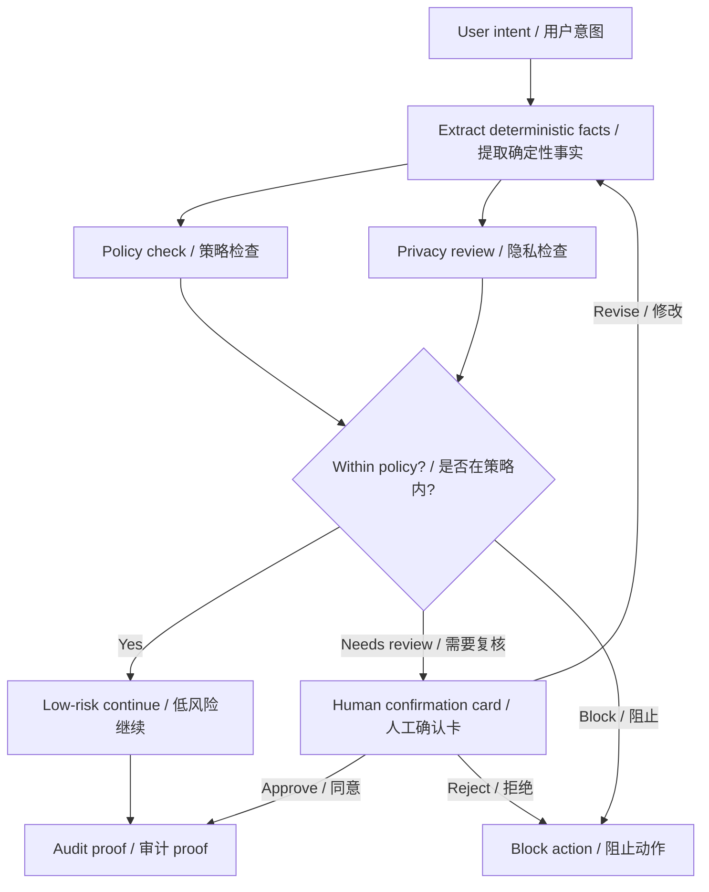

# 任务 021 - Week 2 总交付 / Task 021 - Week 2 Final Deliverable Pack

## 元信息 / Metadata

- 日期：2026-05-29
- 项目：AI x Web3 School
- 周次：Week 2
- 方向：总交付 / Final Deliverable
- WCB 任务：Week 2｜总交付｜方向深挖包与项目初步 Proposal
- WCB 任务 ID：`cmpkl6652nbgpmu012os75zfg`
- 分值：40
- 仓库：https://github.com/pillowtalk-Qy/ai-web3-school-cohort-0
- 任务文件：`tasks/task-021-week-2-final-deliverable-pack.md`
- 状态：已完成，已部署到 GitHub，WCB 最新提交状态为 `SUBMITTED`，提交时间为 2026-05-29T09:05:08.696Z

**English Companion**

- Date: 2026-05-29
- Program: AI x Web3 School
- Week: Week 2
- Track: Final Deliverable
- WCB task: Week 2｜总交付｜方向深挖包与项目初步 Proposal
- WCB task id: `cmpkl6652nbgpmu012os75zfg`
- Points: 40
- Repository: https://github.com/pillowtalk-Qy/ai-web3-school-cohort-0
- Task file: `tasks/task-021-week-2-final-deliverable-pack.md`
- Status: completed, deployed to GitHub, WCB latest submission status `SUBMITTED` at 2026-05-29T09:05:08.696Z

## 任务目标 / Task Goal

这个任务要求我根据 Week 2 的总交付，提交一份方向深挖包和项目初步 proposal。

至少包含：

1. AI x Web3 问题地图：至少覆盖 5 个方向，并标出 AI 作用与 Web3 机制。
2. 方向选择说明：选择 1 个主方向，解释为什么它不是纯 AI 或纯 Web3 问题。
3. 问题拆解：参与方、流程、AI 作用、Web3 机制、自动化边界、人工确认点、验证方式和主要风险。
4. 项目初步 proposal：目标用户、真实场景、最小功能、验证方式、主要风险、可能赛道和 Week 3 下一步。
5. 参考资料清单：至少 5 条项目、标准、协议、工具或案例，并说明每条资料帮助你判断什么。
6. 主方向深挖包：至少 1 张流程图、1 个典型场景、1 个反例、1 组关键风险和 1 个最小验证计划。
7. 方向 backlog：记录没有选择的 2–3 个方向，并说明暂时不选的原因。

**English Companion**

This task asks for a Week 2 final deliverable pack: a deep-dive package plus an initial project proposal.

It must include: an AI x Web3 problem map, a main-direction explanation, a problem breakdown, an initial project proposal, a reference list, a deep-dive package with a diagram and validation plan, and a backlog of unselected directions.

## WCB 要求核对 / WCB Requirement Check

2026-05-29 通过 WCB Agent API 只读查询确认任务详情：

```text
Task id: cmpkl6652nbgpmu012os75zfg
Title: Week 2｜总交付｜方向深挖包与项目初步 Proposal
Points: 40
Available: true
Proof required: true
Exclusive group: week2-final-deliverable-pack
Current status before this proof: NOT_STARTED
Submission history before this proof: none
```

WCB 任务描述原文要点：

```text
根据 Week 2「本周总交付」，提交一份方向深挖包和项目初步 proposal。

至少包含：

1. AI × Web3 问题地图：至少覆盖 5 个方向，并标出 AI 作用与 Web3 机制。
2. 方向选择说明：选择 1 个主方向，解释为什么它不是纯 AI 或纯 Web3 问题。
3. 问题拆解：参与方、流程、AI 作用、Web3 机制、自动化边界、人工确认点、验证方式和主要风险。
4. 项目初步 proposal：目标用户、真实场景、最小功能、验证方式、主要风险、可能赛道和 Week 3 下一步。
5. 参考资料清单：至少 5 条项目、标准、协议、工具或案例，并说明每条资料帮助你判断什么。
6. 主方向深挖包：至少 1 张流程图、1 个典型场景、1 个反例、1 组关键风险和 1 个最小验证计划。
7. 方向 backlog：记录没有选择的 2–3 个方向，并说明暂时不选的原因。
```

Proof prompt 要求：

```text
请提交你的产出链接或截图，可以是 GitHub repo / README / Markdown 笔记 / Notion 页面 / 流程图 / 表格 / demo 链接。请确保内容能让审核者看到你的分析过程和结论。

不要提交私钥、助记词、API Key、token、.env 文件、真实资金账户信息或其他敏感信息。
```

**English Companion**

The WCB read-only API check confirmed that this task is available, requires proof, has no submission history, and is worth 40 points. The deliverable is a Week 2 final pack covering map, direction choice, problem breakdown, proposal, references, deep dive, and backlog.

## Week 2 主线 / Week 2 Main Direction

我选择的主方向是：

```text
AI Wallet Clear Intent Guard
```

更完整的表述是：

```text
pre-signing review for intent, permission boundary, payment route, privacy exposure, and audit proof
```

为什么选它：

- 它和我已经完成的 Task 014 / 015 / 016 / 017 / 018 / 019 / 020 串成一条连续链。
- 它不是纯 AI 问题，因为 AI 不能单独决定钱包授权、支付、审计和风险边界。
- 它不是纯 Web3 问题，因为 Web3 只能提供执行和验证，不能替代对用户意图、语义风险和隐私暴露的理解。
- 它足够真实，能连接钱包、支付、权限、隐私、治理和 agent workflow。

**English Companion**

My main direction is `AI Wallet Clear Intent Guard`, described as a pre-signing review layer for intent, permission boundary, payment route, privacy exposure, and audit proof.

I chose it because it is connected to the tasks I already completed, and because it sits between AI interpretation and Web3 execution rather than being only one of them.

## 1. AI x Web3 问题地图 / Problem Map

我保留 7 个方向：

1. Payment / Commerce / Settlement
2. Identity / Reputation / Capability / Interoperability
3. Wallet / Permission / Safe Execution
4. Privacy / Security / Sovereignty
5. Dev Tooling / Agent Workflow
6. Governance / Coordination / Public Goods
7. Agent Memory / Audit Trail

### 地图总览

| 方向 | AI 作用 | Web3 机制 | 主要风险 |
|---|---|---|---|
| Payment / Commerce / Settlement | 理解服务需求、比较报价、判断交付是否满足意图。 | x402-like payment flow、稳定币、escrow、receipt、settlement。 | 付错对象、重复付款、超预算、假结算。 |
| Identity / Reputation / Capability / Interoperability | 描述能力、协商任务、解释历史交付。 | Agent ID、registry、attestation、reputation、validation record。 | Sybil、刷分、假能力、信誉滥用。 |
| Wallet / Permission / Safe Execution | 结构化意图、比对交易事实、标记权限风险。 | 钱包签名、智能账户、policy engine、allowlist、guard、ERC-4337。 | 盲签、无限授权、错误网络、越权执行。 |
| Privacy / Security / Sovereignty | 识别敏感数据、做 threat model、检测 injection。 | encryption、TEE、ZK、local-first、revocation、audit log。 | 敏感泄露、数据不可删、供应商依赖。 |
| Dev Tooling / Agent Workflow | 读文档、写代码、生成测试、整理 proof。 | ABI、RPC、Foundry、Hardhat、block explorer、CI、GitHub。 | 错误网络、伪造 API、proof 不充分。 |
| Governance / Coordination / Public Goods | 总结提案、抽取 action items、生成预算清单。 | DAO proposal、Snapshot、multisig、公共物品资金、贡献记录。 | AI 扭曲共识、自动化预算、虚假 accountability。 |
| Agent Memory / Audit Trail | 归纳历史意图、权限历史和长期行为。 | 可审计日志、历史记录、可复查 proof、policy versioning。 | 记忆污染、权限漂移、不可追溯。 |

**English Companion**

I keep the 7-direction map and summarize each direction by AI role, Web3 mechanism, and main risk.

## 2. 方向选择说明 / Main Direction Rationale

### 为什么不是纯 AI 问题

它不是纯 AI 问题，因为：

- AI 可以解释，但不能自己授予钱包权限。
- AI 可以总结，但不能替代预算决策。
- AI 可以标注风险，但不能单独签名、转账或修改 policy。
- AI 输出必须依赖确定性字段、工具返回和审计记录。

### 为什么不是纯 Web3 问题

它不是纯 Web3 问题，因为：

- Web3 能执行和验证，但不能自动理解用户模糊意图。
- Web3 不能替代交易语义解释、隐私暴露判断和界面化风险提示。
- Web3 的 policy、guard 和 receipt 仍需要 AI 协助整理和解释。

### 方向结论

```text
AI 负责理解、解释、归纳和提示；
Web3 负责授权、执行、结算和留痕；
人负责高风险确认和最终责任。
```

**English Companion**

This direction is not pure AI because AI cannot independently grant wallet authority or decide budgets, and it is not pure Web3 because Web3 cannot understand intent or privacy exposure by itself. AI understands and explains, Web3 authorizes and settles, and humans confirm high-risk actions.

## 3. 问题拆解 / Problem Breakdown

### 参与方

| 参与方 | 角色 |
|---|---|
| 用户 / wallet owner | 提出目标，提供意图，批准或拒绝高风险动作。 |
| AI Wallet Clear Intent Guard | 审查意图、交易事实、payment route、权限边界和隐私暴露。 |
| Wallet / policy layer | 执行 budget、allowlist、deadline、revocation 和 human confirmation rule。 |
| 服务或收款方 | 提供 x402 request、API 服务或其他可购买服务。 |
| 审计层 | 记录 hash、decision、receipt、review note。 |
| 可选仲裁层 | 处理争议、未交付或退款。 |

### 流程

```text
User intent
-> candidate transaction or payment request
-> deterministic facts extraction
-> policy check
-> privacy exposure check
-> risk label
-> human confirmation if needed
-> execution or block
-> audit proof
```

### AI 作用

- 结构化自然语言意图。
- 比对 intent 和 transaction facts。
- 发现 payment route、budget、payee、network、token、deadline 的不一致。
- 提示隐私暴露和 memory / permission history 风险。
- 生成 review card 和 explanation。

### Web3 机制

- wallet signing。
- smart account / safe account。
- policy engine。
- x402 payment route。
- receipt / proof。
- revocation。
- audit log。

### 自动化边界

可以自动化：

- 只读查询。
- 确定性字段提取。
- 风险解释草稿。
- 低风险、预算内、allowlist 内动作的准备。

必须人工确认：

- 新 payee、新合约、新 token、新网络。
- 超预算。
- 无限授权。
- policy update。
- real-asset 动作。
- 高隐私暴露动作。

### 验证方式

- transaction facts 可由 explorer、RPC、decoded calldata 核验。
- payment route 可由 x402 header / settlement record 核验。
- policy 可由 versioned config / audit log 核验。
- privacy / exposure 可由 review card 和 redacted proof 核验。

### 主要风险

- prompt injection。
- forged tool return。
- policy mismatch。
- over-authorization。
- privacy leakage。
- hallucinated explanation。
- service non-delivery。

**English Companion**

The problem breakdown covers participants, flow, AI role, Web3 mechanism, automation boundary, human confirmation, verification, and major risks.

## 4. 项目初步 Proposal / Initial Project Proposal

### 项目名称

```text
AI Wallet Clear Intent Guard
```

### 目标用户

- 需要频繁审查钱包动作的普通用户。
- 会尝试使用 agent 的 Web3 builder。
- 使用 x402 / pay-per-use 服务的开发者。
- DAO 财务或 reviewer。

### 真实场景

用户收到一笔候选交易或 x402 payment request，想确认：

- 这笔动作和自己的意图是否一致。
- 是否超预算。
- 是否暴露了敏感信息。
- 是否值得签名或付款。

### 最小功能

1. 读取 intent summary。
2. 解析 transaction 或 payment facts。
3. 生成 policy check。
4. 生成 privacy review。
5. 输出 risk label 和建议动作。
6. 生成 audit proof。

### 验证方式

- 用 mock payment request 测试 intent mismatch。
- 用 mock transaction 检测无限授权。
- 用 mock privacy surface 检测地址和关系暴露。
- 用 public Markdown proof 展示 review card 和决策。

### 主要风险

- 过度依赖 AI 摘要。
- 对隐私暴露判断不足。
- policy 设计过宽。
- 用户把 review card 当成最终安全保证。

### 可能赛道

- Wallet / Permission / Safe Execution
- Privacy / Security / Sovereignty
- Agentic Commerce / Payment

### Week 3 下一步

- 进一步做交互 demo。
- 把 review card 做成可点击界面。
- 加入 mock data / sample transaction viewer。
- 继续核验 x402、CAW、ERC-8004 和 privacy 资料。

**English Companion**

The proposal is a pre-signing review layer that helps users inspect intent, transaction facts, budget, payment route, and privacy exposure before they sign or pay.

## 5. 参考资料清单 / Reference List

我选择的 8 条参考资料：

1. x402 docs
2. Cobo Agentic Wallet docs
3. ERC-4337 docs
4. Safe Smart Account docs
5. Web3 Privacy Now / privacy builders notes
6. AI x Web3 School Task 016
7. AI x Web3 School Task 018
8. AI x Web3 School Task 019 / 020

### 每条资料帮助我判断什么

| 资料 | 帮助判断什么 |
|---|---|
| x402 docs | payment request 与 payment required flow 应该怎么机器可读地表达。 |
| Cobo Agentic Wallet docs | Pact、policy、spend limits 和 completion conditions 怎么把权限收紧。 |
| ERC-4337 docs | smart account 如何支持可编程验证与执行。 |
| Safe docs | modules、guards、multisig 和恢复机制如何提供安全边界。 |
| Privacy builders notes | privacy 不是附加功能，而是产品设计前提。 |
| Task 016 | x402 + CAW payment loop 的最小闭环长什么样。 |
| Task 018 | 钱包权限策略如何表达预算、allowlist、阈值和撤销。 |
| Task 019 / 020 | threat model 和 governance coordination 如何把 AI 辅助与人工决策分开。 |

**English Companion**

The references help me judge payment flows, wallet policy, permission boundaries, smart-account execution, privacy-by-design, and the relationship between AI assistance and human governance.

## 6. 主方向深挖包 / Deep Dive Package

### 流程图



### 典型场景

用户想给一个 x402 保护的研究 API 付款 0.20 USDC。

系统应该检查：

- payee 是否是 allowlist。
- token 是否正确。
- network 是否正确。
- amount 是否低于 cap。
- payment route 是否和用户意图一致。
- 是否有不必要的隐私暴露。

### 反例

用户说“帮我付 0.20 USDC”，但交易事实其实是：

- `approve(spender, max_uint256)`
- 新 payee
- 未知 contract
- 隐私字段过多

这种情况必须阻止，而不是“看起来像差不多就通过”。

### 关键风险

- 盲签和无限授权。
- payment route 伪装。
- AI 把 summary 当事实。
- 过度自动化。
- 公开 proof 泄露敏感信息。

### 最小验证计划

1. 做 mock transaction review。
2. 测试 intent mismatch。
3. 测试 policy mismatch。
4. 测试 privacy exposure 检测。
5. 测试 human confirmation card。
6. 用 GitHub markdown 记录 review 结果。

**English Companion**

The deep dive includes a workflow diagram, a typical x402 review scenario, a counterexample with unlimited approval, key risks, and a minimal validation plan based on mock review cases.

## 7. Direction Backlog / 方向 Backlog

我没有选择的 3 个方向：

### 1. Identity / Reputation / Capability / Interoperability

暂不选择原因：

- 这个方向很重要，但如果同时做 identity、reputation、validation、registry 和 interoperability，范围会太大。
- 我现在更需要先把 wallet review 和 permission boundary 做实。

### 2. Governance / Coordination / Public Goods

暂不选择原因：

- 我已经把它整理成 Task 020。
- 它适合做第二条线，但不是我当前 Week 2 的主线。

### 3. Dev Tooling / Agent Workflow

暂不选择原因：

- 这个方向和我的 repo 维护很近，但更偏工具化。
- 我当前更想围绕用户真的会担心的钱包边界和支付边界展开。

**English Companion**

I leave three directions in the backlog: identity/reputation, governance/coordination, and dev tooling/agent workflow. They are all relevant, but they are not my current main line.

## 和已有任务的关系 / Relation to Existing Tasks

这个总交付把我已经完成的 Week 2 任务串起来：

- Task 014 给出问题地图和主方向。
- Task 015 给出 payment / commerce 结构。
- Task 016 给出 x402 + CAW payment loop。
- Task 017 给出 agent profile。
- Task 018 给出 wallet permission policy。
- Task 019 给出 threat model。
- Task 020 给出 governance workflow。

它们一起说明：

```text
AI Wallet Clear Intent Guard 不是孤立想法，
而是一条已经在 Task 014-020 里逐步收束的 Week 2 主线。
```

**English Companion**

This final pack stitches together Tasks 014 through 020 into one coherent Week 2 line: the AI Wallet Clear Intent Guard.

## WCB 提交草稿 / WCB Submission Draft

```text
Task proof:
https://github.com/pillowtalk-Qy/ai-web3-school-cohort-0/blob/main/tasks/task-021-week-2-final-deliverable-pack.md

说明：
我完成了 Week 2「总交付｜方向深挖包与项目初步 Proposal」任务。

这份 proof 包含：
1. AI × Web3 问题地图，覆盖 7 个方向。
2. Week 2 主方向选择：AI Wallet Clear Intent Guard。
3. 问题拆解：参与方、流程、AI 作用、Web3 机制、自动化边界、人工确认点、验证方式和主要风险。
4. 项目初步 proposal：目标用户、真实场景、最小功能、验证方式、主要风险、可能赛道和 Week 3 下一步。
5. 参考资料清单，共 8 条，并说明每条资料帮助判断什么。
6. 主方向深挖包：流程图、典型场景、反例、关键风险和最小验证计划。
7. 方向 backlog：未选择的 3 个方向及原因。

核心结论是：AI Wallet Clear Intent Guard 不是纯 AI 也不是纯 Web3，而是一个把用户意图、交易事实、钱包权限、payment route、隐私暴露和 audit proof 连接起来的 pre-signing review layer。

本 proof 不包含私钥、助记词、API key、token、.env 文件、真实资金账户信息、真实钱包地址、真实资产余额、真实交易 payload 或私密截图。
```

**English Companion**

```text
Task proof:
https://github.com/pillowtalk-Qy/ai-web3-school-cohort-0/blob/main/tasks/task-021-week-2-final-deliverable-pack.md

Description:
I completed the Week 2 final deliverable task "Week 2 Final Deliverable Pack."

The proof includes:
1. An AI x Web3 problem map covering 7 directions.
2. The Week 2 main direction: AI Wallet Clear Intent Guard.
3. Problem breakdown: participants, flow, AI role, Web3 mechanism, automation boundary, human confirmation, verification, and risk.
4. An initial project proposal: target users, real scenario, minimal features, validation, main risks, likely track, and Week 3 next steps.
5. A reference list of 8 items with the judgment each one supports.
6. A deep-dive package with a diagram, typical scenario, counterexample, key risks, and minimal validation plan.
7. A backlog of 3 directions not selected yet and why.

The key conclusion is that AI Wallet Clear Intent Guard is neither pure AI nor pure Web3. It is a pre-signing review layer that connects user intent, transaction facts, wallet permissions, payment route, privacy exposure, and audit proof.

This proof does not include private keys, seed phrases, API keys, tokens, `.env` files, real financial account information, real wallet addresses, real balances, real transaction payloads, or private screenshots.
```

## 验证状态 / Verification Status

- [x] 已通过 WCB Agent API 只读查询任务详情。
- [x] 已确认 WCB 任务 id：`cmpkl6652nbgpmu012os75zfg`。
- [x] 已确认任务当前状态为 `NOT_STARTED`，无提交历史。
- [x] 已完成 AI x Web3 问题地图。
- [x] 已选择主方向。
- [x] 已完成问题拆解。
- [x] 已完成项目初步 proposal。
- [x] 已完成参考资料清单。
- [x] 已完成主方向深挖包。
- [x] 已完成方向 backlog。
- [x] 已准备 WCB 提交草稿。
- [x] 已部署到 GitHub。
- [x] 已通过 WCB 平台提交。

2026-05-29 通过只读 API 核验的 WCB 最新提交状态：

- Submission id: `cmpqp4wuwftjypo01oryy8s1d`
- Status: `SUBMITTED`
- Submitted at: 2026-05-29T09:05:08.696Z
- Review status: not reviewed in the checked API response

**English Companion**

- [x] WCB task details checked through read-only API.
- [x] WCB task id confirmed: `cmpkl6652nbgpmu012os75zfg`.
- [x] Current WCB status confirmed as `NOT_STARTED` with no submission history.
- [x] AI x Web3 problem map completed.
- [x] Main direction selected.
- [x] Problem breakdown completed.
- [x] Initial proposal completed.
- [x] Reference list completed.
- [x] Deep-dive package completed.
- [x] Backlog completed.
- [x] WCB submission draft prepared.
- [x] Deployed to GitHub.
- [x] Submitted through WCB platform.

WCB latest submission status verified through read-only API on 2026-05-29:

- Submission id: `cmpqp4wuwftjypo01oryy8s1d`
- Status: `SUBMITTED`
- Submitted at: 2026-05-29T09:05:08.696Z
- Review status: not reviewed in the checked API response

## 隐私检查 / Privacy Check

- [x] 不包含私钥、助记词、API key、cookies、tokens、sessions 或 `.env` 内容。
- [x] 不包含真实钱包地址、真实资产余额或私密交易模式。
- [x] 不包含真实 payment payload、真实 transaction calldata 或真实 UserOperation。
- [x] 不包含真实治理投票、真实预算执行或真实成员隐私。
- [x] 不包含私密截图或私密聊天记录。
- [x] 使用 mock 术语、公开资料和任务编号，不公开任何敏感数据。
- [x] WCB API 只读查询未调用 `tasks.submitEvidence`。
- [x] commit、push、WCB proof submission、钱包签名和链上交易仍需要明确人工确认。

**English Companion**

- [x] No private keys, seed phrases, API keys, cookies, tokens, sessions, or `.env` content.
- [x] No real wallet address, real-asset balance, or private transaction pattern.
- [x] No real payment payload, transaction calldata, or UserOperation.
- [x] No real governance vote, real budget execution, or private member data.
- [x] No private screenshots or private chat transcripts.
- [x] Mock terms, public references, and task ids are used without sensitive data.
- [x] WCB API use was read-only and did not call `tasks.submitEvidence`.
- [x] Commit, push, WCB proof submission, wallet signing, and onchain transactions still require explicit human confirmation.
